НАЦІОНАЛЬНИЙ УНІВЕРСИТЕТ «ЛЬВІВСЬКА ПОЛІТЕХНІКА»
Кафедра систем штучного інтелекту КОМП'ЮТЕРНІ МЕРЕЖІ 
ТА ПРОТОКОЛИ 
ПЕРЕДАЧІ ДАНИХ
Яковина В. С.

vitaliy.s.yakovyna@lpnu.ua

# Опис Дисципліни

## - Кількість Кредитів - 4 (120 Год.) - Лабораторні Роботи

1. Налаштування протоколу ІР в Windows та Linux. Базові утиліти для діагностики мережі. Основи роботи з Wireshark.

2. Дослідження роботи протоколів ІР та ІСМР. 3. ІР адреси: обчислення адрес мереж та масок. 4. ІР адреси: об'єднання та поділ мереж, робота з таблицею маршрутизації. 5. Дослідження роботи протоколів DNS та DHCP. 6. Дослідження роботи протоколу HTTP, основні методи HTTP. 7. Розгортання віртуальних мереж в хмарі Microsoj Azure. 8. Конфігурування груп мережевої безпеки в хмарі Microsoj Azure. Забезпечення захищеного з'єднання між приватними та хмарними мережами засобами Azure VPN Gateway. 

9. Розгортання мережі доставлення контенту Azure CDN. 10. Балансування навантаження засобами Azure Applica{on Gateway. 

## - Розподіл Балів

| Поточний контроль (ПК)   | Екзамен (ЕК)    | Разом   |     |
|--------------------------|-----------------|---------|-----|
| Письмова компонента      | Усна компонента |         |     |
| 40                       | 50              | 10      | 100 |

## - Література

- Lowe D. Networking all-in-one for dummies. - New Jersey: John Wiley & Sons, Inc., 2021
- Tanenbaum A.S. Computer networks / Andrew S. Tanenbaum, Nick Feamster, David J. Wetherall. - Pearson, 2021

# Концепції Комп'Ютерних 

 Мереж

Застосування комп'ютерних мереж

# Застосування Комп'Ютерних Мереж

- Комп'ютерна мережа - набір автономних комп'ютерів, зв'язаних однією технологією
- Зв'язані комп'ютери - в стані обмінюватись інформацією
- Застосування мереж - **спільне використання** 
ресурсів

# Застосування Для Бізнесу

- Середовище комунікації
- Електронна пошта
- VoIP
- Трансляція відео - Спільний робочий стіл
- Електронна комерція

# Персональне Застосування

- Доступ до Інтернет (www)
- Комунікація
- Електронна пошта
- Дзвінки, відео дзвінки
- Обмін повідомленнями (messaging)
- Соціальні мережі
- Співпраця для створення контенту (**wiki**)
- Розваги (IPTV, комп'ютерні ігри)

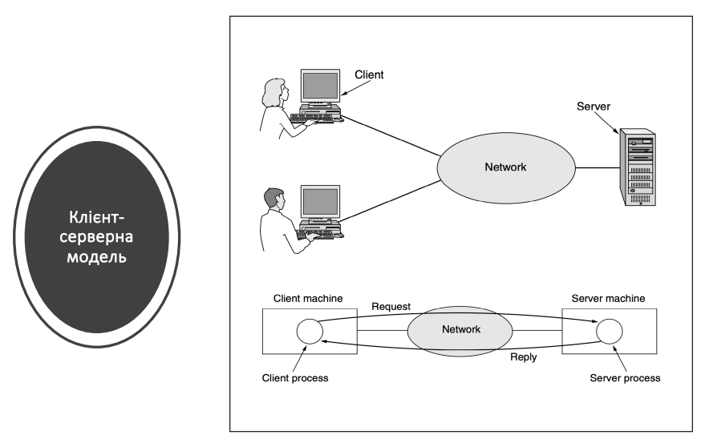

# Однорангові Мережі

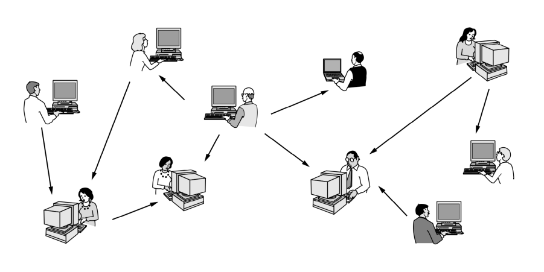

Обладнання мережі

# Технологія Передачі

- Систематизація мереж: **технологія передачі** і розміри
- Технологія передачі:
- **Широкомовні мережі (broadcast)**
- Мережі «точка-точка»

# Технологія Передачі

UnicastBroadcast **Multicast**

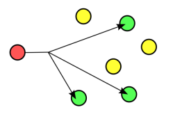

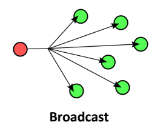

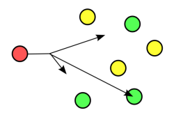

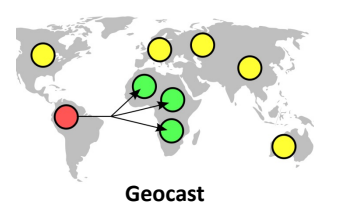

Anycast, IPv6 Geocast
# Розміри Комп'Ютерних Мереж

Персональн

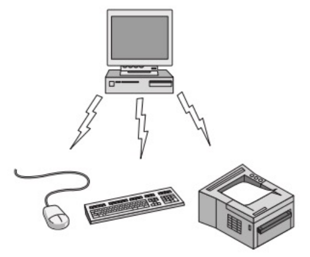

і мережі 
(PAN)

# Локальні Мережі (Lan)

 Муніципальні Мережі (Man)

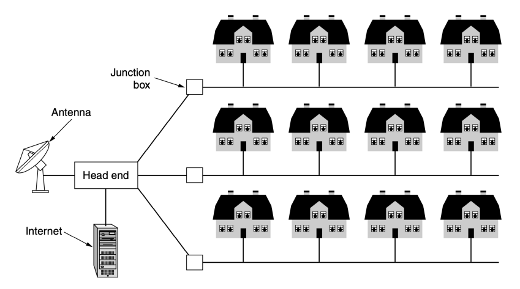

# Глобальні Мережі (Wan)

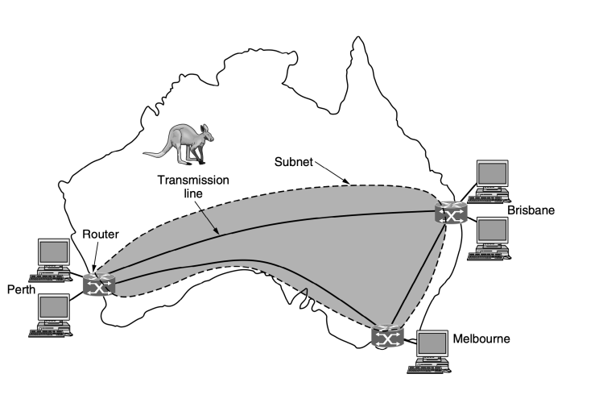

# Об'Єднання Мереж

- Існуючі мережі використовуються різне обладнання і ПЗ
- Потреба в об'єднанні різних, часто несумісних мереж
- Множина поєднаних мереж називається об'єднаною мережею (internetwork, internet)

# Топологія Комп'Ютерної Мережі

- **Топологія комп'ютерної мережі** відображає структуру зв'язків між її основними функціональними елементами
- **Фізична** структура визначає топологію фізичних з'єднань між комп'ютерами
- **Логічна** структура визначає логічну організацію взаємодії комп'ютерів між собою

# Фізичні Топології

- **Лінійна топологія** (line)

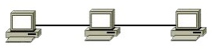

- **Топологія шини** (bus)
- **Кільцева топологія** (ring)

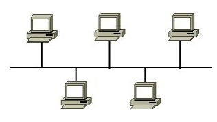

- **Топологія подвійного кільця**

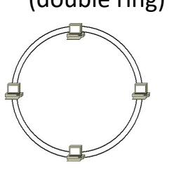

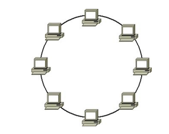

(double ring)

# Фізичні Топології

- **Топологія зірка** (star)
- **Топологія розширеної зірки**
- **Ієрархічна (топологія дерева)**
- **Топологія сітки** - Повнозв'язна **топологія** –
n(n-1)/2 каналів зв'язку
- Змішана (гібридна) топологія

# Логічні Топології

- **Широкомовна топологія** - імовірнісний доступ:
- IEEE 802.3 - 10 Mb Ethernet
- IEEE 802.3u - 100 Mb Ethernet
- IEEE 802.3z - 1 Gb Ethernet
- **Топологія передачі маркера** - детермінований доступ:
- IEEE 802.4 - Token bus
- IEEE 802.5 - Token ring - IEEE 802.6 - Metropolitan Area Networks - FDDI

# Пз Мережі Ієрархія Протоколів

- Для спрощення структури мережі організують в набори **рівнів**
- Кількість рівнів, їх назви, зміст і призначення є різними для різних мереж
- Завдання кожного рівня: надання певних сервісів для вищих рівнів

# Ієрархія Протоколів

- Правила і угоди щодо обміну інформацією між рівнем n однієї машини і рівнем n іншої машини називають **протоколом** рівня n
- Між кожною парою суміжних рівнів лежить інтерфейс, який визначає набір примітивних операцій, що надаються нижнім рівнем верхньому
- Набір рівнів і протоколів - **архітектура мережі**
- Перелік протоколів, що використовуються системою - стек протоколів Ієрархія 

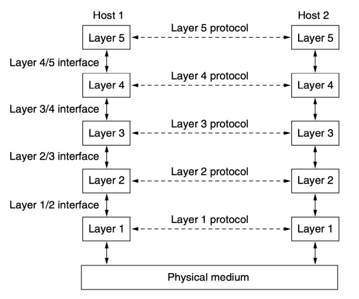

протоколі в

# Потік Інформації В Мережі

 Проблеми Проектування Мережі

- **Надійність** - проблема проектування мережі, яка працює правильно, навіть якщо її елементи відмовляють
- *Виявлення і корекція помилок* - кодування
- Проблема *маршрутизації*
- **Еволюція** мережі. Основний механізм структурування - ієрархія протоколів
- *Адресація*
- Робота з *об'єднаною мережею* - Масштабованість

# Проблеми Проектування Мережі

- **Розподіл ресурсів**
- *Статистичне мультиплексування*
- *Управління потоками* (перевантаження мережі)
- *Якість обслуговування* (QоS)
- **Захист і безпека мережі**
- *Конфіденційність*
- *Автентифікація* - Цілісність

# Сервіси На Основі З'Єднань І Без Встановлення З'Єднань

- Приклад **служби зі встановленням з'єднання** –
телефонний зв'язок
- Приклад **служби без встановлення з'єднання** –
поштова система
- Кожна служба характеризується **якістю** 
обслуговування
- **Надійні** (послідовність повідомлень, потік байтів) - Ненадійні

# Типи Сервісів

Сервіси і 

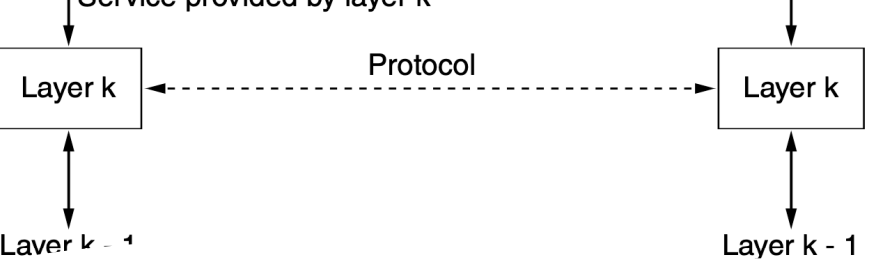 протоколи
- *Сервіс* - це **набір примітивів** (операцій), які нижчий рівень надає вищому, але не обумовлює реалізацію цих операцій
- *Протокол* - це **набір правил**, які описують формат і призначення кадрів, пакетів або повідомлень, якими обмінюються об'єкти одного рівня; протокол - реалізація сервісів Еталонні моделі

# Еталонні Моделі Osi І Tcp/Ip

- Протоколи, пов'язані з еталонною моделлю OSI, 
не використовуються, однак сама *модель* є актуальною, а властивості її рівнів - доволі важливі
- Модель TCP/IP практично не використовується, однак її *протоколи* - одні з найбільш розповсюджених

# Еталонна Модель Osi

- International Organization for Standardization, ISO
- Day і Zimmerman (1983)
- Day (1995) - перегляд
- Еталонна модель взаємодії відкритих систем ISO
- **ISO OSI (Open System Interconnection**) Reference Model
- Не є архітектурою мережі: не описує сервіси і протоколи кожного рівня Еталонна 

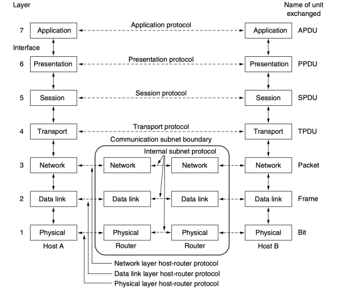

модель OSI

# Фізичний Рівень

- Реальна **передача необроблених бітів** каналом зв'язку
- Механічні, електричні, процедурні інтерфейси; фізичний носій даних

# Канальний Рівень

- Здатність передавати «сирі» дані фізичного рівня по **надійній лінії зв'язку**, вільній від невиявлених помилок, маскувати реальні помилки від мережевого рівня
- Кадри, підтвердження
- Управління потоком
- Спільний доступ до каналу передачі даних

# Мережевий Рівень

- **Об'єднання різнорідних мереж**
- Маршрутизація
- Надання певного рівня сервісу (затримки, час передачі, синхронізація тощо)
- Адресація

# Транспортний Рівень

- Отримання даних від сеансового рівня, розбиття їх на частини, передача мережевому рівню, гарантія доставки даних в складеній мережі
- Тип сервісу для сеансового рівня (напр. надійний канал «точка-точка» з потоком байтів)
- *Наскрізний* рівень

# Сеансовий Рівень

- Дає можливість користувачам різних комп'ютерів встановлювати **сеанси зв'язку**
- Надає різні типи сервісів:
- **управління діалогом** (черговість передачі даних)
- **управління маркерами** (запобігання одночасного виконання критичної операції)
- **синхронізація** (можливість продовжити передачу з місця обриву)

# Рівень Представлення

- **Синтаксис і семантика** інформації, що передається
- Спілкування комп'ютерів з різними внутрішніми представленнями даних
- Визначення і зміна структур даних більш високого рівня

# Прикладний Рівень

- Набір **прикладних протоколів**, необхідних користувачам

# Еталонна Модель Tcp/Ip

- ARPANET, МО США
- Cerf і Kahn (1974)
- Braden (1989) - стандарт

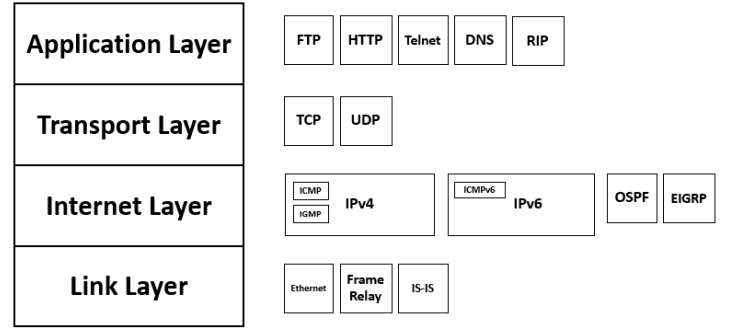

# Модель Tcp/Ip Vs Iso/Osi

Стандартизація мереж

# Телекомунікації

- Забезпечення сумісності в світовому масштабі
- **ITU:** 1865, стандартизація міжнародних засобів зв'язку
- Біля 200 представників різних відомств, понад 700 представників промисловості
- **ITU-T** - телекомунікаційний сектор стандартизації
- **ITU-R** - сектор радіозв'язку
- **ITU-D** - сектор розвитку (ІКТ)

# Міжнародні Стандарти

- **ISO:** добровільна організація, утворена в 1946. 

Входять національні організації 89 країн. Співпрацює ISO і ITU-T з проблем телекомунікаційних стандартів
- **NIST** - підрозділ міністерства торгівлі США. 

Стандарти, обов'язкові для закупівель уряду США, крім Міністерства оборони
- **IEEE:** найбільша професійна світова організація. 

Стандарти в галузі електротехніки і електроніки. Комітет 802 - ряд стандартів локальних мереж.

Стандарти Інтернету
- Інтернет має власний механізм стандартизації, відмінний від ITU-T та ISO
- **IAB** *(Internet Architecture Board)* - **IRTF** (Internet Research Task Force), **IETF** (Internet Engineering Task Force)
- Технічні звіти - RFC. *www.ie?.org/rfc*
- **World Wide Web Consorzum** (W3C) розвиває протоколи і напрямок розвитку веб-стандартів