ФІЗИЧНИЙ РІВЕНЬ

# Фізичний Рівень

•Визначає електричні, часові та інші характеристики мереж, якими пересилають біти інформації в формі сигналів
•Фізичний рівень - фундамент мережі
•Продуктивність каналів передачі даних (смуга пропускання, час затримки, частота помилок) визначаються властивостями фізичних носіїв Теоретичні основи передачі даних

# Ряди Фур'Є

- Будь яка періодична функція *g(t)* з періодом T може бути розкладена в ряд (можливо нескінченний), який складається з суми синусів і косинусів:

$$g(t)=\frac{1}{2}c+\sum_{n=1}^{\infty}a_{n}\,\sin(2\pi n f t)\,+\,\sum_{n=1}^{\infty}b_{n}\,\cos(2\pi n f t)$$

де f *= 1/T* основна частота (гармоніка), an i bn амплітуди синусів і косинусів n-ої **гармоніки,** c - константа
- Такий розклад називається **рядом Фур'є**

$$a_{n}={\frac{2}{T}}\!\!\int\limits_{0}^{T}\!\!g(t)\sin(2\pi n\!\!\!\!/t)\,d t\qquad b_{n}={\frac{2}{T}}\!\!\int\limits_{0}^{T}\!\!g(t)\cos(2\pi n\!\!\!\!/t)\,d t\qquad c={\frac{2}{T}}\!\!\int\limits_{0}^{T}\!\!g(t)\,d t$$

- Для кожної функції *g(t)* можна обчислити:
Сигнали з 

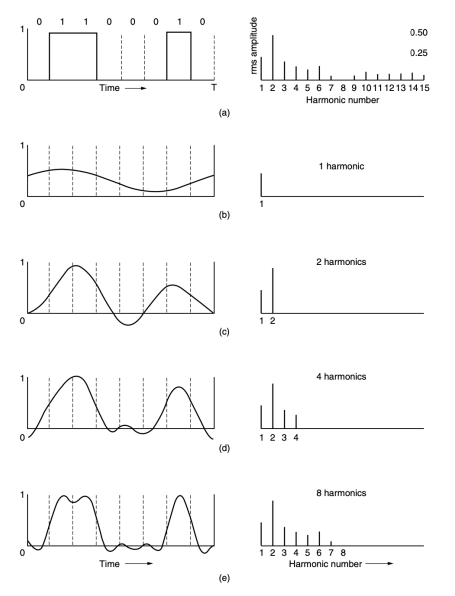

обмеженим спектром

# Смуга Пропускання

- Жоден канал зв'язку не може передавати сигнали без *втрати потужності*
- Всі канали зв'язку зменшують різні гармоніки різною мірою, тим самим *спотворюючи* сигнал
- В кабельних мережах як правило *високочастотна* складова (вище частоти fc) помітно послаблюється
- Діапазон частот від 0 до fc (на практиці від 0 до 50% 
потужності) - **смуга пропускання**
- Смуга пропускання - фізична характеристика середовища передачі даних (ширина смуги пропускання)

# Передача Цифрових Даних

- Головна задача - передача з мінімальною якістю, що дає можливість відновити початкову послідовність бітів
- При швидкості передачі в бітах b біт/с, час для передачі 8 бітів складає 8/b с => частота першої гармоніки - b/8 Гц. Наприклад, для телефонної лінії (fc = 3000 Гц):
- Смуга пропускання каналу обмежує пропускну здатність передачі *двійкових* даних навіть для ідеального каналу

# Максимальна Швидкість Передачі Даних Через Канал

- Рівняння для **максимальної швидкості передачі** 
даних для **безшумного каналу** з обмеженою смугою пропускання частот (H. Nyquist, 1924):
Максимальна пропускна здатність = 2B **log2** V
(біт/с)
B - смуга пропускання, V - кількість дискретних рівнів сигналу
•Наприклад, канал без шумів зі смугою пропускання 3 кГц не може передавати двійкові (два рівні) сигнали зі швидкістю, більшою ніж 6000 біт/с

# Максимальна Пропускна Здатність Каналу З Шумами

- Рівень термодинамічного шуму - **відношення** 
сигнал/шум (SNR)
- Логарифмічна шкала: 10 log10(S/N) - **децибел** (дБ)
S/N = 10 відповідає 10 дБ, 100 - 20 дБ, 1000 - 30 дБ …
- **Максимальна швидкість передачі даних каналу з** 
шумами зі смугою пропускання B Гц і відношенням сигнал/шум S/N (C. Shannon, 1948):
Максимальна пропускна здатність = B **log2(1+S/**N)
(біт/с)
- Наприклад, в ADSL смуга пропускання 1 МГц, S/N ~ 40 дБ => максимальна ємність каналу 13 Мбіт/с незалежно від способу модуляції Провідникові середовища передачі

# Вита Пара

- Вита пара (twisted pair) - вид мережевого кабелю, з однією або декількома парами ізольованих провідників, скручених між собою для зменшення взаємних наведень при передачі сигналу
- Дешевий - Легке встановлення 

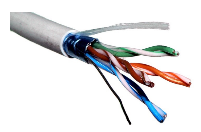

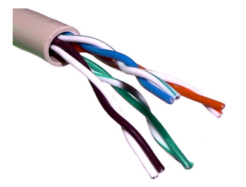

# Види Витої Пари

- Неекранована вита пара (U/UTP), екранована фольгою (F/UTP i U/FTP) та обплетенням (SF/UTP, S/FTP i SF/FTP).

•ISO/IEC 11801:2002 - спосіб позначення кабелю. **xx/yyTP**, де xx відноситься до цілого кабелю, а yy - до кожної пари.

- Можливі значення xx i yy:
- U - неекранована (unshielded) - F - фольгована (foiled)
- S - екранована обплетенням (shielded)
- SF - фольгована і обплетена

# Конструкція Кабелю

| Загальноприйнята назва   | Позначення по ISO/IEC 11801   | Загальний екран    | Екран для пар      |
|--------------------------|-------------------------------|--------------------|--------------------|
| UTP                      | U/UTP                         | ні                 | ні                 |
| STP, ScTP, PiMF          | U/FTP                         | ні                 | фольга             |
| FTP, STP, ScTP           | F/UTP                         | фольга             | ні                 |
| STP, ScTP                | S/UTP                         | обплетення         | ні                 |
| SFTP, S-FTP, STP         | SF/UTP                        | обплетення, фольга | ні                 |
| SFSFTP, SF-SFTP, SF²TP   | SF/SFTP                       | обплетення, фольга | обплетення, фольга |
| FFTP                     | F/FTP                         | фольга             | фольга             |
| SSTP, SFTP, STP PiMF     | S/FTP                         | обплетення         | фольга             |
| SSTP, SFTP               | SF/FTP                        | обплетення, фольга | фольга             |

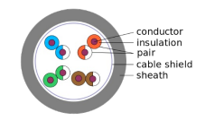

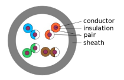

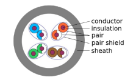

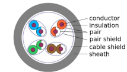

Стандарт ЄС **EN 50173**:
•Клас A (САТ 1) - телефонний кабель, одна пара, смуга пропускання до 100 кГц
•Клас B (САТ 2) - старий тип кабелю з 2-х пар провідників, голосові послуги і термінали, смуга пропускання до 1 МГц
•Клас C (САТ 3) - 2-парний кабель, 10BASE-T і token ring, зустрічається в телефонних мережах, смуга частот 16 МГц

•Клас D (САТ 5/5e) - 4-парний кабель, 10BASE-T, 
100BASE-TX і 1000BASE-T, смуга частот 100 МГц
•Клас E (САТ 6) - розширення ISO/IEC 11801/TIA 
впроваджене в 1999, Fast Ethernet і Gigabit Ethernet, смуга частот 250 МГц. Gigabit Ethernet (4x 250 МГц = 1 ГГц), ATM 622 Мбіт/с
•Клас EA (САТ 6A) - ISO/IEC 11801 2002:2, або загальний екран (F/UTP), або екрани навколо кожної пари (U/FTP), смуга частот 500 МГц

•Клас F (САТ 7) - ISO/IEC 11801 2002:2, відсутня в ANSI/TIA-568-C, екранований (S/FTP + екрановані роз'єми), смуга частот 600 МГц
•Клас FA (САТ 7A) - ISO/IEC 11801 2002:2, F/FTP або S/FTP, смуга частот 1000 МГц, можлива пропускна здатність до 100 Гбіт/с до 15 м і 40 Гбіт/с до 100 м
•Клас I (САТ 8.1) - в розробці (ANSI/TIA-568-C.2-1, ISO/IEC 11801-99-1), F/UTP або U/FTP, смуга частот 1600-2000 МГц

•Клас II (САТ 8.2) - ISO/IEC 11801 ред. 3, F/FTP або S/FTP, швидкість передачі даних до 40 Гбіт/с при використанні стандартних конекторів 8P8C, смуга частот 1600-2000 МГц

## Tia/Eia 568A Додатково Визначає:

•САТ 4 - 4-х скручені пари, використовувався в мережах token ring, 10BASE-T, 10BASE-T4, зараз не використовується, смуга частот 20 МГц

# 8P8C

- 8P8C (8 Position, 8 Contact) - уніфікований конектор. 

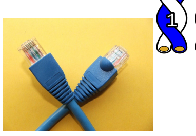

Помилково вважають за RJ-45. Використовується для побудови LAN за технологіями 10BASE-T, 100BASE-TX, 1000BASE-T та IEEE 802.3bz, з використанням 2х або 4парних кабелів типу «вита пара».

# Tia/Eia-568

- **TIA/EIA-568-B** - (TIA/EIA Commercial Building Telecommunications Cabling Standard) набір з трьох телекомунікаційних стандартів, випущених в 2001 році, який замінив собою застарілий стандарт TIA/EIA-568-А . Ці стандарти описують побудову телекомунікаційних СКС у будівлях
•Найбільш відомі за двома таблицями **T568A** і T568B, які описують **з'єднання провідників** кабелю типу «вита пара» з контактами роз'ємів 8P8C при організації мережі Ethernet

# Таблиці T568 - Прямий (Straight Through) Кабель

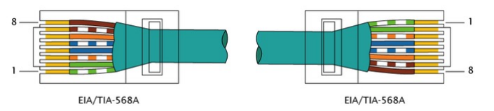

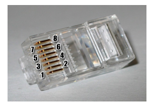

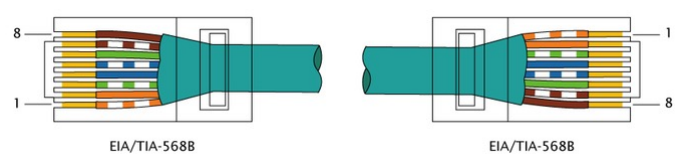

# Таблиці T568 - Перехресний (Crossover) Кабель

 100 Мбіт/С 1 Гбіт/С

- Auto-MDIX - автоматичне розпізнавання типу (прямий чи перехресного) підключеного кабелю
- **Але!** PoE (Power over Ethernet): живлення подається по контактах 4-5 і 7-8 (синя і коричнева пара)

# Типи Ліній Передачі Даних

•Лінії, якими дані можуть одночасно передаватись в обидві сторони, називаються дуплексними або **повнодуплексними** (*fullduplex)*
•Лінії, якими дані в кожен момент часу можуть пересилатись тільки в одному напрямку, називаються **напівдуплексними** (*half-duplex)*
•Лінії, якими передача сигналу можлива тільки в один бік називаються **симплексними** (simplex)

# Коаксіальний Кабель

•Краще екранований ніж вита пара •Ширша смуга пропускання
•Передача даних на більші відстані з більшими швидкостями
- 50-Омний - передача цифрових даних - 75-Омний - аналогова передача, кабельне ТБ

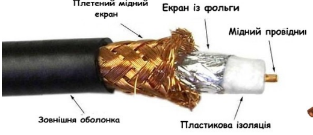

# Оптоволокно

- Застосування:
- Дуже великі відстані - магістральні мережі - Високошвидкісні локальні мережі
- Ефективний доступ до Інтернету
•Основні складові:
- Джерело світла - Носій - Приймач сигналу (детектор)

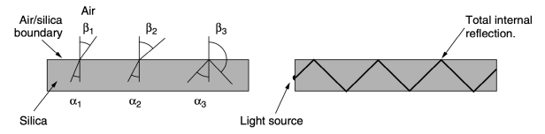

Оптоволокно Затухання світла в ІЧ області при

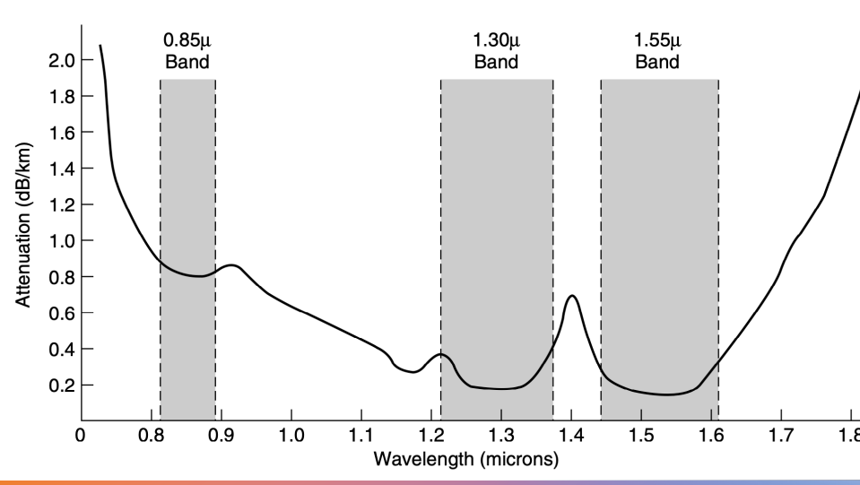

проходженні через оптоволокно

# Оптоволокно

- Множина променів буде одночасно 

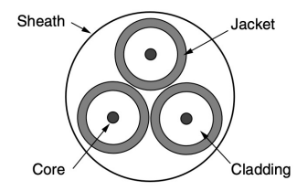

відбиватись під різними кутами. Кожен промінь має певну **моду**. Волокно, здатне передавати кілька променів одразу - багатомодове
- Зменшення діаметра волокна - світловод, без відбивання від стінок. **Одномодове** волокно. 100 Гбіт/с до 100 км.

# Оптоволоконний Кабель

•Багатомодове оптоволокно - серцевина 50 мкм •Одномодове волокно - серцевина 8-10 мкм

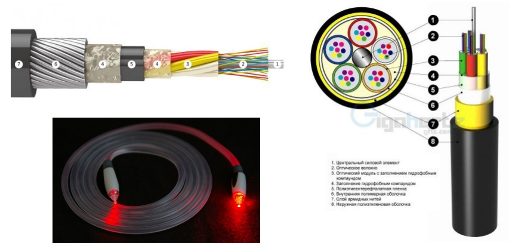

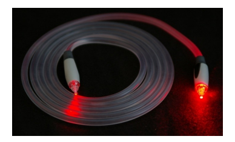

# Оптоволоконний Кабель

•Джерела світла:

| Характеристика            | Світлодіод   | Напівпровідниковий лазер    |
|---------------------------|--------------|-----------------------------|
| Швидкість передачі даних  | Низька       | Висока                      |
| Тип волокна               | Багатомодове | Багатомодове або одномодове |
| Відстань                  | Коротка      | Дальня                      |
| Термін служби             | Довгий       | Короткий                    |
| Чутливість до температури | Невисока     | Значна                      |
| Вартість                  | Низька       | Висока                      |

•Детектор - фотодіод. Типовий час реакції фотодіода обмежує швидкість передачі даних 100 Гбіт/с Безпровідні середовища передачі

# Електромагнітний Спектр

 Радіозв'Язок

- Радіохвилі: легко генерувати, можуть проходити великі відстані, проходять через стіни, огинають будівлі, широка область використання
•**НЧ хвилі**: добре проходять через перешкоди, швидко падає потужність сигналу в повітрі - 1/r2
•**ВЧ хвилі**: прямолінійне поширення, відбивання від перешкод, сильніше поглинаються дощем та іншими перешкодами
- Завади з боку електрообладнання, сильні взаємні завади різних користувачів

# Зв'Язок В Мікрохвильовому Діапазоні

•На частотах вище 100 МГц - розповсюдження по прямій, можуть бути сфокусовані в вузькі пучки
•Погано проходять через будівлі
•Потреби у все більшому діапазоні частот - все більш високі частоти, до 10 ГГц. Частоти, вищі 4 ГГц поглинаються водою
•*Використання*: міжміська телефонія, стільниковий зв'язок, ТБ
•*Переваги*: відсутність потреби в кабелі, відносна дешевизна

# Політика Розподілу Частот

•Діапазони ISM (Industrial, Scientific, Medical) - не потрібна ліцензія, обмежена потужність
•**U-NII** (Unlicensed National Information Infrastructure), США
- 900 МГц - ранні 802.11, на даний момент перевантажений
- 2,4 ГГц - 802.11b/g/n і Bluetooth, завади від мікрохвильовок і радарів
- 5 ГГц - початкова стадія розвитку, 802.11а/aс

# Діапазони, Для Безпровідних Пристроїв В Сша Супутники Зв'Язку

Цифрова модуляція і мультиплексування

# Проблема Пересилання Цифрової Інформації

•Канали зв'язку переносять **аналогові** сигнали.

•Процес перетворення між бітами і аналоговими сигналами - **цифрова модуляція**.

•Передача **в основній смузі частот** - сигнал займає частоти від нуля до певного максимуму. Провідні середовища.

•Передача **в смузі пропускання** - сигнал займає смугу частот навколо несучої. Безпровідні і оптичні канали.

•Спільне використання каналу для передачі кількох сигналів - мультиплексування.

# Передача В Основній Смузі Частот

•**NRZ** (Non Return to Zero)

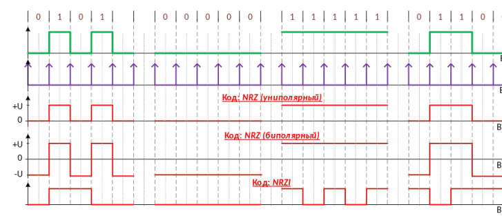

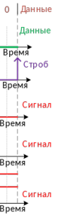

# Ефективність Використання Смуги Частот

•NRZ - для пропускної здатності B біт/с, необхідна смуга принаймні B/2 Гц (формула Найквіста)
- Ефективне використання смуги пропускання –
використання більше ніж двох **рівнів сигналу**
•Напр., 4 рівня напруги => 2 біти = 1 символ •**Символьна швидкість** - швидкість зміни рівня сигналу, швидкість в **бодах** (бодрейт)
•**Бітрейт** = бодрейт Х кількість бітів в символі

# 2B1Q

 (2 Binary 1 Quaternary, Pam-5)

| Кодова   | Кодовий   | Кодова    |
|----------|-----------|-----------|
| група    | напруга   |           |
| 00       | − 3       | − 2,5 V   |
| 01       | − 1       | − 0,833 V |
| 10       | + 3       | + 2,5 V   |
| 11       | + 1       | + 0,833 V |
| символ   |           |           |

# Синхронізація

•**Манчестерське** кодування. «Виняткове АБО» 
тактового імпульсу з інформаційними бітами.

•Вдвічі більша смуга пропускання, ніж для NRZ

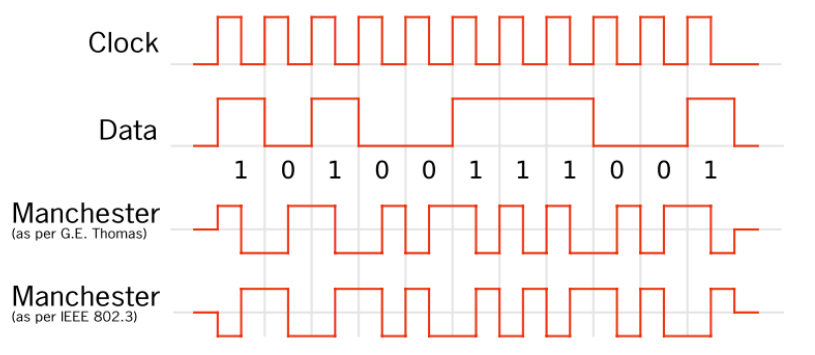

# Синхронізація

•**NRZI** (Non Return to Zero Invertive), 
використовується в USB
•Вимагає додатково логічного кодування для 

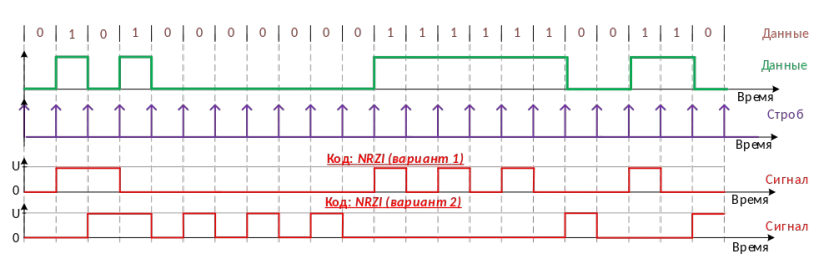

усунення довгих послідовностей бітів, що не змінюються стану, напр. RLL, 4B5B, 8B10B

# Логічне Кодування: 4В5В

•Кожні 4 біти відображають в 5- бітовий зразок так, щоб біт зі значенням «1» зустрічався принаймні двічі
- Заборонені стани - управляючі сигнали фізичного рівня
•Використання:
- 100BASE-TX
•AES10-2003 MADI 
(Multichannel Digital Audio Interface)

| Назва   | 4b     | 5b    | Значення            |
|---------|--------|-------|---------------------|
| 0       | 0000   | 11110 | 0                   |
| 1       | 0001   | 01001 | 1                   |
| 2       | 0010   | 10100 | 2                   |
| 3       | 0011   | 10101 | 3                   |
| 4       | 0100   | 01010 | 4                   |
| 5       | 0101   | 01011 | 5                   |
| 6       | 0110   | 01110 | 6                   |
| 7       | 0111   | 01111 | 7                   |
| 8       | 1000   | 10010 | 8                   |
| 9       | 1001   | 10011 | 9                   |
| A       | 1010   | 10110 | A                   |
| B       | 1011   | 10111 | B                   |
| C       | 1100   | 11010 | C                   |
| D       | 1101   | 11011 | D                   |
| E       | 1110   | 11100 | E                   |
| F       | 1111   | 11101 | F                   |
| Q       | -NONE- | 00000 | Quiet (signal lost) |
| I       | -NONE- | 11111 | Idle                |
| J       | -NONE- | 11000 | Start #1            |
| K       | -NONE- | 10001 | Start #2            |
| T       | -NONE- | 01101 | End                 |
| R       | -NONE- | 00111 | Reset               |
| S       | -NONE- | 11001 | Set                 |
| H       | -NONE- | 00100 | Halt                |

# Логічне Кодування: Скремблінг

•**Скремблінг** - заставити дані виглядати випадковими
•**Скремблер** поєднує «винятковим АБО» дані з псевдовипадковою послідовністю
•Скремблінг не додає вимог до смуги пропускання або часу на службові дані
•Якщо дані схожі на псевдовипадкову послідовність, результат - нулі

# Скремблер (Приклад)

•Скремблер: , де-скремблер: •Вхідна послідовність бітів: 1110 0000 0001

# Симетричні Сигнали

•**Симетричні сигнали** не мають складової постійного струму
- в деяких кабелях постійна складова сильно затухає;
- ємнісний зв'язок пропускає тільки частину сигналу зі змінним струмом
•Допомагає забезпечити передачу для сигналів синхронізації
•Простий спосіб калібрувати приймачі

# Симетричні Сигнали: Біполярне Кодування

•**AMI** (Alternate *Mark Inversion*): логічна 1 –

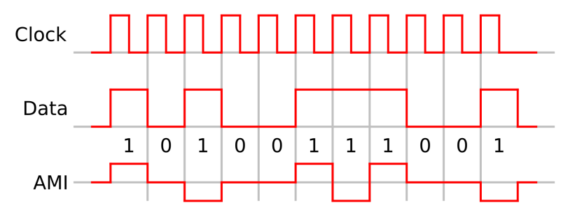

чергування двох рівнів напруги (напр. +1 V і -1 V), логічний нуль - 0 V

# Симетричні Сигнали: Логічне Кодування

•Код **8B/10B** відображає 8 вхідних бітів на 10 вихідних: 5 бітів => 6 бітів + 3 біти => 4 біти
•Кодуючий пристрій пам'ятає **нерівність**
попереднього символу
•Нерівність - загальна кількість нулів або одиниць, що роблять сигнал незбалансованим
•Для 8В/10В найбільша нерівність становить 2 біти - сигнал **збалансований**
- 8В/10В - не більше 5 послідовних нулів чи одиниць - полегшує синхронізацію Передача в 

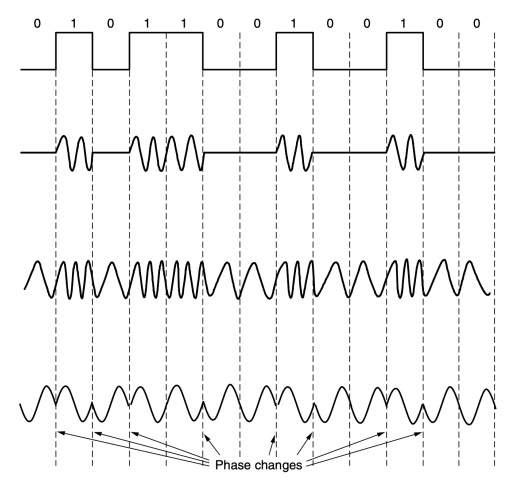 смузі пропускання
- Амплітудна модуляція –
ASK (Amplitude Shift Keying)
- Частотна модуляція –
FSK (Frequency Shift Keying)
- Фазова модуляція - **PSK** 
(Phase Shift Keying)
- Зазвичай комбінують амплітудну і фазову модуляцію.

- (a) - **QPSK** (Quadrature Phase Shift Keying), 2 біти інформації на символ (інтервал часу).

- **QAM-16** - 16 комбінацій амплітуди і фази (б), 4 біти на символ.

- **QAM-64** - 64 комбінації фази і амплітуди (в), 6 бітів на символ.

Діаграма 

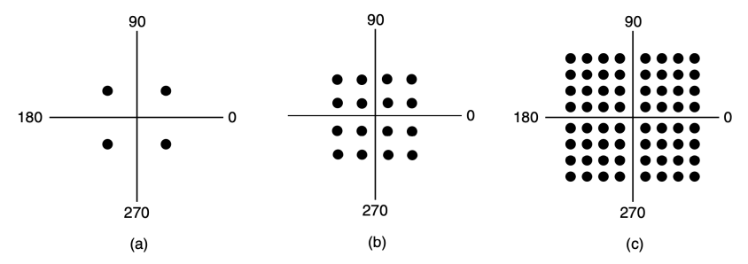 сигнального сузір'я

# Частотне 

 Ущільнення

- **Мультиплексування** 

з поділом частоти, FDM (Frequency Division Multiplexing)

# Частотне 

 Ущільнення

- **OFDM** (Orthogonal Frequency Division Multiplexing) смуга каналу поділена на багато піднесучих, які незалежно передають дані (напр. з QAM).

- Використання: 802.11, кабельні мережі, LTE.

# Часове 

 Ущільнення

- Мультиплексування з поділом часу, **TDM** 
(Time Division Multiplexing).

- Використання: телефонні і стільникові мережі.

# Кодовий Поділ Каналів

•**CDM** (Code Division *Multiplexing*) –
мультиплексування з кодовим поділом. Вузькосмуговий сигнал розподіляють по більш широкому діапазону частот.

•Дає можливість разом використовувати спільний діапазон частот: множинний доступ з кодовим поділом **CDMA** (Code Division Multiple *Access).* Одночасний множинний доступ забезпечується за рахунок використання теорії кодування.

# Множинний Доступ З Кодовим Поділом (Cdma)

•(a) Двійкові елементарні послідовності 4-х станцій, •(б) Біполярні елементарні двійкові послідовності, •(в) Шість прикладів передачі, •(г) Відновлення сигналу станції С.

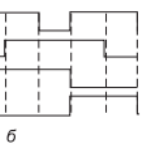

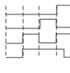

Комутація

- В комунікаційних мережах використовують два типи комутації: **комутація каналів** і комутація пакетів.

Комутація

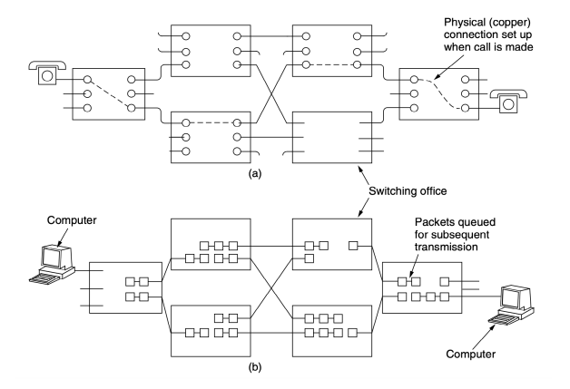

Комутація каналів
•Важлива властивість - необхідність встановлення наскрізного шляху до того, як будуть передаватись дані.

•Час встановлення з'єднання - значний.

•Після встановлення з'єднання єдиною затримкою є швидкість розповсюдження сигналу - біля 5 мс на кожні 1000 км.

•Відсутність небезпеки затору (скупчення даних).

•Повне впорядкування даних.

Комутація пакетів
•Пакети пересилають по мірі готовності.

- Різні пакети можуть рухатись різними шляхами і можуть прибувати не за порядком.

- Затримка проміжної буферизації більша ніж при комутації каналів.

- Затримка черги і можливе скупчення пакетів 
(затор).

•Комутація пакетів не витрачає марно пропускну здатність.

•Комутація пакетів більш стійка до збоїв мережі.

Затрати часу при комутації каналів і комутації пакетів

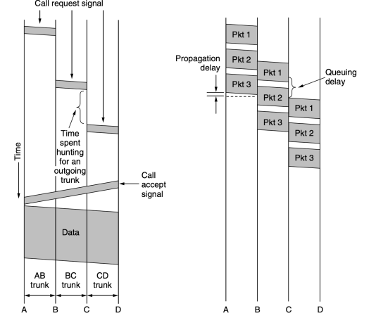

Порівняння мереж з комутацією каналів і комутацією пакетів Параметр Комутація каналів Комутація пакетів Встановлення з'єднання Вимагається Не вимагається Виділений фізичний шлях Так Ні Кожен пакет рухається тим самим шляхом? Так Ні Пакети приходять в правильній послідовності? Так Ні Критичність виходу з ладу комутатора Так Ні Доступна пропускна здатність Фіксована Динамічна Можливість занятості лінії Під час встановлення з'єднання Для кожного пакету Можливість простою лінії Так Ні Передача з проміжним збереженням Ні Так Оплата За час на лінії За трафік