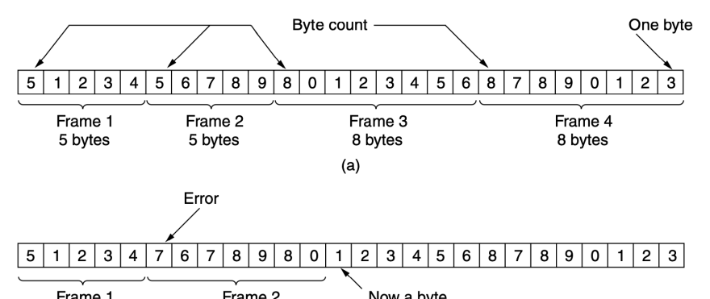
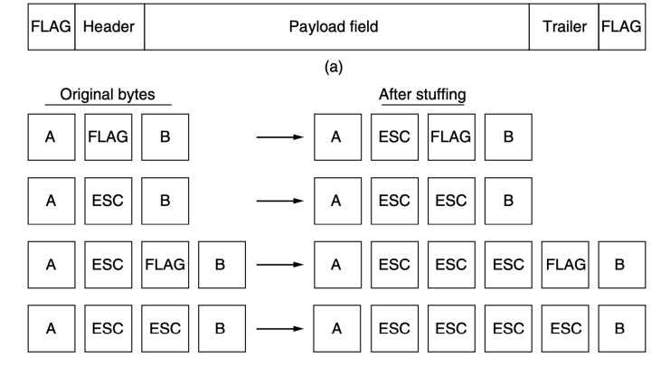
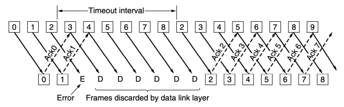
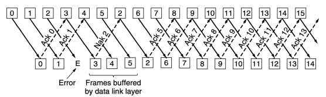

КАНАЛЬНИЙ РІВЕНЬ
КЛЮЧОВІ АСПЕКТИ 
ОРГАНІЗАЦІЇ КАНАЛЬНОГО РІВНЯ

# Функції Канального Рівня

- Канальний рівень використовує служби фізичного рівня для відправлення і отримання бітів комунікаційними каналами
- Специфічні функції канального рівня:
1. Забезпечення строго окресленого службового інтерфейсу для мережевого рівня 2. Обробка помилок передачі даних 3. Управління потоком даних 4. Управління кадрами і формування границь кадрів 5. Управління доступом до спільного каналу передачі даних

# Пакети І 

 Кадри

- Пакет мережевого рівня інкапсулюється в кадр для передачі. Управління кадрами - основа діяльності канального рівня Сервіси, що надаються мережевом у рівню 1. Сервіс без підтверджень, без встановлення з'єднання (Ethernet) - незалежні кадри, відсутні підтвердження 2. Сервіс з підтвердженнями, без встановлення з'єднання (802.11) - *підтвердження* кожного кадру 3. Сервіс з підтвердженнями, зі встановленням з'єднання - правильний порядок кадрів, підтвердження кожного кадру

# Формування Кадра

- Для обслуговування мережевого рівня, канальний рівень використовує сервіси фізичного рівня
- Потік бітів, отриманий від фізичного рівня, не застрахований від помилок
- Канальний рівень повинен *виявити помилки* і, в разі потреби, *виправити* їх
- Потік бітів розбивається на *кадри*, а для кожного кадра обчислюється контрольна сума

# Методи

маркуванн я границь кадрів Розбиття потоку бітів на кадри → проблема виявлення початку нових кадрів
- Підрахунок кількості байтів - Використання сигнальних байтів з символьним заповненням
- Використання сигнальних бітів з бітовим заповненням
- Використання заборонених сигналів фізичного рівня 1. Підрахунок 

 кількості байтів
- Поле в заголовку для зазначення кількості байтів в кадрі
- Недолік - при передачі може бути пошкоджений лічильник → втрата синхронізації 2. Використання 

 сигнальних байтів з символьним заповненням
- Маркування початку і кінця кожного кадра спеціальними байтами (флагами) - вирішення проблеми відновлення синхронізації після збоїв
- ESC екранування - символьне (байтове) 
заповнення 3. Використання сигнальних бітів з бітовим заповненням
- Поділ на кадри на рівні бітів - кадри містять довільну кількість бітів і складаються з блоків довільного розміру
- Бітове заповнення - Допомагає зберігати синхронізацію на фізичному рівні, використання в протоколі USB
4. Використанн я заборонених сигналів фізичного рівня
- Використовуються особливості фізичного рівня (напр. 4В/5В)
- «Заборонені символи» позначають границі кадрів
- Простий пошук границь кадрів - Відсутня необхідність заповнювати дані додатковими байтами чи бітами
- На практиці - комбінації методів. Напр. 

Ethernet і 802.11: *преамбула* (бітовий шаблон) + *поле довжини* кадра

# Обробка Помилок

- Наступна проблема - як гарантувати доставку мережевому рівню *всіх* кадрів, розташованих у правильній послідовності?

- **Управляючі кадри** з позитивними або негативними повідомленнями про отримані кадри - для гарантування надійної доставки
- **Таймери** канального рівня - для уникнення зависання мережі у випадку повної втрати кадрів
- **Нумерація відісланих кадрів** - для можливості відрізнити дублікати кадрів

# Управління Потоком

- Відправник постійно хоче передавати кадри швидше, ніж отримувач може їх отримати?

1) **Управління потоком зі зворотним зв'язком** –
отримувач надсилає інформацію, що дозволяє відправнику продовжити передачу 2) **Управління потоком з обмеженням** –
обмежується швидкість передачі даних відправниками, зворотного зв'язку немає
- Управління потоком частіше використовується на вищих рівнях ВИЯВЛЕННЯ І 
КОРЕКЦІЯ ПОМИЛОК
Основні стратегії боротьби з помилкам и Коди з виправленням помилок (errorcorrecting codes) –
канали з шумами (безпровідні). Коди з виявленням помилок (error-detecting codes) - високонадійні канали.

# Коди З Виправленням Помилок

Коди Хеммінга (пам'ять з самокорекцією)
Двійкові згорткові коди (GSM, супутникові мережі, 802.11) Коди Ріда - Соломона (DSL, кабельні і супутникові мережі, CD, DVD, Blue-Ray) Коди з малою густиною перевірок парності (цифрове телебачення, 10G Ethernet, 802.11)

# Коди З Виявленням Помилок

Перевірка парності. До даних додається один *біт парності*. Код з контрольними сумами. «Контрольна сума» - будь яка група контрольних бітів, пов'язана з повідомленням. Сума бітів даних і контрольної суми повинна бути рівна нулю. Циклічний надлишковий код CRC. *Поліноміальний код*. В основі - представлення бітових рядків у вигляді многочленів з коефіцієнтами, рівними тільки 0 або 1.

ПРОТОКОЛИ 
КОВЗНОГО ВІКНА

# Передача Кадрів Підтверджень

- Потреба передачі даних в двох напрямках
- Один зі способів - *два фізичних канали* (для даних і для підтверджень)
- Недолік - марнування пропускної здатності
- Рішення - використання *одного каналу* для передачі даних в обох напрямках:
- Перемішування кадрів даних і підтверджень в каналі
- Часова затримка → додавання підтвердження до інформаційного кадра вищого рівня → для передачі підтвердження майже не витрачаються ресурси

# Двонапрямлені Протоколи Ковзного Вікна

- Кожен вихідний кадр містить *порядковий номер*
- Відправник працює з певним набором порядкових номерів, дозволеним для передачі 
(кадри, що потрапляють у **вікно відправлення**)
- Отримувач працює з **вікном прийому** (набір кадрів, дозволених для прийому
- Вікно відправника і отримувача не обов'язково мають однакові межі і розмір

# Алгоритм Ковзного Вікна

 Розмір Вікна

- *Розмір вікна* може змінюватись по мірі передачі - Канальний рівень може приймати і передавати дані в *довільному порядку*
- Мережевому рівню пакети **завжди** передаються в строгому порядку, незалежно від розміру вікна
- Вікно *одиничного розміру* - канальний рівень може приймати кадри тільки у встановленому порядку
- *Більший розмір* вікна - порядок приймання кадрів може бути довільним

# Ковзне Вікно 

 Розміру 1

(a) початковий стан (b) після відправлення першого кадра (c) після отримання першого кадра (d) після прийому першого підтвердження

# Недолік 1-Бітового Вікна

- **Час проходження** кадрів в мережі може значно зменшити ефективність використання пропускної здатності каналу
- Супутниковий канал: 50 Кбіт/с, час подвійного оберту - 500 мс; розмір кадрів - 1000 біт
- t = 0 - початок відправлення першого кадра - *t =* 20 мс - кадр повністю відправлений
- t = 270 мс - отримувач прийняв кадр
- *t =* 520 мс - відправник отримав підтвердження
- Відправник був заблокований 500/520 = 96% 
часу, використано 4% пропускної здатності Максимальний розмір вікна відправлення
- Відправнику дозволено надіслати w кадрів не чекаючи підтверджень
- Значення w визначається кількістю кадрів, що 
«вміщається» в канал.

- Ємність каналу = пропускна здатність (біт/с) Х 
час пересилання в одну сторону
- BD (bandwith-delay product) = ємність каналу / 
кількість бітів в кадрі
- Розмір вікна: w = 2BD + 1 Конвеєрна обробка
- Техніка, коли в процесі передачі одночасно перебувають кілька кадрів, називається конвеєрною обробкою (pipelining)
- Що відбудеться, якщо пошкодиться або загубиться кадр в середині довгого потоку?

- Що робити отримувачу з усіма правильними наступними кадрами?

o **Повернення на n** (go-back-n)
o **Вибіркове повторення** (selective repeat)

Повернення 

 на n і вибіркове повторення
Негативні і кумулятивні підтвердження
- Вибіркове повторення часто комбінується з негативним підтвердженням (NAK - Negative Acknowledgement) → стимулює повторне відправлення до завершення часу очікування підтвердження
- **Кумулятивне підтвердження** (cumulative acknowledgement) - якщо надходить підтвердження на кадр n, то кадри n - 1, n - 2, … (тобто усі попередні) автоматично вважаються підтвердженими