ПІДРІВЕНЬ УПРАВЛІННЯ ДОСТУПОМ ДО СЕРЕДОВИЩА

# Широкомовні Канали

- Мережеві технології:
- з використанням **з'єднань точка-точка**
- з використанням **широкомовних каналів**
- Широкомовні канали = канали з множинним доступом або **канали з довільним доступом**
- **Ключова проблема** широкомовних мереж: кому надати канал, якщо на нього одночасно претендують кілька комп'ютерів?

# Підрівень Mac

- Протоколи визначення черговості доступу до каналу передачі даних належать до нижнього підрівня канального рівня, який називається MAC *(Medium Access Control*)
- Підрівень MAC є особливо важливим в локальних мережах, зокрема в безпровідних
- В **глобальних мережах**, за винятком супутникових, використовуються з'єднання типу точка-точка

# Проблема Розподілу Каналу

Як розподілити один широкомовний канал між численними користувачами?

- Традиційний спосіб розділення каналу –
мультиплексування
- Конфлікту між користувачами не виникає
- У випадку *постійної невеликої* кількості абонентів - мультиплексування є простим і ефективним механізмом розподілу
- *Низька ефективність*: погано підходить для пульсуючого комп'ютерного потоку даних

- **Середній час затримки** T для відправлення кадра каналом ємністю C біт/с з теорії масового обслуговування:

1

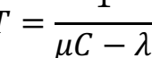

- Кадри з'являються у випадковому порядку із середньою швидкістю l кадрів на секунду; довжина кадрів випадкова і становить 1/µ бітів; µC кадрів на секунду - швидкість обслуговування каналу.

- Якщо C = 100 Мбіт/с, 1/µ = 10 000 бітів, l = 5000 кадрів/с, то T **= 200 мкс**.

- Якщо не врахувати затримки при формуванні черги, то час передачі 10 000 бітів каналом 100 Мбіт/с, формально становить **100 мкс**. Це справедливо тільки у випадку *відсутності* боротьби за канал.

- Якщо поділити канал на N незалежних підканалів, пропускною здатністю C/N біт/с кожен, то:

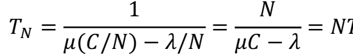

- Значення середньої затримки є в N разів гірше, ніж при використанні однієї спільної черги

# Припущення, Пов'Язані З Динамічним Розподілом Каналу

1. **Незалежний трафік.** Станції незалежні. 

Очікувана кількість кадрів = lDt, де l = const.

2. **Припущення про єдиний канал.** Канал доступний для всіх.

3. **Спостережувані колізії.** Всі станції можуть виявляти колізії.

4. **Неперервний або дискретний час.** Передача може розпочинатись в довільний момент, або тільки на початку кожного такту.

5. **Контроль несучої або його відсутність.**
Визначення чи вільна лінія до її використання.

ПРОТОКОЛИ 
КОЛЕКТИВНОГО 
ДОСТУПУ

# Aloha

- Гаваї, 1970-ті
- Задача підключення користувачів на віддалених островах до головного комп'ютера
- Радіоканал, спільна смуга частот для кожного термінала
- Дві версії системи ALOHA: *чиста* (неперервний час) і дискретна

# Чиста Система Aloha

- Основна ідея - дозволити передачу, як тільки з'являються дані для відправлення → виникнення **колізій** → потреба їх виявлення
- Центральний комп'ютер розсилає отриманий кадр всім іншим станціям → відправник може визначити успішність передачі
- У випадку колізії - відправник очікує *випадковий* інтервал часу і повторює передачу

# Приклад Формування Кадрів В Системі Aloha

Якщо всі кадри мають однаковий розмір - пропускна здатність системи є 

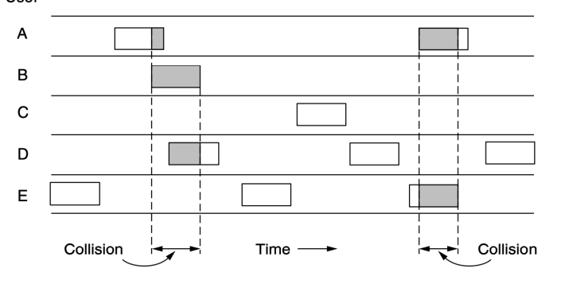

максимальною Ефективність 

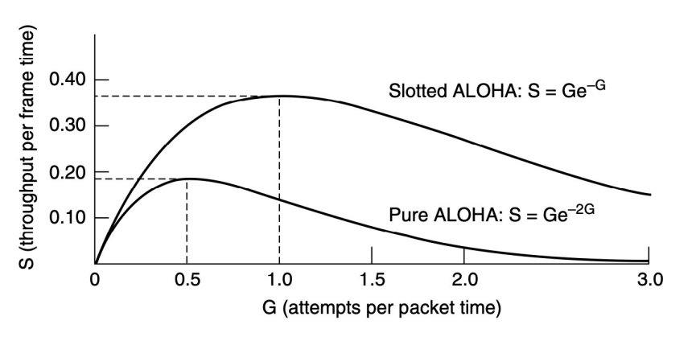 каналу ALOHA
S - продуктивність каналу, G - завантаженість Максимальна продуктивність S≈ 0,184 при G= 0,5

# Дискретна Система Aloha

- Roberts, 1972: поділ часу на **слоти** (або **такти**), які відповідають часу одного кадру
- Потреба синхронізації границь слотів. Один зі способів: спеціальна станція, що передає синхронізуючий сигнал на початку кожного інтервалу
- Вразливий часовий інтервал стає вдвічі коротшим.

Ефективність 

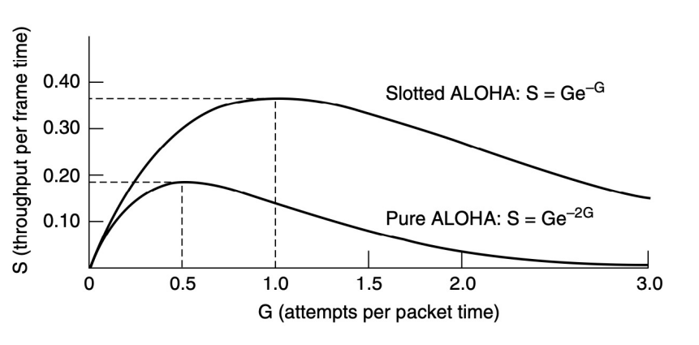 каналу ALOHA
Максимальна продуктивність S ≈ 0,368 при G = 1 Оптимальна ситуація: 37% інтервалів - порожні, 37% - кадри успішно передані, 26% - колізії

# Значення Дискретної Aloha

- Доступ до Інтернет через кабельні мережі
- Спілкування кількох тегів RFID з одним зчитувачем RFID
Протоколи множинного доступу з контролем несучої

# Протоколи Множинного Доступу З Контролем Несучої

- Дискретна ALOHA - максимальний коефіцієнт використання каналу становить 1/e
- Станції не враховують поведінки інших → значна кількість колізій
- Протоколи, в яких станції прослуховують середовище передачі даних і діють відповідно до цього, називають протоколами з контролем несучої (carrier sense *protocol*).

# Наполегливий І Ненаполегливий Csma

- **1-наполегливий CSMA** (*Carrier Sense Multiple* Access) - станція передає кадр з імовірністю 1, якщо канал вільний 1) Прослуховування каналу - перевірка чи він вільний чи занятий 2) Якщо канал вільний - станція відправляє дані 3) Інакше - очікування звільнення каналу 4) Якщо відбувається колізія - *випадкова* пауза, прослуховування, спроба передачі кадру

# 1-Наполегливий Csma: Колізії

- Якщо **дві станції очікують** звільнення каналу третьою - гарантовано виникне колізія
- На кількість колізій впливає **затримка** 

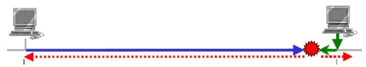

розповсюдження сигналу. Імовірність такої колізії залежить від кількості кадрів, що поміщаються в каналі: **добутку пропускної** здатності на затримку

# Ненаполегливий Csma

- Якщо канал вільний - станція починає передачу даних
- Якщо канал зайнятий - випадкова пауза з наступним повторним прослуховуванням каналу
- Краще використання каналу, однак більші інтервали очікування, ніж у випадку протоколу CSMA з наполегливістю 1

# Csma З Наполегливістю Р

- Протокол CSMA **з наполегливістю р** працює в дискретних калах
- Якщо канал вільний, з імовірністю р починається передача, з імовірністю q = 1 - p станція очікує початку наступного такту
- Якщо канал зайнятий, або виникає колізія –
станція витримує випадкову паузу
- ІЕЕЕ 802.11 - покращений варіант протоколу CSMA з наполегливістю р

# Використання Каналу Залежно Від 

 Його Завантаження Csma З Виявленням Колізій

- Дві станції можуть почати передачу, якщо виявлять, що канал вільний
- Здатність станцій до швидкого розпізнавання колізій і негайного припинення передачі → 
економія часу і покращення продуктивності каналу
- **CSMA/CD** (CSMA with Collision *Detection*), основа мереж Ethernet

# Csma/Cd: Розпізнавання Колізій

- Розпізнавання колізій - аналоговий процес
- Прослуховування каналу під час передачі і порівняння з сигналом, що передається
- Проблема для *безпровідних мереж*: сигнал, що приймається може бути суттєво слабшим за сигнал, що передається
- Спосіб кодування, який дозволить розпізнати колізії (напр. неможливо розпізнати колізію двох 0-вольтових сигналів)

# Csma/Cd

Протоколи без колізій

# Протоколи Без Колізій

- Колізії в CSMA/CD знижують продуктивність системи, особливо при *великій довжині кабелю* і *коротких кадрах*
- Колізії не тільки зменшують *пропускну* здатність, але і роблять час пересилання кадру непостійним (трафік реального часу, VoIP)
- Протоколи без періоду конкуренції. Нехай є N 
станцій з унікальним адресами від 0 до N. Вважаємо, що затримка розповсюдження сигналу є нехтовно малою.

# Протокол Бітової Карти

- **Протокол з резервуванням** - намір про передачу оголошується перед передачею
- Кожен період конкуренції складається рівно з N
часових інтервалів
- Якщо у станції j є кадр для передачі, то вона передає одиничний біт під час j інтервалу
- В кінці всіх N інтервалів усі станції знають, хто хоче передавати
- Далі починається передача кадрів відповідно до порядку номерів → колізії відсутні

# Базовий Протокол Бітової Карти

 Передача Маркера

- Маркер **(token**) - невелике повідомлення, передається від однієї станції до іншої в тому самому наперед визначеному порядку
- Маркер - *дозвіл на передачу*
- Станція, яка отримала маркер, має право відправити кадр перед тим як передати маркер наступній станції
- Якщо кадрів для відправлення немає - просто передається маркер

# Протокол Token-Ring

- Порядок відправлення даних визначається топологією мережі
- Кадри передаються в тому ж напрямку, що і маркер
- Отримувач або відправник (якщо кадр пройшов повне коло) вилучає кадр з мережі
- Фізичне кільце не є необхідним –

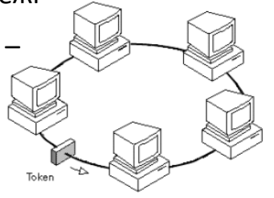

маркерна шина **(token bus**)

# Мережі На Базі Маркерного Кільця

TOKEN RING (IEEE 802.5)

- 1980-ТІ
FDDI (*FIBER DISTRIBUTED* 

DATA INTERFACE) - 1990-
ТІ
RPR (*RESILIENT PACKET* 

RING), IEEE 802.17 –
2000-НІ

# Двійковий Зворотній Відлік

Недолік протоколів бітової карти і передачі маркера - накладні витрати в один біт на станцію → **погане масштабування** в мережах з 1000+ станцій Протокол з **двійковим зворотнім відліком** → підвищення ефективності каналу Протокол з двійковим зворотнім відліком
- Станція, яка хоче 

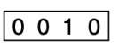

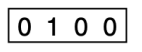

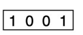

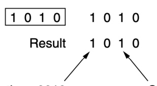

зайняти канал, передає свою адресу у вигляді бітового рядка
- Біти адреси логічно додаються (OR)
- Пріоритет станції залежить від її адреси Протоколи безпровідних локальних мереж

# Типова Конфігурація 

 Безпровідних Lan Особливості Безпровідних Локальних Мереж

- Немає можливості розпізнати колізії в той момент, коли вони відбуваються - сигнал, що приймає станція може бути дуже *слабким*
- Для виявлення колізій та інших помилок використовують **підтвердження**
- В безпровідній мережі деколи немає можливості передавати або приймати сигнал з інших станцій - обмежений діапазон передачі

# Проблеми 

використання CSMA
a) **Проблема прихованої станції** (hidden *terminal problem*). 

А і С - приховані станції під час пересилання даних на В
b) **Проблема засвіченої станції** (exposed *terminal problem*). 

В і С засвічені станції під час пересилання даних на А і D
Проблеми використання CSMA
- Перед початком передачі необхідно знати чи є активність в радіодіапазоні поблизу **приймача**
- Протокол CSMA дає інформацію про активність поблизу **передавача** шляхом опитування несучої
- У випадку провідного каналу всі сигнали досягають **всіх** станцій
- В системі з радіозв'язком **одночасно** можуть передавати дані *декілька* станцій, якщо вони передають *різним* приймачам, розміщеним достатньо далеко один від одного Протокол MACA
- **MACA** (Multiple Access with Collision *Avoidance*) 
- Замість прослуховування несучої - відправлення короткого кадру для інформування оточуючих 1) А→В: RTS (Request *to Send*), містить довжину наступного кадра даних 2) В→А: CTS (Clear *to Send*), містить довжину інформаційного кадра (скопійовану з RTS)
3) А→В: передача даних

Протокол

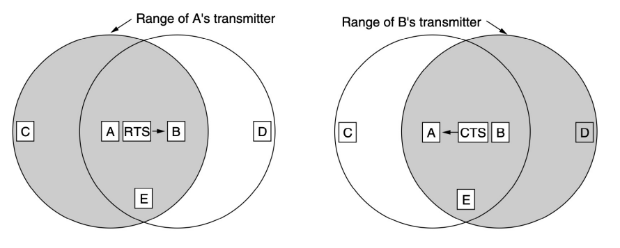 MACA
- Станції, що чують RTS від станції А повинні зберігати тишу до отримання CTS станцією А
- Станції, що чують CTS повинні утриматись від передачі, поки станція В не отримає кадр даних