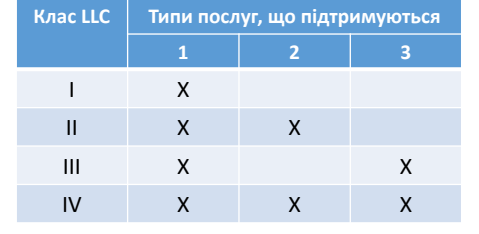
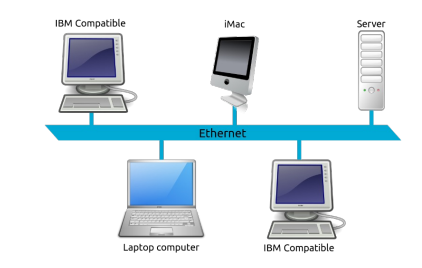
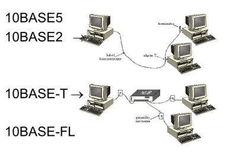
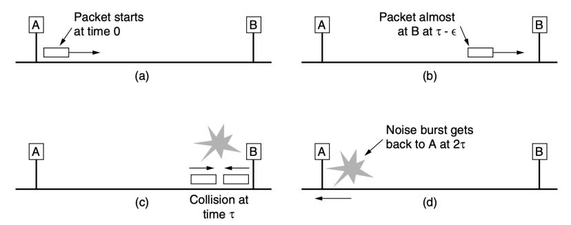
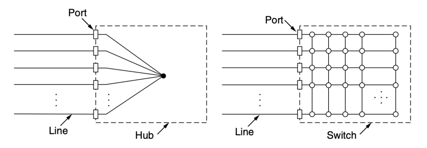
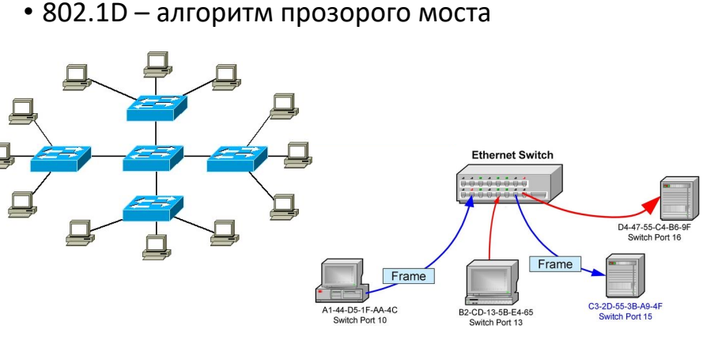
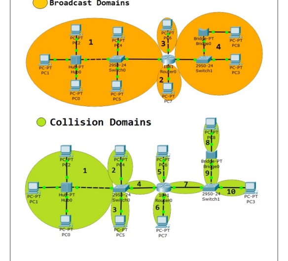
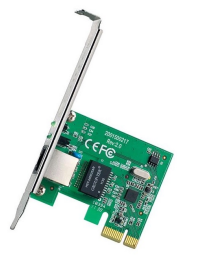
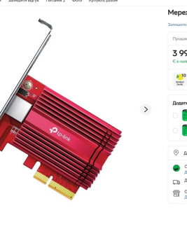

ETHERNET

# Робочі Групи Іеее 802

| Номер    | Назва                                                            |
|----------|------------------------------------------------------------------|
| 802.1    | Управління мережевими пристроями та їх взаємодія                 |
| 802.2 †  | LLC                                                              |
| 802.3    | Ethernet                                                         |
| 802.4 †  | Token bus                                                        |
| 802.5 †  | Token ring                                                       |
| 802.6 †  | Міські мережі MAN (Distributed-queue dual-bus)                   |
| 802.7 †  | Широкосмугова передача по коаксіальному кабелю                   |
| 802.8 †  | Волоконно-оптичні мережі (Fiber Optic TAG)                       |
| 802.9 †  | Integrated Services LAN                                          |
| 802.10 † | Interoperable LAN Security                                       |
| 802.11   | Wi-Fi                                                            |
| 802.12 † | 100VG-AnyLAN                                                     |
| 802.13   | Не використовується                                              |
| 802.14 † | Кабельні модеми                                                  |
| 802.15   | Wireless PAN (Bluetooth, Zigbee)                                 |
| 802.16 ¯ | WiMAX                                                            |
| 802.17 ¯ | Resilient Packet Ring                                            |
| 802.18   | Радіорегулювання                                                 |
| 802.19   | Співіснування мереж 802.11                                       |
| 802.20 ¯ | Мобільний широкосмуговий безпровідний доступ (подібно до 802.16) |
| 802.21   | Media Independent Handoff (роумінг між різними технологіями)     |
| 802.22   | Регіональні безпровідні мережі (Wireless Regional Area Network)  |
| 802.23   | Робоча група надзвичайних сервісів (березень, 2010)              |
| 802.24   | Smart Grid TAG (листопад, 2012)                                  |
| 802.25   | Omni-Range Area Network (ще не ратифіковано)                     |
| 802.26   | Reconfigurable Convolutional Encoder                             |

# Мережі Ieee 802

Група стандартів, що стосуються локальних (LAN) і міських (MAN) мереж Служби і протоколи, описані в IEEE 802 охоплюють фізичний і канальний рівні моделі OSI
IEEE 802 ділить канальний рівень на два підрівня - LLC і **MAC:**
- канальний рівень
- підрівень LLC
- підрівень MAC
- фізичний рівень

# Llc (Ieee 802.2)

- LLC (Logical Link Control) - вищий підрівень канального рівня в стандартах IEEE 802
- Підрівень LLC є *ідентичним* для різних фізичних середовищ передачі даних (Ethernet, Token Ring, WLAN тощо)
- Підрівень LLC **відповідає за**:
- мультиплексування протоколів вищого рівня - управління потоком, підтвердження і повторну передачу втрачених кадрів

# Режими Роботи Llc

- Режими роботи LLC:
- **Тип 1** - без підтверджень без встановлення з'єднань, служба дейтаграм (unicast, multicast, broadcast)
- **Тип 2** - з підтвердженням і встановленням з'єднання - **Тип 3** - з підтвердженням без встановлення з'єднань 
(тільки unicast)
- Кожному вузлу мережі призначається **клас LLC**:

# Заголовок Llc

- Будь який PDU 802.2 LLC має наступний формат:

| Заголовок 802.2 LLC   | Дані        |                |                |
|-----------------------|-------------|----------------|----------------|
| Адреса DSAP           | Адреса SSAP | Контроль       |                |
| 8 бітів               | 8 бітів     | 8 або 16 бітів | кратне 8 бітам |

- Якщо використовується протокол доступу до підмережі (SNAP), то його розширення розміщується на початку поля даних:

| Заголовок 802.2 LLC   | Розширення SNAP   | Дані           |         |              |                |
|-----------------------|-------------------|----------------|---------|--------------|----------------|
| DSAP                  | SSAP              | Контроль       | OUI     | ID протоколу |                |
| 8 бітів               | 8 бітів           | 8 або 16 бітів | 24 біти | 16 бітів     | кратне 8 бітам |

# Мережі Ethernet 802.3

- Найбільш розповсюджений тип КМ
- **Класичний Ethernet**
- **Комутований Ethernet** (switched Ethernet)

# Стандарти Ethernet 802.3

| Стандарт   | Дата прийняття      | Опис                                                                 |
|------------|---------------------|----------------------------------------------------------------------|
| 802.3      | 1983                | 10BASE5 («Товстий Ethernet»)                                         |
| 802.3a     | 1985                | 10BASE2 («Тонкий Ethernet»)                                          |
| 802.3i     | 1990                | 10BASE-T (вита пара)                                                 |
| 802.3j     | 1993                | 10BASE-F (оптичне волокно)                                           |
| 802.3u     | 1995                | Fast Ethernet                                                        |
| 802.3x     | 1997                | Управління потоком в повнодуплексному режимі                         |
| 802.3z     | 1997                | Gigabit Ethernet                                                     |
| 802.3ab    | 1999                | Gigabit Ethernet по мідному кабелю 5-ї категорії                     |
| 802.3an    | 2006                | 10GBaseT - 10 Gigabit Ethernet по мідному кабелю 6-й (7-й) категорії |
| 802.3ck    | 2022                | 100, 200, 400 Gbit Ethernet на основі 100 Gbit каналів               |
| 802.3cm    | 2020                | 400 Gbit/s over multimode fiber (four and eight pairs, 100 m)        |
| 802.3cz    | 2023                | Multi-gigabit optical automotive Ethernet                            |
| 802.3db    | 2022                | 100 Gbit/s, 200 Gbit/s, and 400 Gbit/s operation over optical fiber  |
| 802.3df    | 2024                | 200 Gb/s, 400 Gb/s and 800 Gb/s using 100 Gbit/s lanes               |
| 802.3dj    | Заплановано на 2026 | 200 Gb/s, 400 Gb/s, 800 Gb/s and 1.6 Tbit/s using 200 Gbit/s lanes   |

# Фізичний Рівень Класичної Мережі Ethernet

- Історія мережі Ethernet:
- 1976 - Xerox, товстий коаксіальний кабель 3 Mбіт/с
- 1978 - DEC, Intel i Xerox, 10 Мбіт/с, стандарт DIX
- 1983 - стандарт **IEEE 802.3**

- **Повторювач** (repeater) - пристрій *фізичного рівня*

# Фізичний Рівень Класичної Мережі Ethernet

| 10BASE5                              | 10BASE2                    | 10BASE-T             | 10BASE-FL         |                     |
|--------------------------------------|----------------------------|----------------------|-------------------|---------------------|
| Пропускна                            | 10 Мбіт/с                  | 10 Мбіт/с            | 10 Мбіт/с         | 10 Мбіт/с           |
| здатність Кабель                     | Товстий                    | Тонкий               | Неекранована вита | Одно- і             |
| багатомодове  оптоволокно            |                            |                      |                   |                     |
| Топологія                            | Шина з 50-Ом               |                      |                   |                     |
| коаксіальний кабель  діаметром 0,5'' | коаксіальний  кабель RG-58 | пара cat. 3 (2 пари) |                   |                     |
| Шина з 50-Ом                         | Зірка                      | Точка-точка          |                   |                     |
| термінаторами                        | термінаторами              |                      |                   |                     |
| Кодування                            | Manchester                 | Manchester           | Manchester        | Manchester (on-off) |
| Кількість станцій в                  | 100                        | 30                   | -                 | -                   |
| сегменті Максимальна                 | 297 (3x99)                 | 87 (3x29)            | 1024              | 1024                |
| кількість станцій Довжина сегменту   | 500 м                      | 185 м                | 100 м             | 2000 м              |
| мережі Максимальна кі                                      | 5                          | 5                    | 5                 | 5                   |
| лькість сегментів Максимальний       | 2500 м                     | 925 м                | 500 м             | 2500 м              |
| діаметр мережі Правило               | 5-4-3                      | 5-4-3                | 4-х хабів         |                     |

# Протокол Підрівня Mac Класичного Ethernet

- Існує 4 стандарти кадрів:
- Ethernet вер. 1 (Raw 802.3; Novell 802.3) - на даний час не використовується
- Ethernet вер. 2 (Ethernet II; Ethernet DIX) –
найпоширеніший
- IEEE 802.3 LLC (Novell 802.2; 802.3/802.2) - IEEE 802.2 Subnetwork Access Protocol (SNAP)
- Відрізняються довжиною заголовку, максимальною довжиною кадру (MTU) та ін.

# Кадр Ethernet

 Преамбула

- *Преамбула* - 7 октетів 10101010 + SFD
- *Обмежувач початку кадру* (start of frame delimiter, SFD) - октет 10101011
- Манчестерське кодування - 10 МГц, тривалість 6,4 мкс, дає можливість синхронізації

# Mac Адреси

- Унікальні 6-байтові адреси (**11-A0-17-3D-BC-01)**
- **Перший біт:** 0 - індивідуальна адреса; 1 –
групова (multicast) адреса
- **Другий біт:** 0 - адреса призначена централізовано (Ethernet); 1 - адреса призначена локально
- **Перші три байти** - ідентифікатор організації виробника, OUI (призначається IEEE)
- **FF-FF-FF-FF-FF-FF** - широкомовна адреса

# Формат Кадру Ethernet

| Поле   | Опис                                                    | Довжина, байт   |
|--------|---------------------------------------------------------|-----------------|
| DA     | Destination Address = адреса призначення                | 6               |
| SA     | Source Address = адреса відправника                     | 6               |
| L      | Length = довжина поля даних в кадрі (в кадрі Raw 802.3) | 2               |
| T      | Type = тип протоколу вищого рівня (в кадрі Ethernet II) | 2               |
| Data   | поле даних                                              | 0 - 1500        |
| Pad    | Padding = поле заповнювача                              | якщо дані < 46  |
| FCS    | Frame Check Sequence = контрольна сума CRC-32           | 4               |

# Типи Кадрів Ethernet Типи Кадрів Ethernet

| Тип або            |                       |          |
|--------------------|-----------------------|----------|
| Тип кадру          | Перші два байти даних |          |
| Довжина            |                       |          |
| Raw (Novell) 802.3 | ≤ 1500                | 0xFFFF   |
| Ethernet II (DIX)  | ≥ 1536                | Будь-які |
| IEEE 802.3 LLC     | ≤ 1500                | Інші     |
| IEEE 802.2 SNAP    | ≤ 1500                | 0xAAAA   |

| Тип кадру                              | IP   | IPX   |
|----------------------------------------|------|-------|
| Ethernet DIX = Ethernet II *           | Так  | Так   |
| 802.3/LLC = Novell 802.2 = 802.3/802.2 | Ні   | Так   |
| Raw 802.3 = Novell 802.3               | Ні   | Так   |
| Ethernet SNAP                          | Так  | Так   |

# Csma/Cd. Виявлення Колізій

- 1-наполегливий CSMA/CD
- При виявленні колізії - **jam-послідовність** (32-48 

бітів)

# Мінімальна Довжина Кадру

- Для надійного розпізнавання колізій повинно виконуватись співвідношення !"\# ≥ 
- PDV, Path Delay Value (RDT, Round Trip Delay) - час подвійного проходження сигналу
- Для мережі 10 Мбіт/с діаметром 2500 м, в найгіршому випадку PDV становить **50 мкс**
- При 10 Мбіт/с мінімальна довжина кадру становить *500 бітів*, тому мінімальна довжина кадру Ethernet становить 512 бітів = 64 байти

# Алгоритм Двійкового Експоненційного Очікування

- Після виникнення колізії станція витримує паузу протягом випадкового інтервалу:
Пауза = ×Інтервал відтермінування
-  ∈ 0 … 2$,  ∈ 1 … 10 - номер повторної спроби
- Інтервал відтермінування =  = 512 
(51,2 мкс для 10 Мбіт/с)
- Всього спроб передачі кадру - 16

# Параметри Підрівня Mac Класичного Ethernet

| Параметр                            | Значення             |
|-------------------------------------|----------------------|
| Білова швидкість                    | 10 Мбіт/с            |
| Інтервал відтермінування            | 51,2 мкс = 512 bt    |
| Інтервал між кадрами = IPG          | 9,6 мкс = 96 bt      |
| Max. кількість спроб передачі кадру | 16                   |
| Max. зростання діапазону паузи      | 10                   |
| Довжина jam-послідовності           | 32-48 бітів          |
| Min. довжина кадру (без преамбули)  | 64 байти = 512 бітів |
| Max. довжина кадру (без преамбули)  | 1518 байтів          |
| Довжина преамбули                   | 8 байтів = 64 біти   |
| Max. відстань між станціями         | 2500 м               |
| Max. кількість станцій в мережі     | 1024                 |

# Продуктивність Мережі Ethernet

- Ефективність каналу залежно від довжини кадру F, пропускної здатності мережі B, довжини кабелю L і швидкості розповсюдження сигналу c для оптимального випадку e колізій на кадр:
1 Ефективність каналу =
1 + 2/
- Збільшення пропускної здатності або розміру мережі *зменшує ефективність* при заданому розмірі кадру

# Ефективність Мережі Ethernet При 

 10 Мбіт/С З 512-Бітовими Інтервалами Продуктивність Мережі Ethernet

- Швидкість, з якою протокол передає біти по лінії зв'язку називається номінальною швидкістю протоколу
- **Продуктивність мережі** залежить від швидкості передачі кадрів по лініям зв'язку і швидкості обробки цих кадрів комунікаційним обладнанням
- Для комунікаційного обладнання найбільш важким режимом є обробка кадрів мінімальної довжини

# Максимальна Продуктивність Мережі Для Кадрів Min. Довжини

| Frame Part                | Minimum Size Frame   |
|---------------------------|----------------------|
| Inter Frame Gap (9.6µs)   | 12 Bytes             |
| MAC Preamble (+ SFD)      | 8 Bytes              |
| MAC Destination Address   | 6 Bytes              |
| MAC Source Address        | 6 Bytes              |
| MAC Type (or Length)      | 2 Bytes              |
| Payload (Network PDU)     | 46 Bytes             |
| Check Sequence (CRC)      | 4 Bytes              |
| Total Frame Physical Size | 84 Bytes             |

Max кількість кадрів в секунду:
Ethernet Data Rate (bps) / Total Frame Physical Size 
(bits) = 10 000 000 / ( 84 * 8) = **14 880,95 кадрів/c**
*1000 кадрів/c - більшість маршрутизаторів і мостів

# Максимальна Продуктивність

мережі для кадрів max. довжини

| Frame Part                | Minimum Size Frame   |
|---------------------------|----------------------|
| Inter Frame Gap (9.6µs)   | 12 Bytes             |
| MAC Preamble (+ SFD)      | 8 Bytes              |
| MAC Destination Address   | 6 Bytes              |
| MAC Source Address        | 6 Bytes              |
| MAC Type (or Length)      | 2 Bytes              |
| Payload (Network PDU)     | 1500 Bytes           |
| Check Sequence (CRC)      | 4 Bytes              |
| Total Frame Physical Size | 1538 Bytes           |

Max кількість кадрів в секунду:
Ethernet Data Rate (bps) / Total Frame Physical Size 
(bits) = 10 000 000 / ( 1538 * 8) = 812,74 **кадрів/c**

# Комутовані Мережі Ethernet

- Розвиток класичного Ethernet - **концентратори**
(hub), вита пара, легко додавати станції
- **Концентратор** - пристрій *фізичного рівня*
- Концентратори не збільшують ємність мережі

# Комутатори

- **Комутатор (switch)** передає кадри тільки на той порт, для якого цей кадр призначений

# Домен Колізій

- В концентраторі всі підключені станції становлять один **домен колізій**. Отже всі повинні використовувати алгоритм CSMA/CD
- В комутаторі **кожен порт** є окремим доменом колізій o**Повний дуплекс:** колізії неможливі, CSMA/CD не використовується o**Напівдуплекс:** CSMA/CD використовується тільки *між* станцією і портом комутатора

# Домен Колізій

Широкомовни

й домен і домен колізій

# Комутований Ethernet: Управління Потоком

- Механізм управління потоком (Flow Control) дає можливість запобігти втраті даних у випадку переповнення буфера приймаючого пристрою

## - Напівдуплекс:

o Метод зворотного тиску (Backpressure) o Метод агресивної поведінки порту комутатора

## - Повний Дуплекс:

o **IEEE 802.3х**: управляючі МАС-кадри (кадр-пауза): 
унікальні значення поля «Довжина/Тип» (88-08); заборонені коди фізичного рівня (4В/5В)

# Додаткові Можливості Комутаторів

- Трансляція протоколів канального рівня (802.1H)
- Підтримка алгоритму Spanning Tree (802.1D)
- Управління потоком кадрів
- Комутація «на льоту» або з буферизацією - Використання різних класів сервісу (порт, МАС)
- Підтримка віртуальних мереж, VLAN (802.1Q)
o Port-based o MAC-based o Protocol-based o Authentication based (802.1х)

# Комутований Ethernet: Переваги

- Вища **продуктивність**: (1) відсутність колізій; (2) 
можливість передачі кадрів між різними станціями одночасно
- **Безпека** передачі даних - ізоляція трафіку комутатором
- В сучасних мережах в основному використовують комутований Ethernet

# Fast Ethernet

- 1992: Комітет 802.3 - збільшити швидкість роботи стандарту 802.3 і залишити його без змін
- *Обернена сумісність* з існуючими локальними мережами Ethernet
- Нова технологія, новий метод доступу (трафік реального часу, голос) - 802.12 100VG-AnyLAN
- 1995: **802.3u**, Fast Ethernet
- Всі формати кадрів, інтерфейси і процедури залишаються без змін
- Зменшується час передачі біта зі 100 до 10 нс
- *Вита пара*, концентратори, комутатори

# Основні Типи Кабелів Для Мереж Fast Ethernet

- Ознакою вільного стану мережі є передача по ній *символу простою джерела* - відповідного надлишкового коду Idle **11111** (в класичному Ethernet - відсутність сигналу)

| Довжина    |             |          |                                                       |
|------------|-------------|----------|-------------------------------------------------------|
| Назва      | Тип         | Переваги |                                                       |
| сегменту   |             |          |                                                       |
| 100Base-T4 | Вита пара   | 100 м    | Використання UTP cat. 3 Повний дуплекс при 100 Мбіт/с |
| 100Base-TX | Вита пара   | 100 м    | (UTP cat. 5) Повний дуплекс при 100 Мбіт/с;           |
| 100Base-FX | Оптоволокно | 2000 м   | велика довжина сегменту                               |

# 100Base-T4

- Сигнальна швидкість - 25 МГц (в класичному Ethernet - 20 МГц)
- Використовуються **чотири пари**: одна - прийом, одна - передача, дві перемикаються залежно від поточного напрямку передачі даних
- Кодування **8B6T+РАМ-3**: трійкові сигнали з трьома рівнями напруги

# 100Base-Tx/Fx

100Base-TX
- Сигнальна частота - 125 МГц
- Використовуються **дві пари** (прийом, передача)
- Кодування **4В/5В+MLT-3** (подібний на NRZI) - *Повний дуплекс* 100Base-FX
- Два оптичних багатомодових кабелі
- Кодування **4В/5В+NRZI**
- Повний дуплекс

# Fast Ethernet. Csma/Cd

- Збільшення бітової швидкості → збільшити мінімальний розмір кадру або зменшити максимальну довжину кабелю
- Максимальний діаметр мережі було зменшено в 10 разів (довжина сегменту витої пари - 100 м)
- 100Base-FX - занадто довгий кабель (2 км) → 
підключення до комутатора, повний дуплекс без колізій

# Автоматичне Узгодження (Autonegotiation)

- Пріоритети (IEEE 802.3, 2015)
1. 10GBASE-T full duplex 2. 1000BASE-T full duplex 3. 1000BASE-T half duplex 4. 100BASE-T2 full duplex 5. 100BASE-TX full duplex 6. 100BASE-T2 half duplex 7. 100BASE-T4 half duplex 8. 100BASE-TX half duplex 9. 10BASE-T full duplex 10. 10BASE-T half duplex

# Обмеження Мережі Fast Ethernet На Концентраторах

Правило 1 або 2 хабів:
В *одному домені колізій* допускається наявність одного концентратора **класу І**, або двох - класу ІІ

| Клас                    | Кодування                               | Порти                          | Затримка   |
|-------------------------|-----------------------------------------|--------------------------------|------------|
| 4B/5B і                 | 70 бітових інтервалів  через трансляції |                                |            |
| різних систем кодування |                                         |                                |            |
| Клас І                  | 100Base-TX/FX/T4                        |                                |            |
| 8B/6T 4B/5B  або        | 100Base-TX/FX або                       | 46 bt для TX/FX 33,5 bt для T4 |            |
| Клас ІІ                 | 8B/6T                                   | 100Base-T4                     |            |

# Gigabit Ethernet

- *Збільшення швидкості передачі* в 10 разів при збереженні оберненої *сумісності* зі старими мережами Ethernet
- Gigabit Ethernet (IEEE 802.3ab, 1999):
- дейтаграмний сервіс без підтверджень (unicast + 
broadcast)
- незмінна схема адресації (48-бітова МАС-адреса)
- незмінний формат кадру та його розміри
- Всі конфігурації будуються за принципом **«точкаточка»** (комутатори або концентратори)

# Gigabit Ethernet: Режими Роботи

- Підтримуються два режими: **повнодуплексний** і напівдуплексний
- Основний режим - **повний дуплекс**
(комутатори)
- Колізії відсутні → CSMA/CD не використовується. 

Максимальна довжина кабелю обмежена потужністю (затуханням) сигналу
- **Автоматичне узгодження**, комутатори обирають оптимальну швидкість

# Gigabit Ethernet: Напівдуплекс

- **Напівдуплекс** використовується при з'єднанні комп'ютерів концентраторами
- Можливі колізії → використання CSMA/CD → 
максимальна довжина кабелю - 25 м
- Для збільшення діаметра мережі до 200 м додано:
- Розширення носія (**carrier extension**): апаратура додає заповнення, що збільшує кадр до 512 байт
- Пакетна передача кадрів (**frame bursting**): 
відправник може об'єднати кілька кадрів в пакет (не більше 8192 байтів). Якщо повна довжина пакету менша 512 байтів - розширення носія

# Кабелі Gigabit Ethernet

- Волоконна оптика допускає дві довжини хвилі: 
0,85 мкм (1000Base-SX) і 1,3 мкм (1000Base-LX)

| Довжина              |                                      |          |                                      |
|----------------------|--------------------------------------|----------|--------------------------------------|
| Назва                | Тип                                  | Переваги |                                      |
| сегменту             |                                      |          |                                      |
| 1000Base-SX          | Оптоволокно                          | 550 м    | Багатомодове волокно (50 i 62,5 мкм) |
| (802.3z) 1000Base-LX | Одномодове (10 мкм) або багатомодове |          |                                      |
| Оптоволокно          | 5000 м                               |          |                                      |
| (802.3z)             | волокно (50 і 62,5 мкм)              |          |                                      |
| 1000Base-CX          | 2 пари STP                           | 25 м     | Екранована вита пара                 |
| (802.3z) 1000Base-T  | 4 пари UTP                           | 100 м    | Неекранована вита пара cat. 5.       |
| (802.3ab)            |                                      |          |                                      |

# Gigabit Ethernet: Кодування

- 8B/10B **+ скремблер**, кодові слова вибираються так, щоб вони були *збалансовані* і давали можливість *відновити синхронізацію*
- **802.3z**: фізичне кодування NRZ
- **UTP cat. 5**: використовуються *всі чотири пари*, 
кожна пересилає дані одночасно в двох напрямках (цифрова обробка сигналів)
- **802.3ab**: фізичне кодування РАМ-5 - п'ять рівнів напруги, які кодують по два біти

# Дуплексна Передача По 

 Чотирьох Парах Utp Cat. 5 Gigabit Ethernet: Управління Потоком

- 1 мс = 1953 кадри в буфері
- **Управління потоком**: службовий кадр PAUSE 
(802.1x), в якому поле Type має значення 0x8808
- Гігантські кадри, джамбо-кадри (**jumbo frames**), 
розміром більше 1500 байтів (зазвичай до 9 Кбайт). Не визначено в стандарті для сумісності з попередніми версіями. Підтримується більшістю виробників

# 10-Gigabit Ethernet

- Тільки **повний дуплекс**
- CSMA/CD більше не є частиною архітектури
- Сумісність на основі автоматичного узгодження швидкості
- Кодування 64B/66B (10GBase-CX4 - 8B/10B)

# Кабелі 10-Gigabit Ethernet

| Довжина               |                      |          |                              |
|-----------------------|----------------------|----------|------------------------------|
| Назва                 | Тип                  | Переваги |                              |
| сегменту              |                      |          |                              |
| 10GBase-SR            | Багатомодове волокно |          |                              |
| Оптоволокно           | до 300 м             |          |                              |
| (802.3ae)             | (0,85 мкм)           |          |                              |
| 10GBase-LR            | Оптоволокно          | 10 км    | Одномодове волокно (1,3 мкм) |
| (802.3ae) 10GBase-ER  | Оптоволокно          | 40 км    | Одномодове волокно (1,5 мкм) |
| (802.3ae) 10GBase-CX4 | 4 пари біаксіального | 15 м     | Біаксіальний мідний кабель   |
| (802.3ak)             | кабелю               |          |                              |
| 10GBase-T             | 4 пари UTP           | 100 м    | UTP cat. 6а або 7            |
| (802.3an)             |                      |          |                              |

# 10Gbase-T

- Найпоширеніший стандарт 10-Gigabit Ethernet
- Вита пара категорії 6а або 7 (100 м), але на довжині до 55 м можна використовувати кабель категорії 6
- Амплітудно-імпульсна модуляція з 16 рівнями сигналу (РАМ-16), що кодуються в рамках сигнального сузір'я DSQ128
- Перед кодуванням використовуються код прямої корекції помилок з малою густиною перевірок (на основі коду Ріда - Соломона)
Мережеві 

адаптери 10GBase-T

# Кабель

 10Gbase-T 40 І 100 Gigabit Ethernet

- **40 Gigabit Ethernet** (40GbE) і **100 Gigabit Ethernet** 
(100GbE) стандарти, в яких встановлюється швидкість передачі даних в 40 і 100 Гбіт/с при спільному використанні ліній зв'язку (*lane*) на 10 або 25 Гбіт/с
- IEEE 802.3ba-2010
- 802.3bg-2011
- 802.3bj-2014
- 802.3bm-2015

# Кабелі 40 І 100 Gigabit Ethernet

| PHY                                      | 40 Gigabit Ethernet   | 100 Gigabit Ethernet   |
|------------------------------------------|-----------------------|------------------------|
| Min 1 м по з'єднуючій платі              | 40GBase-KR4           |                        |
| Min 10 м по мідному кабелю               | 40GBase-CR4           | 100GBase-CR10          |
| Min 100 м по багатомодовому  оптоволокну | 40GBase-SR4           | 100GBase-SR10          |
| Min 125 м по багатомодовому  оптоволокну | 40GBase-SR4           | 100GBase-SR10          |
| Min 10 км по одномодовому  оптоволокну   | 40GBase-LR4           | 100GBase-LR4           |
| Min 40 км по одномодовому  оптоволокну   | 100GBase-ER4          |                        |
