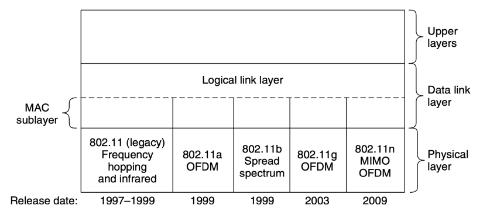
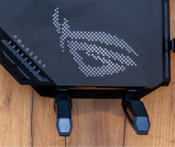
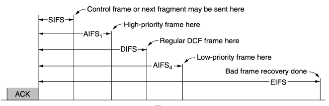
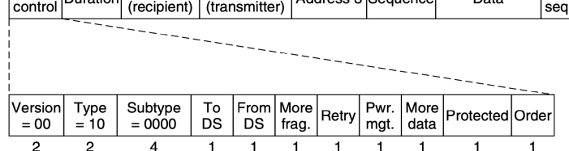

БЕЗПРОВІДНІ 
ЛОКАЛЬНІ МЕРЕЖІ

# Безпровідні Мережі

 Архітектура

 Мережі 802.11

- **Режим інфраструктури** - кожен клієнт зв'язується з **точкою доступу** (Access Point, АР), яка, своєю чергою, підключена до мережі
- Довільний режим (**ad hoc**) - набір комп'ютерів, що можуть безпосередньо надсилати кадри один одному

# Стек Протоколів 802.11

- Стек протоколів 802.11 є однаковим для клієнтів 

# І Точок Доступу Стандарти 802.11

| Protocol                | Date              | Frequency (GHz)   | Bandwith (MHz)   | Stream data  rate (Mbit/s)   | MIMO   | Indoor   |     |
|-------------------------|-------------------|-------------------|------------------|------------------------------|--------|----------|-----|
| range (m)               | Outdoor range (m) |                   |                  |                              |        |          |     |
| IEEE 802.11a            | 1999              | 5                 | 5, 10, 20        | 6-54                         | -      | 35       | 120 |
| IEEE 802.11b            | 1999              | 2.4               | 22               | 1-11                         | -      | 35       | 140 |
| IEEE 802.11g            | 2003              | 2.4               | 5, 10, 20        | 6-54                         | -      | 38       | 140 |
| IEEE 802.11n            | 2009              | 2.4, 5            | 20, 40           | 72-600                       | 4      | 70       | 250 |
| (Wi-Fi 4) IEEE 802.11ac | 2013              | 5                 | 20, 40, 80, 160  | 433-6933                     | 8      | 35       | ?   |
| (Wi-Fi 5) IEEE 802.11ax | 2019              | 2.4, 5            | 20, 40, 80, 160  | 574-9608                     | 8      | 30       | 120 |
| (Wi-Fi 6, 6E)           | 2020              | 6                 |                  |                              |        |          |     |
| IEEE 802.11be           | Dec. 2024         | 2.4, 5, 6         | 80, 160, 240,    | 1376-46120                   | 16     | 30       | 120 |
| (Wi-Fi 7)               | 320               |                   |                  |                              |        |          |     |
| IEEE 802.11bn           | May 2028          | 2.4, 5, 6, 42,    | 320              | 100 Gbit/s                   | 16     | ?        | ?   |
| (Wi-Fi 8)               | 60, 71            |                   |                  |                              |        |          |     |

# Asus Rog 

 Rapture Gt-Be98

- Wi-Fi 7 (IEEE 802.11be):

4096 QAM, смуга 320 МГц, швидкість до 46 Гбіт/с (6 ГГц)
- Порти: 10-Gb WAN/LAN, 

10-Gb LAN; 2,5-Gb WAN/LAN, 3 x 2,5-Gb LAN; 1-Gb LAN

# Фізичний Рівень 802.11

- Радіосигнали ближнього радіусу дії в діапазоні ISM 2,4 або 5 ГГц (без ліцензування - до 1 Вт; в безпровідних мережах типово 50 мВт)
- Діапазон 2,4 ГГц більш населений
- Адаптація швидкості (rate **adaptation**) залежно від якості сигналу. Хороша адаптація важливіша за хорошу продуктивність з'єднання

# Протокол Підрівня Mac В 802.11

- Радіопередавачі - майже завжди напівдуплекс
- Отриманий сигнал може бути значно слабший за переданий
- Проблема з розпізнаванням колізій як в CSMA/CD
- 802.11 намагається уникати колізій за рахунок протоколу CSMA/CA

# Csma/Ca

- Якщо є кадр для надсилання, станція починає цикл з *мовчання випадкової довжини*
- Станція очікує звільнення каналу і відраховує слоти бездіяльності, призупиняючи відлік на час відправлення кадрів
- Відправлення кадру, коли лічильник = 0
- Якщо кадр проходить успішно - отримувач надсилає коротке *підтвердження*
- Якщо підтвердження немає - подвоєння періоду мовчання і повторна спроба передачі

# Відправлення Кадру В Csma/Ca

 Csma/Ca Vs Csma/Cd

- Дві основних відмінності порівняно з Ethernet:
oПеріоди мовчання допомагають уникати колізій oДля розпізнавання колізій використовуються підтвердження
- Режим DCF (Distributed Coordination Function),
розподілена координація, всі станції незалежні
- Необов'язковий режим PCF (Point Coordination Function), зосереджена координація, керує точка доступу; практично не використовується

# Проблеми Прихованої І 

 Засвіченої Станції 802.11: Прослуховування Каналу

- **Фізичне прослуховування** - перевірка наявності сигналу
- **Віртуальне прослуховування** - кожна станція веде логічний журнал використання каналу, відслідковуючи вектор розподілу мережі NAV (Network Allocation Vector)
- Кожен кадр містить поле NAV, яке повідомляє як довго буде передаватись послідовність (в т.ч. підтвердження), що містить цей кадр

# Механізм Rts/Cts

- Необов'язковий. Використовує NAV - Сигнали NAV **не передаються**, вони є внутрішніми 

нагадуваннями про те, що потрібно зберігати тишу протягом певного проміжку часу

# Механізм Rts/Cts

- Практично майже не використовується: не розрахований на короткі кадри (відправляються замість RTS) і на присутність точок доступу (повинні бути чутні всім)
- Сповільнює роботу
- Проблема засвіченої станції не вирішується
- Проблема прихованих станцій і так мінімізується протоколом CSMA/CA (сповільнення станцій збільшує імовірність успішного пересилання)

# 802.11: Надійність Передачі

- Безпровідні канали - зашумлені і ненадійні
- Основна стратегія - **зменшення швидкості**
передачі. Менші швидкості використовують більш сильні методи модуляції сигналу
- Друга стратегія - **короткі кадри**. Якщо імовірність помилки в одному біті - p, то імовірність, що n-бітовий кадр буде прийнятий коректно дорівнює (1-p)n
- 802.11 дозволяє розділяти кадри на *фрагменти*, 
розмір яких може коректуватись точкою доступу

# 802.11: Економія Енергії

- Основний механізм - **кадри «маяки»** (beacon frames). Періодичні широкомовні повідомлення від АР, що містять системні параметри
- Клієнт повідомляє АР про входження в енергоощадний режим → точка доступу буферизує вхідний трафік для такого клієнта
- Перевірка наявності вхідного трафіку - з кожним маяком (карта трафіку, частина кадра маяка)
- 2005: **APSD** (Automatic Power Save Delivery) - АР 
буферизує кадри і відсилає їх клієнту після того, як клієнт відсилає кадри в АР

# 802.11: Якість Обслуговування

- 802.11e - розширює CSMA/CA різними часовими інтервалами для різних видів кадрів
- **DIFS** (DCF InterFrame Spacing) - звичайні кадри - **SIFS** (Short InterFrame Spacing) - найкоротший інтервал
- **AIFS** (Arbitration InterFrame Space) - різні рівні пріоритету
- **EIFS** (Extended InterFrame Spacing) - у випадку отримання 

зіпсутого або нерозпізнаного кадру

# 802.11: Якість Обслуговування

- **Можливість передачі, TXOP** (transmission opportunity) - кожна станція отримує однакову кількість *ефірного часу*, а не однакову кількість кадрів → збільшення пропускної здатності
- CSMA/CA - передача одного кадру за раз (без ТХОР)
- 802.11a - 6 Мбіт/с, 802.11g - 54 Мбіт/с. При одночасні роботі середня швидкість - 5,4 Мбіт/с. Аномалія швидкості (rate anomaly)

# Структура Кадра 802.11

- Три класи кадрів 802.11:
•**інформаційні**
- **службові**
- управляючі

# Інформаційний Кадр 802.11

- *Тривалість* - тривалість передачі кадра і підтвердження в мкс (реалізація механізму NAV)
- *Послідовність* - нумерація фрагментів
- *Дані* - до 2312 байтів, формат LLC

# Поле «Управління Кадром»

- Тип (інформаційний, службовий чи управляючий) та *Підтип* (RTS чи CTS)
- DS - мережа, з'єднана з точкою доступу 
(розподілена система, distribution system)
- *Повтор* - кадр, що надсилається повторно
- *Управління живленням –* вхід і вихід з енергоощадного режиму
- *Продовження* - станція має ще кадри для пересилки
- *Порядок* - кадри з цим бітом повинні опрацьовуватись приймачем строго по порядку

# Службові Та Управляючі Кадри

- **Управляючі** кадри - формат інформаційних кадрів плюс частина даних, що міняється залежно від підтипу (напр. параметри в кадрах «маяках»)
- **Службові** кадри - короткі, містять поля Управління кадром, Тривалість і FCS. Можуть мати тільки одну *Адресу* і не мати поля *Дані*. Ключова інформація міститься в полі *Підтип* (ACK, RTS, CTS)

# Сервіси Стандарту 802.11

- **Асоціація** - використовується для підключення до точок доступу
- **Реасоціація** - дає можливість станції змінити точку доступу (напр. при переміщенні станції від однієї АР до іншої)
- **Дизасоціація** - розрив зв'язку станції і АР 
(виключення станції або АР, вихід станції з зони дії точки доступу тощо)
Сервіси стандарту 802.11: 
автентифікація
- *Відкрита мережа* 802.11 - автентифікація відсутня
- **WPA2** (WiFi Protected Access 2). Створений для заміни застарілого протоколу WEP. Реалізує безпеку згідно 802.11i. Може взаємодіяти з сервером автентифікації (БД користувачів) або використовувати *ключ* (pre-shared key).

- 2018: **WPA3** - посилена безпека навіть для 
«слабких паролів»; спрощено налаштування приладів без дисплеїв; 192-бітові алгоритми Сервіси стандарту 802.11: 
конфіденційність
- Безпровідна передача - широкомовний сигнал → 
шифрування для збереження конфіденційності
- **Служба конфіденційності** - управляє деталями шифрування і дешифрування.

- WPA2 використовує алгоритм шифрування **AES** 
(Advanced Encryption Standard)
- Ключі шифрування визначаються під час процедури автентифікації Сервіси стандарту 802.11: 
передача кадрів
- Служба розподілу (**distribution service**) –
визначає маршрутизацію кадрів (по радіоканалу (локальні адреси), або через провідну мережу)
- Служба інтеграції (**integration service**) –
підтримка трансляції кадрів між стандартом 802.11 та іншими
- Доставка даних **(data delivery**) - ключовий сервіс. Як і в Ethernet *відсутня* гарантія доставки. Виявленням і виправленням помилок займаються верхні рівні.

Сервіси стандарту 802.11: обробка трафіку і використання спектра
- Служба планування трафіку (QoS) - обробка трафіку з різними пріоритетами (міжкадрові інтервали + синхронізація більш високого рівня)
- Регулювання потужності передавача (transmit power control) надає станціям інформацію для відповідності нормативам потужності передачі для даного регіону
- Служба **динамічного вибору частоти (dynamic** 
frequency selection) дає станціям інформацію для уникнення передачі в діапазоні 5 ГГц, що використовується радарами