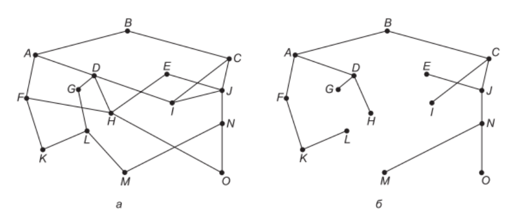
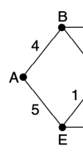
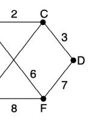
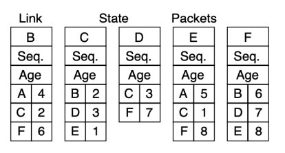

МЕРЕЖЕВИЙ РІВЕНЬ

# Функції Мережевого Рівня

- Розробка маршрутів доставки пакетів від відправника до отримувача - передача даних по усьому шляху
- Канальний рівень - передача кадрів з одного кінця кабелю на інший
- Проблема маршрутизації
- Проблема з'єднання різних мереж

# Питання Проектування Мережевого Рівня

Сервіси, що надаються транспортному рівню та внутрішня будова мережі

# Сервіси, Що Надаються Транспортному Рівню

1. Сервіси мережевого рівня не повинні залежати від технології маршрутизаторів 2. Транспортний рівень повинен бути незалежним від кількості, типу і топології наявних підмереж з маршрутизаторами 3. Мережеві адреси, доступні транспортному рівню, повинні використовувати єдину систему нумерації, навіть між локальними і глобальними мережами

# Тип Сервісу Мережевого Рівня

- **Сервіс без встановлення з'єднання,** 
дейтаграмні мережі (datagram network)
oПакети потрапляють в мережу окремо, їх маршрути обчислюються незалежно oЖодні попередні налаштування не потрібні oКожен пакет містить повну адресу отримувача, оскільки пересилається *незалежно* від інших

# Тип Сервісу Мережевого Рівня

- Сервіс зі встановленням з'єднання, мережі віртуального каналу (virtual-circuit network)
oВесь шлях від маршрутизатора-відправника до маршрутизатора-отримувача повинен бути встановлений *до початку передачі* будь-яких пакеті даних oЛегше забезпечити якість обслуговування o**MPLS** (Multi-Protocol Label Switching), VLAN

# Маршрутизація В Дейтаграмних Мережах

- Кожен маршрутизатор має внутрішню таблицю і визначає маршрут *для кожного пакету* окремо
- Алгоритм, що управляє таблицями маршрутизації і приймає рішення - **алгоритм** 
маршрутизації (routing algorithm)
- IP (Internet Protocol)

# Маршрутизація В Дейтаграмних Мережах

 Маршрутизація В Мережах Віртуальних Каналів

- Маршрут вибирається в процесі встановлення з'єднання і *для усього трафіку* даного з'єднання використовується один маршрут
- Кожен пакет включає в себе ідентифікатор віртуального каналу
- **Комутація міток (label switching)**
- **MPLS**: мережі провайдерів, ІР-пакети отримують MPLS-заголовок з 20-бітовою міткою (ідентифікатор з'єднання)

# Маршрутизація В Мережах Віртуальних Каналів

 Порівняння Мереж Віртуальних Каналів І Дейтаграмних Мереж

| Проблема                                | Дейтаграми                                                 | Віртуальні канали                                                             |
|-----------------------------------------|------------------------------------------------------------|-------------------------------------------------------------------------------|
| Встановлення каналу                     | Не потрібне                                                | Необхідне                                                                     |
| Адресація                               | Кожен пакет містить повну  адресу відправника і отримувача | Кожен пакет містить короткий номер  віртуального каналу (ВК)                  |
| Інформація про стан                     | Маршрутизатори не містять  інформації про стан             | Кожен ВК вимагає місця в таблиці  маршрутизатора                              |
| Маршрутизація                           | Маршрут кожного пакету  обирається незалежно               | Маршрут обирається при  встановленні ВК. Кожен пакет слідує  за цим маршрутом |
| Ефект від виходу з ладу  маршрутизатора | Жодного, крім втрачених пакетів                            | Всі ВК, що проходили через цей  маршрутизатор, припиняють  існування          |
| Забезпечення якості  обслуговування     | Тяжко реалізувати                                          | Легко реалізувати за наявності  достатніх ресурсів для кожного ВК             |
| Боротьба з  перевантаженням             | Тяжко реалізувати                                          | Легко реалізувати за наявності  достатніх ресурсів для кожного ВК             |

Алгоритми маршрутизації

# Пересилання І Маршрутизація

- **Пересилання (forwarding)** - процес обробки вхідних пакетів і вибору для них по таблиці маршрутизації вихідної лінії (інтерфейсу)
- **Алгоритм маршрутизації** - відповідає за заповнення і оновлення таблиць маршрутизації
- Алгоритм вибору маршрутів і використовувані ним структури даних є важливою областю проектування мережевого рівня

# Алгоритми Маршрутизації: Властивості

- **Коректність**
- **Простота**
- **Надійність** (здатність справлятись зі змінами топології і трафіку без припинення всіх задач на всіх вузлах)
- **Стійкість** (збіжність при побудові маршрутів) - **Справедливість**
- Ефективність

# Алгоритми Маршрутизації: Класи

- **Неадаптивні алгоритми:** не враховують при виборі маршруту топологію і поточний стан мережі і не вимірюють трафік на лініях. **Статична** маршрутизація.

- **Адаптивні алгоритми:** змінюють рішення про вибір маршрутів при зміні топології, а також іноді залежно від завантаженості ліній. Динамічні алгоритми маршрутизації.

# Алгоритми Маршрутизації: Принцип Оптимальності

- **Принцип оптимальності маршруту** (Bellman, 1957) - якщо маршрутизатор J розміщений на оптимальному маршруті від I до K, то оптимальний маршрут від J до K співпадає з частиною першого маршруту
- Наслідок: множина оптимальних маршрутів від усіх джерел до даного приймача є деревом з приймачем в корені (**вхідне дерево, sink tree**)
- **Мета** усіх алгоритмів вибору маршрутів - обчислення і використання вхідних дерев для усіх маршрутизаторів

# Алгоритми Маршрутизації: Вхідне Дерево

# Алгоритми Маршрутизації: Знаходження Найкоротшого Шляху

- Побудова графа мережі: вузол = маршрутизатор, ребро = лінія зв'язку
- Для вибору маршруту алгоритм знаходить найкоротший шлях на графі
- *Метрика віддалі*: кількість транзитних ділянок; час затримки, пропускна здатність, середня завантаженість; вартість …

# Знаходження Найкоротшого Шляху: Алгоритм Дейкстри

 Алгоритми Маршрутизації: Затоплення

- *Локальні методи* - рішення приймається на основі локальних відомостей, а не повної інформації про мережу
- Один з найпростіших локальних методів –
затоплення (**flooding**), кожен вхідний пакет надсилається на усі вихідні лінії, крім тієї, на яку він надійшов

# Алгоритми Маршрутизації: Затоплення

- Непрактичний алгоритм в більшості випадків
- Переваги: гарантована доставка пакету в кожен вузол мережі → ефективний при широкомовній розсилці
- Переваги: надійність → навіть якщо більша частина маршрутизаторів вийде з ладу, будьякий існуючий шлях буде знайдений
- Переваги: не потребує налаштування → може використовуватись як частина іншого, більш ефективного, алгоритму

# Методи Динамічної Маршрутизації

- Динамічні алгоритми маршрутизації: більш складні, але більш *ефективні* ніж затоплення
- В комп'ютерних мережах найбільш поширені два динамічних методи:
oмаршрутизація за вектором віддалей 
(distance vector routing)
oмаршрутизація з урахуванням стану каналів
(link state routing)

# Маршрутизація За Вектором Віддалей

- Алгоритми маршрутизації **за вектором віддалей** 
працюють на основі таблиць (векторів), які підтримуються усіма маршрутизаторами і містять відомості про *найкоротші відомі шляхи* до кожного з можливих адресатів
- Для **оновлення** даних векторів віддалей здійснюється обмін інформацією з сусідніми маршрутизаторами
- Алгоритм маршрутизації за вектором віддалей –
алгоритм Беллмана - Форда (RIP)

# Маршрутизація 

 За Вектором Віддалей

Розрахунок віддалі від J до G
через A, *I, H* та K як:
26 (18+8), 41 (31+10), 18 (6+12) 
та 37 (31+6)

# Проблема Лічення До Нескінченності

 Маршрутизація З Урахуванням Стану Каналів

- Маршрутизація **за вектором віддалей** 
використовувалась в ARPANET до 1979 року
- Довго приходить до стійкого стану при зміні топології мережі
- Замінена на маршрутизацію з урахуванням стану ліній
- Більші вимоги до пам'яті і обчислювальних потужностей маршрутизаторів
- Великі мережі і Інтернет: алгоритми IS-IS та OSPF

# Вимоги До Маршрутизаторів

1. Виявляти своїх сусідів та їх мережеві адреси 2. Встановлювати метрику віддалі або вартості зв'язку з кожним зі своїх сусідів 3. Створювати пакет, з усією зібраною інформацію 4. Відправляти цей пакет усім маршрутизаторам і приймати всі пакети, відправлені іншими маршрутизаторами (повна топологія)
5. Обчислювати найкоротший шлях до всіх маршрутизаторів (напр. алгоритм Дейкстри)

# Пакети Стану Ліній

# Ієрархічна Маршрутизація

- Проблема: зростання розміру таблиць маршрутизації
- Великі мережі - *ієрархічна* маршрутизація, як в телефонних мережах
- Маршрутизатори розбиваються на окремі регіони
- Кожен маршрутизатор знає всі маршрути в межах свого регіону
- Зменшення розміру таблиць маршрутизації за рахунок збільшення довжини маршруту

# Ієрархічна Маршрутизація

 Ієрархічна Маршрутизація

- В дуже великих мережах - можливе збільшення рівнів ієрархії
- Камун та Кляйнрок (1979) - *оптимальна* кількість рівнів ієрархії для мережі з N
маршрутизаторів становить ln(N)
- Для кожного маршрутизатора потрібно *e ln*(N) 
записів
- Збільшення довжини ефективного середнього шляху внаслідок ієрархічної маршрутизації є достатньо малим

# А Також:

- Широкомовна маршрутизація
- Багатоадресна розсилка
- Довільна (anycast) маршрутизація
- Маршрутизація для мобільних вузлів - Маршрутизація в довільних мережах
- …