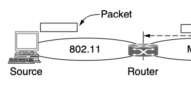
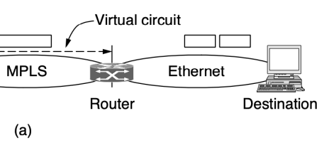
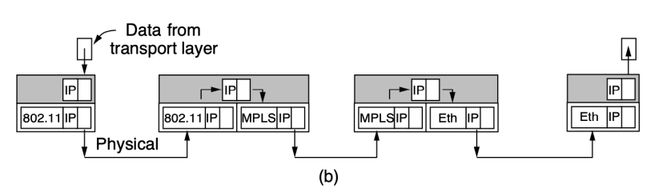
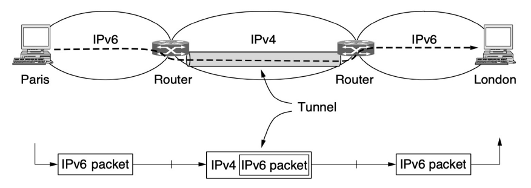
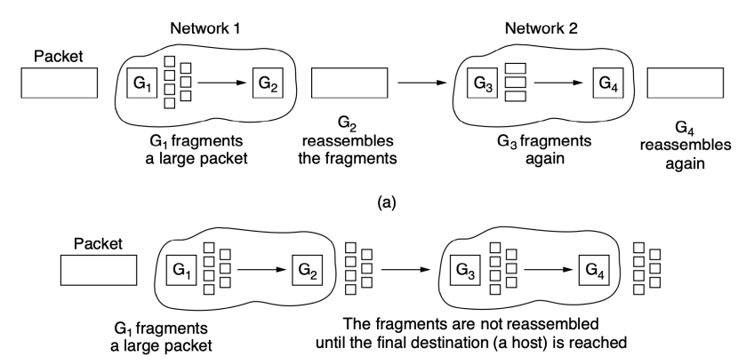
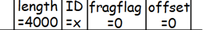
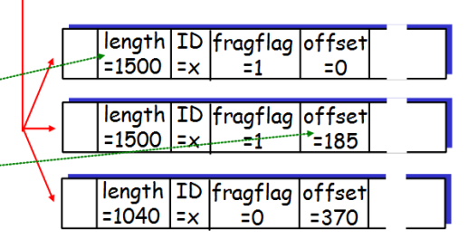
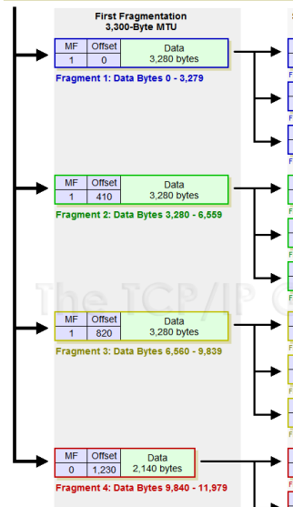

ОБ'ЄДНАННЯ МЕРЕЖ

# Відмінності Мереж

| Аспект                | Можливі відмінності                         |
|-----------------------|---------------------------------------------|
| Пропонований сервіс   | З чи без встановлення з'єднання             |
| Адресація             | Різного розміру, плоска або ієрархічна      |
| Широкомовлення        | Наявне чи відсутнє                          |
| Розмір пакету         | Кожна мережа має свій максимум              |
| Упорядкування         | Упорядкована чи невпорядкована доставка     |
| Якість обслуговування | Наявна чи ні. Багато різновидів             |
| Надійність            | Різні рівні втрат                           |
| Безпека               | Правила секретності, шифрування та ін.      |
| Параметри             | Різні тайм-аути, специфікація потоку тощо   |
| Тарифікація           | За час з'єднання, за обсяг трафіку або ніяк |

# Способи Об'Єднання Мереж

- Основні способи сполучення різних мереж:
- Пристрої, які конвертують пакети з будь-якої мережі в довільну іншу
- Додавання ще одного над-мережевого рівня, спільного в усіх мережах, який забезпечить однаковий механізм передачі даних
- В обох випадках в граничних областях мереж розміщуються певні пристрої: або спеціалізовані або програмовані

# Спільний Рівень (Tcp Та Ip)

- Cerf та Kahn (1974): ідея спільного шару, що приховує різниці існуючих мереж → протоколи ІР та TCP
- IP використовує **універсальний формат пакетів**, 
який розпізнається усіма маршрутизаторами і може бути переданий до будь-якої мережі
- Різні мережі мають різні типи адресації → 
адреси мережевого рівня, які однозначно ідентифікують вузол в *усіх мережах* складеної (об'єднаної) мережі

# Взаємодія Через Мережевий Рівень

# Тунелювання

- В загальному випадку об'єднання мереж є винятково складною задачею
- Частковий випадок - джерело і приймач перебувають в мережах одного типу, а між ними лежить мережа іншого типу
- Метод вирішення - **тунелювання** - Широко використовується для з'єднання ізольованих вузлів і мереж через мережу- посередника
- Приклад - VPN

# Тунелювання Пакету

# Маршрутизація В Об'Єднаних Мережах

- Додаткові складнощі порівняно з маршрутизацією в єдиній мережі: різні класи алгоритмів маршрутизації, різні оператори, різні метрики маршрутів тощо
- Дворівневий алгоритм маршрутизації:
- В кожній мережі - **внутрішній протокол** (interior gateway protocol)
- Між мережами - **зовнішній шлюзовий протокол**
(exterior gateway protocol), повинен бути спільним
- В мережі Інтернет міждоменний протокол називається **BGP** (Border Gateway Protocol)

# Вибір Маршрутів В Інтернет

- Мережа, що управляється незалежно –
автономна система (АС)
- Мережа провайдера Інтернет може складатись з кількох АС
- Різні зовнішні фактори (вартість за трафік іншого ISP, законодавчі аспекти та ін.) об'єднуються в поняття **політики маршрутизації**
- АС обирають маршрути відповідно до політики маршрутизації

# Максимальний Розмір Пакету

- Обмеження на максимальний розмір пакетів:
1. Апаратні (напр. розмір кадру Ethernet) 2. Операційна система (напр. всі буфери мають розмір 512 байтів)
3. Протоколи (напр. кількість бітів в полі довжини пакету)
4. Відповідність якомусь міжнародному чи національному стандарту 5. Зниження кількості пакетів, що пересилаються повторно через помилки передачі 6. Запобігання ситуації, коли один пакет занадто довго займає канал

# Path Mtu

- **Проблема**: розмір пакету більший за MTU даної мережі
- **Одно з вирішень**: недопущення виникнення такої проблеми
- Path MTU - максимальний розмір пакету для обраного шляху
- Дейтаграмна мережа - маршрути пакетів обираються незалежно → маршрут може неочікувано змінитись → зміниться Path MTU

# Фрагментація Пакетів

- **Альтернативне вирішення** проблеми: шлюзи розбивають пакети на **фрагменти** і відправляють кожен фрагмент у вигляді окремого пакету мережевого рівня
- В мережах з комутацією пакетів існує проблема з відновленням пакетів з фрагментів
- *Стратегії відновлення* вихідних пакетів з фрагментів:
- Прозора фрагментація (а) - Непрозора фрагментація (б)

# Прозора І Непрозора Фрагментація

# Приклад Фрагментації

Example
↑  4000 byte datagram MTU = 1500 bytes О
1480 bytes in data field offset =
1480/8

One large datagram becomes several smaller datagrams

М
 Offset 0 0 Data 1,980 bytes

| First Fragmentation                   | Second Fragmentation   |             |                     |             |      |
|---------------------------------------|------------------------|-------------|---------------------|-------------|------|
| 3,300-Byte MTU                        | 1,300-Byte MTU         |             |                     |             |      |
| М                                     | Offset                 | Data        | М                   | Offset      | Data |
| 3,280 bytes                           |                        |             |                     |             |      |
| 1                                     | 0                      | 1           | 0                   | 1,280 bytes |      |
| Fragment 1A: Bytes 0 - 1,279          |                        |             |                     |             |      |
| Fragment 1: Data Bytes 0 - 3,279      | М                      | Offset      | Data                |             |      |
| 4                                     | 1                      | 160         | 1,280 bytes         |             |      |
| Fragment 1B: Bytes 1,280 - 2,559      |                        |             |                     |             |      |
| | Offset | Data                       |                        |             |                     |             |      |
| М                                     |                        |             |                     |             |      |
| 4                                     | 1                      | 320   720 b |                     |             |      |
| Fragment 1C: Bytes 2,560 - 3,279      |                        |             |                     |             |      |
| М                                     | Offset                 | Data        | М                   | Offset      | Data |
| 3,280 bytes                           | 1,280 bytes            |             |                     |             |      |
| 1                                     | 410                    | 1           | 410                 |             |      |
| Fragment 2A: Bytes 3,280 - 4,559      |                        |             |                     |             |      |
| Fragment 2: Data Bytes 3,280 - 6,559  | М                      | Offset      | Data                |             |      |
| 1                                     | 570   1,280 bytes      |             |                     |             |      |
| Fragment 28: Bytes 4,560 - 5,839      |                        |             |                     |             |      |
| М                                     | Offset | Data          |             |                     |             |      |
| 720 b                                 |                        |             |                     |             |      |
| 1                                     | 730                    |             |                     |             |      |
| Fragment 2C: Bytes 5,840 - 6,559      |                        |             |                     |             |      |
| М                                     | Offset                 | Data        | М                   | Offset      | Data |
|                                       |                        |             |                     |             |      |
| 3,280 bytes                           | 1,280 bytes            |             |                     |             |      |
| 1                                     | 820                    | 1           | 820                 |             |      |
| Fragment 1A: Bytes 6,560 - 7,839      |                        |             |                     |             |      |
| Fragment 3: Data Bytes 6,560 - 9,839  | М                      | Offset      | Data                |             |      |
| 4                                     | 1                      | 90          | 1,280 bytes         |             |      |
| Fragment 1B: Bytes 7,840 - 9,119      |                        |             |                     |             |      |
| М                                     | Offset | Data          |             |                     |             |      |
| 1                                     | 1,140 | 720 b          |             |                     |             |      |
| Fragment 1C: Bytes 9,120 - 9,839      |                        |             |                     |             |      |
| М                                     | Offset                 | Data        | М                   | Offset      | Data |
| 2,140 bytes                           |                        |             |                     |             |      |
| 0                                     | 1,230                  | 1           | 1,230 | 1,280 bytes |             |      |
| Fragment 1A: Bytes 9,840 - 11,119     |                        |             |                     |             |      |
| Fragment 4: Data Bytes 9,840 - 11,979 | М                      | Offset      | Data                |             |      |
| 4                                     | 0                      | 1,390       | 80 b                |             |      |
| Fragment 18: Bytes 11,120 - 11,979    |                        |             |                     |             |      |

## Приклад

фрагментації

# Path Mtu Discovery

- **Фрагментація знижує продуктивність**: при втраті одного фрагменту втрачається весь пакет, передача зайвих заголовків
- **Пошук значення MTU шляху** (Mogul і Deering, 1990): використання біту DF
- *Перевага* пошуку MTU шляху - джерело знає про необхідний розмір пакету
- *Недолік* - затримка при відправленні пакету

Пошук значення MTU шляху

