МЕРЕЖЕВИЙ РІВЕНЬ В 
ІНТЕРНЕТІ

# Структура Мережі Інтернет

- На мережевому рівні Інтернет - набір мереж, або **автономних систем (АС)**
- Кілька **магістралей** з високопродуктивних ліній та швидких маршрутизаторів
- Найбільші магістралі називаються мережами Tier 1
- До магістралей під'єднані **інтернет-провайдери** 
(ISP, Internet Service Providers)
- Об'єднує - протокол ІР

# Структура Мережі Інтернет

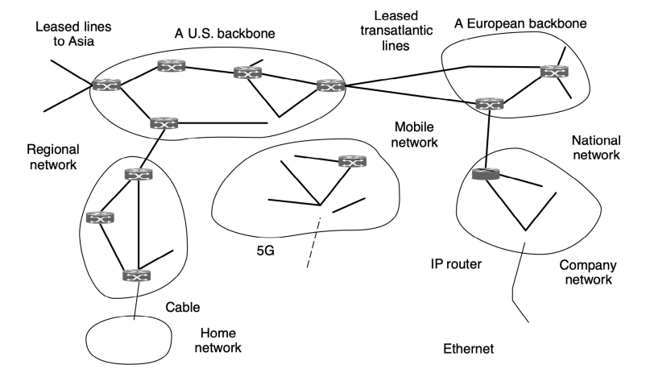

Протокол IPv4

# Заголовок Протоколу Ipv4

| 0                                | 2          |                           |                |    |               |    |     |    |                                              |
|----------------------------------|------------|---------------------------|----------------|----|---------------|----|-----|----|----------------------------------------------|
| 1                                | З          |                           |                |    |               |    |     |    |                                              |
| 0 | 1 | 2                        | 4          | 5                         | 6              | 0  | 1 | 2 | 3 | 4 | 5  | 6 7 | 0  | |1 |2 |3 |4 |5 |6 |7 |0 |1 |2 |3 |4 |5 |6 |7 |
| з                                | ЕСИ        |                           |                |    |               |    |     |    |                                              |
| Версія                           | Довжина    | Тип сервісу               | Довжина пакету |    |               |    |     |    |                                              |
| зголовку                         | Р РИРИ THR |                           |                |    |               |    |     |    |                                              |
| Ідентифікатор                    | 0 D M      | Зміщення фрагменту        |                |    |               |    |     |    |                                              |
| F                                | F          |                           |                |    |               |    |     |    |                                              |
| Час життя (TTL)                  | Протокол   | Контрольна сума заголовку |                |    |               |    |     |    |                                              |
| ІР-адреса джерела                |            |                           |                |    |               |    |     |    |                                              |
| IP-адреса призначення            |            |                           |                |    |               |    |     |    |                                              |
| Оції (якщо розмір заголовку > 5) |            |                           |                |    |               |    |     |    |                                              |
| Дані                             |            |                           |                |    |               |    |     |    |                                              |

# Поля Заголовку Протоколу Ipv4

- **Довжина заголовку** в 32-бітових словах - min 5, max 15 (20 - 60 байтів)
- **Тип сервісу** - пріоритет (3 біти), Delay, Throughput, Reliability
- **Explicit Congestion Notification** - розширення протоколу IP, описане в RFC 3168
- Повний **розмір пакету** в байтах (включаючи заголовок і дані) - min 20, max 65 535
- **Зміщення фрагменту** в блоках по 8 байт
- **Протокол** - RFC 1700, www.iana.org Адреси IPv4

# Ір-Адреси

- IPv4 - 32-бітова адреса (чотири октети) - **Dotted decimal notation** - 192.168.5.17
- ІР-адреси - **ієрархічні**
- Перша частина адресує **мережу** (192.168.5.17), 
остання - **вузол** (192.168.5.17)
- Усі біти другої частини нулі - **адреса мережі**
(192.168.5.0)
- Усі біти другої частини одиниці - широкомовна адреса, direct broadcast (192.168.5.255)
- 255.255.255.255 - limited broadcast

# Спеціальні Ip-Адреси

00 This host

| 0 0            | 0                | A host on this network   |                 |
|----------------|------------------|--------------------------|-----------------|
| Host           | Broadcast on the |                          |                 |
| 1 1            | local network    |                          |                 |
| Broadcast on a |                  |                          |                 |
| Network        | 111              | 111                      | distant network |
| (Anything)     | Loopback         |                          |                 |
| 127            |                  |                          |                 |

# Призначення Ір-Адрес

- Регіональні реєстратори (Regional Internet Registry, RIR) отримують номери АС та великі блоки адрес у **IANA**, а потім видають локальним інтернет-реєстраторам (великим провайдерам)
- Регіональні реєстратори:
- **ARIN** - Північна Америка - **APNIC** - Південно-Східна Азія
- **AfriNIC** - Африка
- **LACNIC** - Південна Америка і басейн Карибського моря
- **RIPE NCC** - Європа, Центральна Азія, Близький Схід

# Зарезервовані Ір-Адреси

| Підмережа       | Призначення                                           |
|-----------------|-------------------------------------------------------|
| 0.0.0.0/8       | Адреса джерела пакету                                 |
| 127.0.0.0/8     | Підмережа для комунікацій всередині вузла (localhost) |
| 169.254.0.0/16  | Канальні (link-local) адреси                          |
| 192.0.2.0/24    | Приклади та документація                              |
| 198.51.100.0/24 | Приклади та документація                              |
| 203.0.113.0/24  | Приклади та документація                              |
| 198.18.0.0/15   | Для стендів тестування потужності                     |
| 10.0.0.0/8      | Для використання у приватних мережах                  |
| 172.16.0.0/12   | Для використання у приватних мережах                  |
| 192.168.0.0/16  | Для використання у приватних мережах                  |
| 224.0.0.0/4     | Багатоадресна мережа (multicast)                      |
| 240.0.0.0/4     | Зарезервовано для використання у майбутньому          |
| 255.255.255.255 | Широкомовна адреса                                    |

# Класова Адресація

До 1993 року ІР-адреси ділились на 5 класів

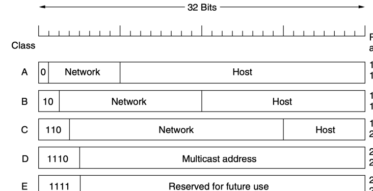

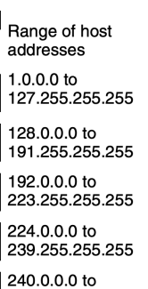

| 240.0.0.0 to   |
|----------------|
| 255.255.255    |

# Префікси

- Мережі відповідає неперервний блок простору ІР-адрес - **префікс**
- Префікс задається найменшою ІР-адресою в блоці і **розміром блоку** (кількість бітів в мережевій частині): 128.208.2.0/24
- Довжина префіксу відповідає двійковій масці, в якій одиниці вказують на мережеву частину - маска підмережі (255.255.255.0)

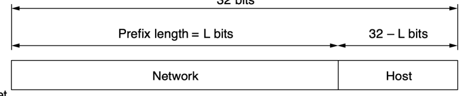 маска підмережі
ІР-адреса AND маска = адреса мережі ІР-адреса OR NOT (маска) **= широкомовна** адреса

# Ієрархія Ір-Адрес

- **Зменшення розміру таблиць маршрутизації**
- Недоліки: ІР-адреса вузла *залежить від його* розташування в мережі → вузли не можуть переміщуватись з однієї мережі в іншу зі збереженням ІР-адреси
- Недоліки: Неправильна ієрархія може призвести до *неефективного використання* ІР-адрес

# Підмережі

- Регіональні реєстратори отримують номери автономних систем та *великі блоки адрес* у IANA, а потім видають номери автономних систем та *блоки адрес меншого розміру* локальним інтернет-реєстраторам
- Більша мережа (блок адрес) може бути розділена на менші - **підмережі** (subnets)
- Поділ на мережі можна довільним чином змінювати - змінюються тільки маршрути всередині організації

# Підмережі

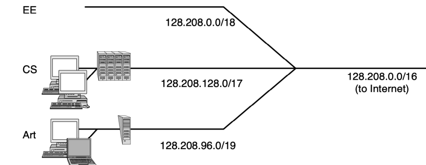

# Cidr - Безкласова Міждоменна Маршрутизація

- Маршрутизатори інтернет-провайдерів та магістралей - **default-free zone**
- **Зростання розміру таблиць маршрутизації** →
- Швидкість опрацювання пакетів
- Алгоритми маршрутизації передбачають обмін таблицями маршрутизації
- Вирішення: збільшення кількості рівнів ієрархії
- Префікси різної довжини. **Агрегація маршруту**. 

→ CIDR (Classless InterDomain **Routing)**, RFC 4632

# Агрегація Маршруту

| Університет   | Перша адреса   | Остання адреса   | Кількість   | Форма запису   |
|---------------|----------------|------------------|-------------|----------------|
| Cambridge     | 194.24.0.0     | 194.24.7.255     | 2048        | 194.24.0.0/21  |
| Edinburgh     | 194.24.8.0     | 194.24.11.255    | 1024        | 194.24.8.0/22  |
| (Не задіяно)  | 194.24.12.0    | 194.24.15.255    | 1024        | 194.24.12.0/22 |
| Oxford        | 194.24.16.0    | 194.24.31.255    | 4096        | 194.24.16.0/20 |

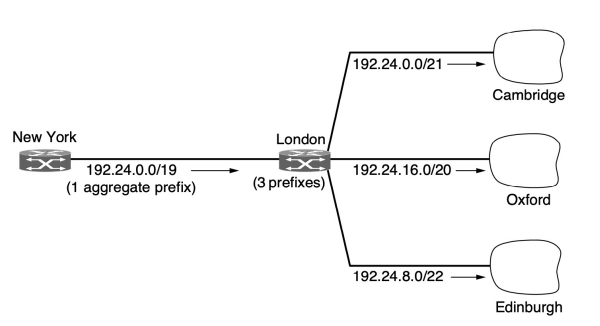

# Агрегація Маршруту

- Агрегація здійснюється *автоматично*
- Агрегація в Інтернеті зменшує розмір таблиць маршрутизації приблизно до **200 000** префіксів
- Префікси можуть перетинатись. Пакети 

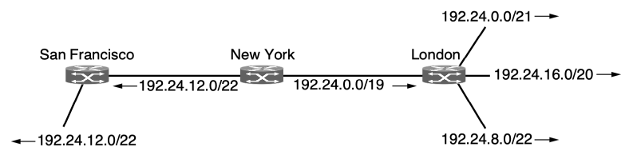

передаються в напрямку **найдовшого префіксу** (longest matching prefix)

# Nat - Трансляція Мережевих Адрес

- Класова адресація, неефективне використання ІР 
адрес → вичерпання доступних адрес IPv4
- **3 лютого 2011** року IANA видала **останні 5 блоків**
IP-адрес Регіональним реєстраторам (RIR)
- Методи ефективного використання ІР-адрес:
oДинамічне виділення адрес тільки *активним* користувачам oДовготривала перспектива - **IPv6**, довжина адреси 128 біт oNAT (Network Address Translation), RFC 3022

# Nat

- Кожному клієнту виділяється один або декілька 
«зовнішніх» ІР-адрес
- Всередині абонентської мережі - **приватні ІРадреси**
- В пакетах, які виходять з абонентської мережі в Інтернет, виконується **трансляція** внутрішньої ІРадреси в публічну

# Приватні Ір-Адреси

- Можуть використовуватись всередині мережі довільним чином
- Пакети з такими адресами ніколи не повинні з'являтися в Інтернеті
- Діапазони приватних ІР-адрес:
o10.0.0.0 - 10.255.255.255/8 o172.16.0.0 - 172.31.255.255/12 o192.168.0.0 - 192.168.255.255/16

# Концепції Трансляції Адрес

- **Статичний NAT** - відображення внутрішньої ІРадреси на зовнішню на підставі один до одного. 

Пристрій може бути доступним ззовні
- **Динамічний NAT** - відображає внутрішню ІРадресу на зовнішню з групи зовнішніх ІР-адрес. 

Відображення може мінятись залежно від доступної під час комунікації зовнішньої адреси
- **Перевантажений NAT** (NAPT, NAT Overload, PAT, 
masquerading) - форма динамічного NAT, який відображає кілька внутрішніх адрес в одну зовнішню, використовуючи різні порти

# Статичний Nat

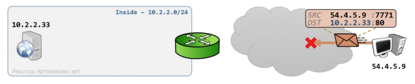

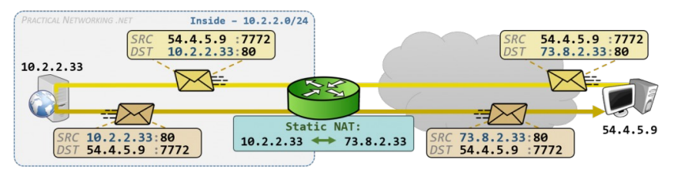

# Динамічний Nat

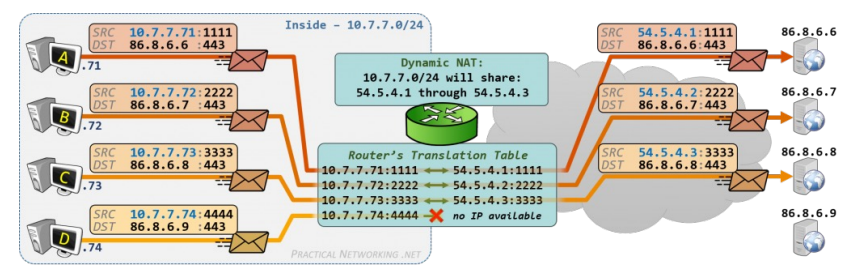

# Перевантажений Nat

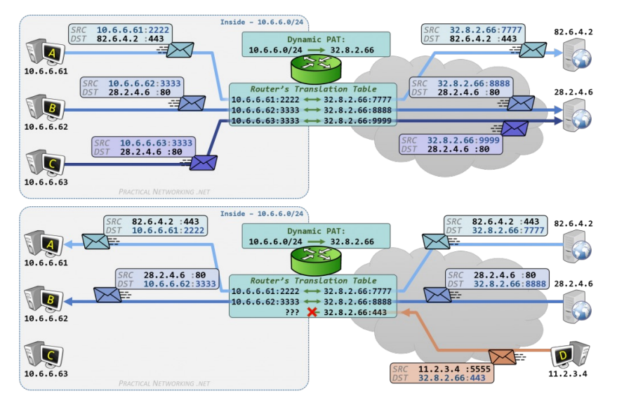

# Недоліки Nat

1. Порушення архітектури ІР: одна ІР-адреса –
один інтерфейс 2. Проблеми з вхідними підключеннями 3. Перетворення Інтернету на мережу зі встановленням з'єднання → при збої маршрутизатора з NAT перериваються усі з'єднання 4. Порушення незалежності рівнів (використання заголовків TCP/UDP)

# Недоліки Nat

5. В якості транспорту передбачено використання тільки протоколів TCP або UDP
6. Деякі додатки або протоколи використовують декілька з'єднань TCP або портів UDP (напр. 

FTP, протокол ІР-телефонії H.323 та ін.)
7. Розрядність поля «Порт джерела» (16 біт) 
обмежує кількість внутрішніх адрес, які можуть бути відображені на одну зовнішню до 61 440 Адреси IPv4. Приклади

# Перетворення Dec → Bin

( 150 )DEC -> ( 10010110 )BIN

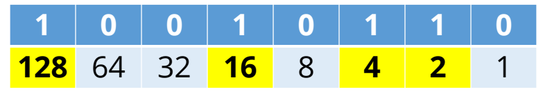

150 - 128 = 22 22 - 16 = 6 6 - 4 = 2 2 - 2 = 0

o Дано ІР-адресу вузла 150.150.150.150, маска 255.255.0.0 Визначити: адресу мережі, широкомовну адресу, адреси першого і останнього вузлів, загальну кількість комп'ютерів в цій мережі.

N = Network, H = Host

| IP                                                                                                                                         | 150.                                | 150.   | 150.   | 150   |
|--------------------------------------------------------------------------------------------------------------------------------------------|-------------------------------------|--------|--------|-------|
| IP                                                                                                                                         | 10010110.10010110.10010110.10010110 |        |        |       |
| MASK                                                                                                                                       | 11111111.11111111.00000000.00000000 |        |        |       |
| =>                                                                                                                                         |                                     |        |        |       |
| SCHEMA                                                                                                                                     | NNNNNNNN.NNNNNNNN.HHHHHHHH.HHHHHHHH |        |        |       |
| =>                                                                                                                                         |                                     |        |        |       |
| NETWORK                                                                                                                                    | 10010110.10010110.00000000.00000000 |        |        |       |
| FIRST HOST 10010110.10010110.00000000.00000001 LAST HOST 10010110.10010110.11111111.11111110 BROADCAST 10010110.10010110.11111111.11111111 |                                     |        |        |       |

NETWORK 150.150.0.0 FIRST HOST 150.150.0.1 LAST HOST 150.150.255.254 BROADCAST 150.150.255.255 HOSTS 232-16-2 HOSTS = 2(32-L)-2

o Дано ІР-адресу вузла 150.150.150.150, маска 255.240.0.0 Визначити: адресу мережі, широкомовну адресу, адреси першого і останнього вузлів, загальну кількість комп'ютерів в цій мережі.

N = Network, H = Host

| IP                                                                                                                                         | 150.                                | 150.   | 150.   | 150   |
|--------------------------------------------------------------------------------------------------------------------------------------------|-------------------------------------|--------|--------|-------|
| IP                                                                                                                                         | 10010110.10010110.10010110.10010110 |        |        |       |
| MASK                                                                                                                                       | 11111111.11110000.00000000.00000000 |        |        |       |
| =>                                                                                                                                         |                                     |        |        |       |
| SCHEMA                                                                                                                                     | NNNNNNNN.NNNNHHHH.HHHHHHHH.HHHHHHHH |        |        |       |
| =>                                                                                                                                         |                                     |        |        |       |
| NETWORK                                                                                                                                    | 10010110.10010000.00000000.00000000 |        |        |       |
| FIRST HOST 10010110.10010000.00000000.00000001 LAST HOST 10010110.10011111.11111111.11111110 BROADCAST 10010110.10011111.11111111.11111111 |                                     |        |        |       |

NETWORK 150.144.0.0 FIRST HOST 150.144.0.1 LAST HOST 150.159.255.254 BROADCAST 150.159.255.255 HOSTS 232-12-2

o Дано ІР-адресу вузла 150.150.150.150, маска 255.255.255.252 Визначити: адресу мережі, широкомовну адресу, адреси першого і останнього вузлів, загальну кількість комп'ютерів в цій мережі.

N = Network, H = Host

| IP                                                                                                                                         | 150.                                | 150.   | 150.   | 150   |
|--------------------------------------------------------------------------------------------------------------------------------------------|-------------------------------------|--------|--------|-------|
| IP                                                                                                                                         | 10010110.10010110.10010110.10010110 |        |        |       |
| MASK                                                                                                                                       | 11111111.11111111.11111111.11111100 |        |        |       |
| =>                                                                                                                                         |                                     |        |        |       |
| SCHEMA                                                                                                                                     | NNNNNNNN.NNNNNNNN.NNNNNNNN.NNNNNNHH |        |        |       |
| =>                                                                                                                                         |                                     |        |        |       |
| NETWORK                                                                                                                                    | 10010110.10010110.10010110.10010100 |        |        |       |
| FIRST HOST 10010110.10010110.10010110.10010101 LAST HOST 10010110.10010110.10010110.10010110 BROADCAST 10010110.10010110.10010110.10010111 |                                     |        |        |       |

NETWORK 150.150.150.148 FIRST HOST 150.150.150.149 LAST HOST 150.150.150.150 BROADCAST 150.150.150.151 HOSTS 232-30-2=2

# Приклад 2

o Організація хоче надати ір-адреси 9200 комп'ютерам. Дано одну з ір-адрес: 150.150.150.150.

Визначити найбільший префікс, необхідній для адресації даної кількості комп'ютерів, визначити маску, адресу мережі, широкомовну адресу, адреси першого і останнього вузлів, загальну кількість комп'ютерів в цій мережі.

2x-2≥9200 210=1024, 211=2048, 212=4096, 213=8192, 214≈16200

| =>     |                                     |      |      |    |
|--------|-------------------------------------|------|------|----|
| SCHEMA | NNNNNNNN.NNNNNNNN.NNHHHHHH.HHHHHHHH |      |      |    |
| MASK   | 11111111.11111111.11000000.00000000 |      |      |    |
| MASK   | 255.                                | 255. | 192. | 0  |
| IP     | 10010110.10010110.10010110.10010110 |      |      |    |

# Приклад 2

| SCHEMA                                                                                                                                                                                                                                            | NNNNNNNN.NNNNNNNN.NNHHHHHH.HHHHHHHH   |      |      |    |
|---------------------------------------------------------------------------------------------------------------------------------------------------------------------------------------------------------------------------------------------------|---------------------------------------|------|------|----|
| MASK                                                                                                                                                                                                                                              | 11111111.11111111.11000000.00000000   |      |      |    |
| MASK                                                                                                                                                                                                                                              | 255.                                  | 255. | 192. | 0  |
| IP                                                                                                                                                                                                                                                | 10010110.10010110.10010110.10010110   |      |      |    |
| =>                                                                                                                                                                                                                                                |                                       |      |      |    |
| NETWORK                                                                                                                                                                                                                                           | 10010110.10010110.10000000.00000000   |      |      |    |
| FIRST HOST 10010110.10010110.10000000.00000001 LAST HOST 10010110.10010110.10111111.11111110 BROADCAST 10010110.10010110.10111111.11111111 => NETWORK 150.150.128.0  FIRST HOST 150.150.128.1 LAST HOST 150.150.191.254 BROADCAST 150.150.191.255 |                                       |      |      |    |

o Розбити мережу 150.150.0.0/16 на 12 підмереж.

IP 150.150.0.0/16 MASK 255.255.0.0 2x≥12 => x=4 => 24=16 N = Network, S = Subnet, H = Host IP 150. 150. 0. 0 IP 10010110.10010110.00000000.00000000 MASK 11111111.11111111.00000000.00000000
=>
SCHEMA NNNNNNNN.NNNNNNNN.HHHHHHHH.HHHHHHHH
=>
SCHEMA NEW NNNNNNNN.NNNNNNNN.SSSSHHHH.HHHHHHHH

| 01: 150.150.00000000.00000000/20   | = 150.150.0.0                |                 |
|------------------------------------|------------------------------|-----------------|
| 02: 150.150.00010000.00000000/20   | = 150.150.16.0               |                 |
| 03: 150.150.00100000.00000000/20   | = 150.150.32.0               |                 |
| 04: 150.150.00110000.00000000/20   | = 150.150.48.0               |                 |
| 05: 150.150.01000000.00000000/20   | = 150.150.64.0               |                 |
| 06: 150.150.01010000.00000000/20   | = 150.150.80.0               |                 |
| 07: 150.150.01100000.00000000/20   | = 150.150.96.0               |                 |
| 08: 150.150.01110000.00000000/20   | = 150.150.112.0              |                 |
| 09: 150.150.10000000.00000000/20   | = 150.150.128.0              |                 |
| 10: 150.150.10010000.00000000/20   | = 150.150.144.0              |                 |
| 11: 150.150.10100000.00000000/20   | = 150.150.160.0              |                 |
| 12:                                | 150.150.10110000.00000000/20 | = 150.150.176.0 |
| 13: 150.150.11000000.00000000/20   | = 150.150.192.0              |                 |
| 14: 150.150.11010000.00000000/20   | = 150.150.208.0              |                 |
| 15: 150.150.11100000.00000000/20   | = 150.150.224.0              |                 |
| 16:                                | 150.150.11110000.00000000/20 | = 150.150.240.0 |

Не задіяний пул адрес: 4 * 212

o Організація має мережу 192.168.1.0/24. 

Розділіть мережу на 4 підмережі з такими кількостями вузлів: 5, 25, 50, 100.

Крок 1. Скласти перелік можливих підмереж

| Subnet Mask     | Prefix   | Hosts / Subnet   |
|-----------------|----------|------------------|
| 255.255.255.0   | /24      | 254              |
| 255.255.255.128 | /25      | 126              |
| 255.255.255.192 | /26      | 62               |
| 255.255.255.224 | /27      | 30               |
| 255.255.255.240 | /28      | 14               |
| 255.255.255.248 | /29      | 6                |
| 255.255.255.252 | /30      | 2                |

Крок 2. Посортувати підмережі за вимогою кількості вузлів Підмережа 1 - 100 вузлів Підмережа 2 - 50 вузлів Підмережа 3 - 25 вузлів Підмережа 4 - 5 вузлів Крок 3. Виділити найбільший діапазон IP найбільшій підмережі.

192.168.1.0/25 (255.255.255.128) => Підмережа 1 (126 вузлів)
Крок 4. Виділити наступний найбільший діапазон.

192.168.1.128/26 (255.255.255.192) => Підмережа 2 (62 вузла)
Крок 5. Виділити наступний найбільший діапазон.

192.168.1.192/27 (255.255.255.224) => Підмережа 3 (30 вузлів)
Крок 6. Виділити наступний найбільший діапазон.

192.168.1.224/29 (255.255.255.248) => Підмережа 4 (6 вузлів)

Підмережа 1 => 192.168.1.0/25, 126 вузлів IP 192.168.1. 00000000 MASK 255.255.255.10000000 NETWORK 192.168.1.0 - 192.168.1.127

| Підмережа 2 =>192.168.1.128/26, 62 вузла IP 192.168.1. 10000000 MASK 255.255.255.11000000 NETWORK 192.168.1.128 - 192.168.1.191   |
|-----------------------------------------------------------------------------------------------------------------------------------| | Підмережа 3 => 192.168.1.192/27, 30 вузлів IP 192.168.1. 11000000 MASK 255.255.255.11100000 NETWORK 192.168.1.192 - 192.168.1.223   |
|-------------------------------------------------------------------------------------------------------------------------------------|

| Підмережа 4 =>192.168.1.224/29, 6 вузлів IP 192.168.1. 11100000 MASK 255.255.255.11111000 NETWORK 192.168.1.224 - 192.168.1.231   |
|-----------------------------------------------------------------------------------------------------------------------------------|

Протокол IPv6

# Протокол Ipv6, Історія

- IETF, 1990 початок розробки. Основні цілі:
1. Підтримка мільярдів вузлів, навіть при неефективному використанні адрес 2. Зменшення таблиць маршрутизації 3. Спрощення протоколу для пришвидшення обробки пакетів маршрутизаторами 4. Вища безпека 5. Більша увага до типу сервісу, зокрема при передачі даних реального часу 6. Спрощення роботи багатоадресних розсилок 7. Можливість зміни розташування вузла без зміни адреси 8. Можливість подальшого розвитку протоколу 9. Співіснування старого і нового протоколів

# Ipv6, Характеристики

- **Не сумісний** з IPv4, проте **сумісний** з іншими протоколами Інтернету, включаючи TCP, UDP, ICMP, IGMP, OSPF, BGP i DNS
- Довжина адреси - **128 бітів**
- **Більш простий заголовок** пакету
- Краща підтримка опцій → спрощення (і пришвидшення) роботи маршрутизаторів
- Підвищена **безпека**. Автентифікація і конфіденційність - ключові особливості IPv6
- Більша увага якості обслуговування

# Основний Заголовок Ipv6

| 0                                                                                    |  2                  | З                        |
|--------------------------------------------------------------------------------------|---------------------|--------------------------|
| 1                                                                                    |                     |                          |
| 0 1 2 3 4 5 6 7 8 9 10 11 12 13 14 15 16 17 18 19 20 21 22 23 24 25 26 27 28 129 131 |                     |                          |
| Версія                                                                               | Клас трафіку        | Мітка потоку             |
| Розмір поля даних                                                                    | Наступний заголовок | Ліміт транзитних ділянок |
| Адреса джерела (128 бітів)                                                           |                     |                          |
| Адреса призначення (128 бітів)                                                       |                     |                          |

# Заголовки Ipv4 Та Ipv6 Ipv4 Header Ipv6 Header

| Туре of             |              |                 |        |
|---------------------|--------------|-----------------|--------|
| Version  IHL        | Total Length | Traffic         |        |
| SerVice             | Version      | Flow Label      |        |
| Class               |              |                 |        |
| Fragment            |              |                 |        |
| Identification      | Flags        | Offset          | Next   |
| Payload Length      | Hop Limit    |                 |        |
| Time to Live        | Protocol     | Header Checksum | Header |
| Source Address      |              |                 |        |
| Destination Address |              |                 |        |
| Options             | Padding      | Source Address  |        |

р en ба Field's Name Kept from IPv4 to IPv6 Fields Not Kept in IPv6 Name and Position Changed in IPv6 New Field in IPv6 Destination Address

# Поля Заголовку Ipv6

- **Мітка потоку** дає можливість значно спростити маршрутизацію однорідного потоку пакетів. Потік - послідовність пакетів до одного або кількох адресатів, при цьому усі пакети повинні певним чином опрацьовуватись. Призначено для додаткової підтримки дейтаграм реального часу і QoS.

- **Наступний заголовок** - TCP, UDP, або додатковий заголовок IPv6

# Адреси Ipv6

- Вісім груп по 4 шістнадцяткові цифри:
8000:0000:0000:0000:0123:4567:89AB:CDEF
- Ведучі нулі в кожній групі можна опускати. Одна або кілька груп *підряд* з одних нулів можуть бути замінені парою двокрапок:
8000::123:4567:89AB:CDEF
- Адресу IPv4 можна записати як:
:: 192.31.20.46
- Традиційна довжина префіксу - 64 біти

# Адреси Ipv6 (Unicast І Anycast)

## - Unicast

- **Global unicast** (48 біт - префікс глобальної маршрутизації, 16 біт - ID підмережі, 64 біти - ID інтерфейсу)
- **Link-local** - для обміну з іншими пристроями в одній канальній мережі: FE80::/10
- **Loopback** - ::1
- **Unspecified** - :: - Unique **local** - подібні до приватних адрес IPv4, не маршрутизуються: від FC00::/7 до FDFF::/7
- **IPv4 embedded**

# Адреси Ipv6 (Multicast)

## - Multicast: Ff00::/8

- **Групові адреси** - зарезервовані для заданих груп пристроїв, що працюють на одному протоколі або сервісі:
o **Група всіх вузлів FF02::1** o **Група всіх маршрутизаторів FF02::2**
- **Присвоєна групова адреса** - відповідає 24 молодшим бітам Global unicast адреси пристрою. Адресує всі пристрої, що мають однакові найменш значущі 24 біти адреси.

- **Broadcast** адреси відсутні

# Фрагментація Ipv6

- Поля, пов'язані з фрагментацією ІР-пакета, відсутні в заголовку IPv6
- Всі вузли повинні динамічно визначати розмір пакету (Path MTU Discovery)
- Маршрутизатори не фрагментують пакети
- Мінімальний розмір пакету збільшено з 576 до 1280 байтів

# Додаткові Заголовки Ipv6

| Додатковий заголовок    | Опис                                                   |
|-------------------------|--------------------------------------------------------|
| Параметри маршрутизації | Інформація для маршрутизаторів                         |
| Параметри отримувача    | Додаткова інформація для отримувача                    |
| Маршрутизація           | Частковий перелік транзитних маршрутів на шляху пакета |
| Фрагментація            | Управління фрагментами дейтаграми                      |
| Автентифікація          | Перевірка справжності відправника                      |
| Шифровані дані          | Інформація про зашифрований вміст                      |
