УПРАВЛЯЮЧІ 
ПРОТОКОЛИ 
ІНТЕРНЕТУ Протокол ICMP

# Протокол Icmp

- **ICMP** (Internet Control Message Protocol) - RFC 
792, використовується для діагностики, управління та повідомлень про помилки
- На основі цього протоколу заснована дія таких утиліт як ping та **traceroute**
- ICMP пакети інкапсулюються в IP пакети
- Протокол є невіддільною частиною IP й обов'язковий при реалізації стека TCP/IP

# Заголовок Icmp

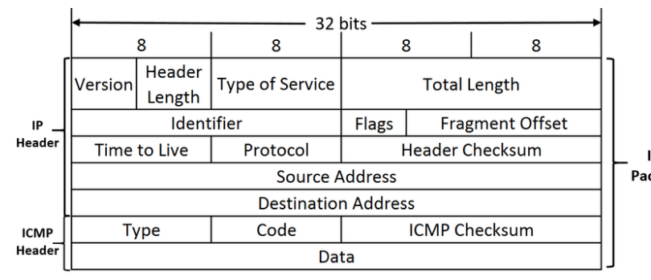

ІР
Packet
# Основні Типи Icmp Пакетів

| Тип                                    | Код                                       | Назва                                           |
|----------------------------------------|-------------------------------------------|-------------------------------------------------|
| 0 - Echo Reply                         | 0                                         | Ехо-відповідь                                   |
| 3 - Destination Unreachable            | 0                                         | Мережа недоступна                               |
| 1                                      | Хост недоступний                          |                                                 |
| 2                                      | Протокол недоступний                      |                                                 |
| 3                                      | Порт недоступний                          |                                                 |
| 4                                      | Потрібна фрагментація, але DF встановлено |                                                 |
| 4 - Source Quench                      | 0                                         | Вгамовування джерела (управління заторами)      |
| 5 - Redirect Message                   | 0                                         | Переадресація для мережі                        |
| 1                                      | Переадресація для хосту                   |                                                 |
| 2                                      | Переадресація для TOS та мережі           |                                                 |
| 3                                      | Переадресація для TOS та хосту            |                                                 |
| 8 - Echo Request                       | 0                                         | Ехо-запит                                       |
| 9 - Router Advertisement               | 0                                         | Оголошення маршрутизатора                       |
| 10 - Router Solicitation               | 0                                         | Клопотання маршрутизації                        |
| 11 - Time Exceeded                     | 0                                         | Час життя пакету став рівний 0 під час транзиту |
| 1                                      | Час збірки фрагментів пакету закінчився   |                                                 |
| 12 - Parameter Problem: Bad IP  header | 0                                         | Помилка заголовку IP-пакету                     |
| 1                                      | Відсутня необхідна опція заголовку        |                                                 |
| 2                                      | Погана довжина заголовку                  |                                                 |
| 13 - Timestamp                         | 0                                         | Запит мітки часу                                |
| 14 - Timestamp Reply                   | 0                                         | Мітка часу                                      |

# Правила Генерування Icmpпакетів

| Причина                                                 | Створення ICMP  повідомлення   |
|---------------------------------------------------------|--------------------------------|
| Втрата ICMP повідомлення                                | НІ                             |
| Пошкодження фрагментованого ІР                                                         | ТАК                            |
| пакету: перший фрагмент Пошкодження фрагментованого ІР                                                         | НІ                             |
| пакету: усі інші фрагменти Відповідь на Multicast пакет | НІ                             |
| Відповідь на Broadcast пакет                            | НІ                             |

# Протокол Arp Рух Даних І Адресація

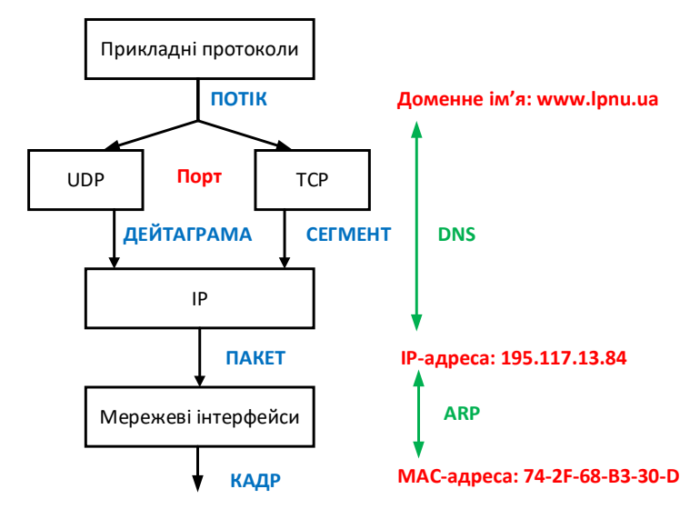

# Адресація В Складеній Мережі

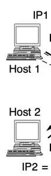

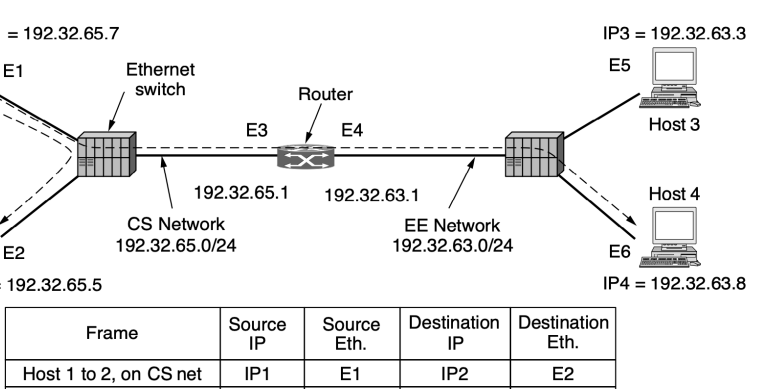

IP2 = 192.32.65.5

| Source                 | Destination   |      |     |
|------------------------|---------------|------|-----|
| Source                 |               |      |     |
| Frame                  | ІР            | Eth. | ІР  |
| Host 1 to 2, on CS net | IP1           | Е1   | IP2 |
| Host 1 to 4, on CS net | IP1           | Е1   | IP4 |
| Host 1 to 4, on EE net | ІР1           | E4   | IP4 |

| Destination   |
|---------------|
| Eth.          |
| Е2            |
| ЕЗ            |
| Е6            |

# Протокол Arp

- Address Resolution Protocol, протокол визначення адрес (ARP) - комунікаційний протокол, призначений для перетворення IPадрес (адрес **мережевого рівня**) в MAC-адреси 
(адреси **канального рівня**) в мережах TCP/IP.

- Не обмежується MAC-адресами Ethernet
- Визначений і описаний в RFC 826

# Arp-Таблиця

- Перетворення адрес виконується шляхом пошуку за таблицею
- ARP-таблиця зберігається у пам'яті й містить рядки для кожного вузла мережі

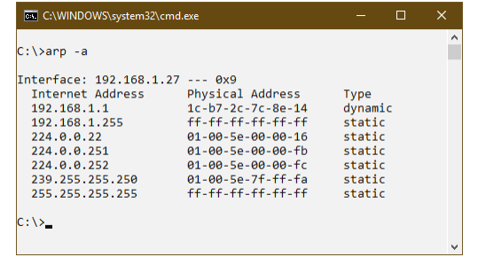

# Заголовок Arp

| Bits 0–7       | Bits 8–15                     | Bits 16–23                    | Bits 24–31   |
|----------------|-------------------------------|-------------------------------|--------------|
| 0              | Hardware address type (HTYPE) | Network protocol type (PTYPE) |              |
| 32             | Length of hardware            | Length of protocol            | Operation    |
| address (HLEN) | adress (PLEN)                 |                               |              |
| 64             | Senders' MAC address          |                               |              |
| 96             |                               |                               |              |
| 1              | Senders' IP address           |                               |              |
| 2              |                               |                               |              |
| 14             | Recipients' MAC address       |                               |              |
| 4              |                               |                               |              |
| 17             |                               |                               |              |
| 6              |                               |                               |              |
| 19             | Recipients' IP address        |                               |              |
| 2              |                               |                               |              |

# Протокол Arp: Визначення Адреси

 PRACTICAL NETWORKING .NET

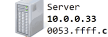

Router 10.0.99 053.ffff.999

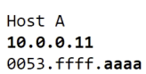

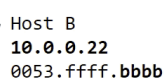

# Gratuitous Arp

- Добровільне ARP-повідомлення (gratuitous ARP)
- Під час налаштування кожна машина надсилає ARP-запит про *свою* ІР адресу:
oПідтримка ARP-таблиць

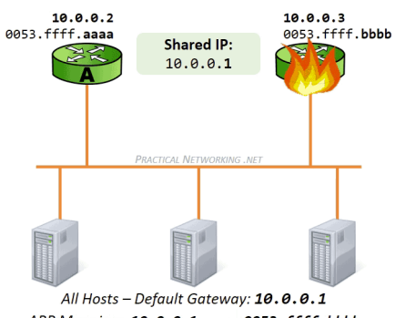

в актуальному стані oВиявлення дублікатів ІР-адрес в мережі

# Proxy Arp

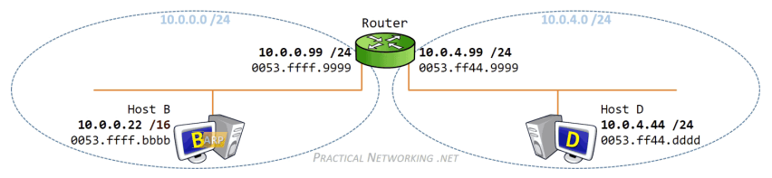

# Proxy Arp: Застосування

- Імітація присутності вузла з одного сегменту мережі в іншому, зокрема для об'єднання в єдиний канальний сегмент кількох мереж
- Протоколи з резервуванням (CARP, VRRP)
- Вузли, в яких неправильно налаштована маска підмережі

# Протокол Dhcp Dhcp - Протокол Динамічної Конфігурації Вузла

- **DHCP** (Dynamic Host Configuration Protocol) –
стандартний протокол прикладного рівня, який дозволяє комп'ютерам автоматично отримувати IP-адресу та інші параметри, необхідні для роботи в мережі
- Транспорт: UDP, порти: сервера 67, клієнта 68
- Опублікований в 1993 році в RFC 2131, є розширенням протоколу BOOTP
- Для версії IPv6 додано DHCPv6 (RFC 3315)
0 Заголовок DHCP

| 4                                | 8                                                        | 12   | 16   | 20   | 24   | 28   | 32   |
|----------------------------------|----------------------------------------------------------|------|------|------|------|------|------|
| Hardware Address                 |                                                          |      |      |      |      |      |      |
| Operation Code                   | Hardware Type                                            | Hops |      |      |      |      |      |
| Length                           |                                                          |      |      |      |      |      |      |
| Transaction Identifier           |                                                          |      |      |      |      |      |      |
| Seconds                          | Flags                                                    |      |      |      |      |      |      |
| Client IP Address (ClAddr)       |                                                          |      |      |      |      |      |      |
| "Your" IP Address (YlAddr)       | і                                                        |      |      |      |      |      |      |
| Server;lP Address (SlAddr)       | ольного каталогу.                                        |      |      |      |      |      |      |
| Gateway IP Address (GlAddr)      |                                                          |      |      |      |      |      |      |
| Client Hardware Address (CHAddr) |                                                          |      |      |      |      |      |      |
| (16 bytes)                       | орон                                                     |      |      |      |      |      |      |
| Server Name (SName)              |                                                          |      |      |      |      |      |      |
| (64 bytes)                       |                                                          |      |      |      |      |      |      |
| May also                         | ,used for Options, if option overloading is enabled.     | орон |      |      |      |      |      |
| Boot Filename                    |                                                          |      |      |      |      |      |      |
| (128 bytes)                      |                                                          |      |      |      |      |      |      |
| М                                | o be used for Options, if option overloading is enabled. |      |      |      |      |      |      |
| Options                          |                                                          |      |      |      |      |      |      |
| (Variable Size)                  |                                                          |      |      |      |      |      |      |

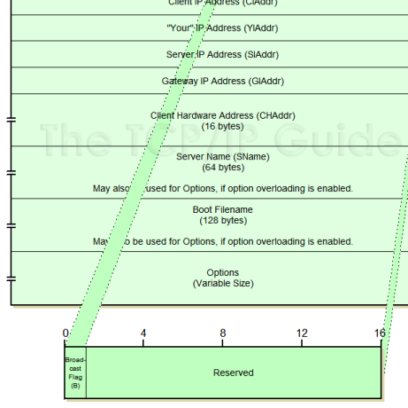

# Поля Заголовку Dhcp

- **OpCode:** Тип повідомлення.

1 = BOOTREQUEST, 2 = BOOTREPLY
- **Htype:** Тип апаратної адреси
- **Hlen:** Довжина апаратної адреси в байтах
- **Hops:** Кількість агентів ретрансляції, через які пройшло повідомлення
- **Xid:** Унікальний ідентифікатор транзакції
- **Secs:** Час від початку процесу отримання адреси
- **Flags:** Поле для прапорців

# Поля Заголовку Dhcp (2)

- **CIAddr:** ІР-адреса клієнта (в разі поновлення адреси)
- **YIAddr** : Нова ІР-адреса клієнта, запропонована сервером
- **SIAddr:** ІР-адреса сервера - **GIAddr:** ІР-адреса агента ретрансляції - **CHAddr:** MAC-адреса клієнта - **SName:** Ім'я сервера (необов'язкове) - **File:** Ім'я файлу для віддаленого завантаження - **Options:** Додаткові параметри конфігурації

# Повідомлення Dhcp

DHCPDISCOVER - пошук серверів DHCPOFFER - пропозиція параметрів конфігурації

| DHCPREQUEST - запит на виділення параметрів   |
|-----------------------------------------------|

| DHCPACK - підтвердження виділення параметрів   |
|------------------------------------------------|

| DHCPNAK - відмова сервера в підтвердженні   |
|---------------------------------------------|

| DHCPDECLINE - відмова клієнта, виділена адреса вже використовується   |
|-----------------------------------------------------------------------|

| DHCPRELEASE - звільнення виділеної адреси DHCPINFORM - запит на виділення додаткових параметрів (без ІР-адреси)   |
|-------------------------------------------------------------------------------------------------------------------|

# Виділення Ip-Адреси

РС

PC MAC=m1

DHCP Server IP=1.1.1.254

DHCP Server MAC=m2 1  DHCP Discover
"Hello, Any DHCP server available out there? Answer me if you hear me!"
 Ethernet Header {DA=FF:FF:FF:FF, SA=m1}, IP Header {SIP=0.0.0, DIP=255.255.255.255},
DHCP Payload {Client MAC=m1}
"I can hear you! My IP address is 1.1.1.254. I can allocate/lease an IP
adress, 1.1.10, to you" 2  DHCP Offer Ethernet Header {DA=FF:FF:FF:FF, SA=m2}, IP Header {SIP=1.1.1.254, DIP=255.255.255.255},
DHCP Payload {Your IP=1.1.10, Client MAC=m1, Subnet Mask(1)=255.255.255.0, Router(3)=1.1.1, DNS(6)=10.1.1.1 & 10.1.1.2, IP Lease Time(51)=3,600s, DHCP Server Identifier(54)=1.1.1.254}
"Thank you for your response. Then, can you, at IP address is 1.1.1.254, allocate/lease the IP address to me?"
3  DHCP Request Ethernet Header {DA=FF:FF:FF:FF, SA=m1}, IP Header {SIP=0.0.0, DIP=255.255.255.255},
DHCP Payload {Client MAC=m1, Requested IP Address(50)=1.1.1.10, DHCP Server Identifier(54)=1.1.1.254}
4 DHCP Ack
"Sure, I can lease you all network configuration data, including your IP
address. The IP lease time is one hour."

Ethernet Header (DA=FF:FF:FF:FF:FF, SA=m2}, IP Header {SIP=1.1.1.254, DIP=255.255.255.255}, DHCP Payload {Your IP=1.1.10, Client MAC=m1, Subnet Mask(1)=255.255.255.0, Router(3)=1.1.1.1, DNS(6)=10.1.1.1 & 10.1.1.2, IP Lease Time(51)=3,600s, DHCP Server Identifier(54)=1.1.1.254}
IP address=1.1.10 allocation completed Internet Access SIP=1.1.1.10

# Оновлення Ip-Адреси

РС МАС=m1

РС
DHCP Server IP=1.1.1.254 DHCP Server MAC=m2

DHCP Ack t=0

| Ethernet Header {DA=FF:FF:FF:FF, SA=m2}, IP Header {SIP=1.1.1.254, DIP=255.255.255.255},                     |
|--------------------------------------------------------------------------------------------------------------|
| DHCP Payload {Your IP=1.1.1.10, Server IP=1.1.1.254, Client MAC=m1, Subnet Mask(1)=255.255.255.0,            |
| Router(3)=1.1.1, DNS(6)=10.1.1.1 & 10.1.1.2, IP Lease Time(51)=3,600s, DHCP Server Identifier(54)=1.1.1.254} |

| Internet Access                                                                                              |                                                                                              |
|--------------------------------------------------------------------------------------------------------------|----------------------------------------------------------------------------------------------|
| SIP=1.1.1.10                                                                                                 | I'd like to extend the lease time for IP=1.1.1.10. Can you give me                           |
| 1  DHCP Request                                                                                              | permission?                                                                                  |
| (t=1,800s                                                                                                    | Ethernet Header {DA=m2, SA=m1}, IP Header {SIP=1.1.10, DIP=1.1.1.254},                       |
| DHCP Payload {Client IP=1.1.10, Client MAC=m1}                                                               |                                                                                              |
| "OK, Use IP address=1.1.10/24 for one more hour"                                                             |                                                                                              |
| IP Renewal Time                                                                                              | 2  DHCP Ack                                                                                  |
| = IP Lease Time / 2                                                                                          | Ethernet Header {DA=m1, SA=m2}, IP Header {SIP=1.1.1.254, DIP=1.1.1.10},                     |
| = 3,600s / 2 = 1,800s                                                                                        | DHCP Payload {Client IP=1.1.10, Your IP=1.1.10, Client MAC=m1, Subnet Mask(1)=255.255.255.0, |
| Router(3)=1.1.1, DNS(6)=10.1.1.1 & 10.1.1.2, IP Lease Time(51)=3,600s, DHCP Server Identifier(54)=1.1.1.254} |                                                                                              |
| IP address=1.1.10 renewal completed                                                                          |                                                                                              |

Internet Access

SIP=1.1.1.10

# Звільнення Ip-Адреси

РС МАС=m1

РС

DHCP Server IP=1.1.1.254 DHCP Server MAC=m2

:
DHCP client shut down (or "ipconfig /release")
1  DHCP Release
"I won't use IP=1.1.1.10/24 any more" Ethernet Header {DA=m2, SA=m1}, IP Header {SIP=1.1.1.10, DIP=1.1.1.254},
DHCP Payload {Client IP=1.1.1.10, Client MAC=m1, DHCP Server Identifier(54)=1.1.1.254}
IP address=1.1.10 release completed

# Dhcp Протокол: Підсумок

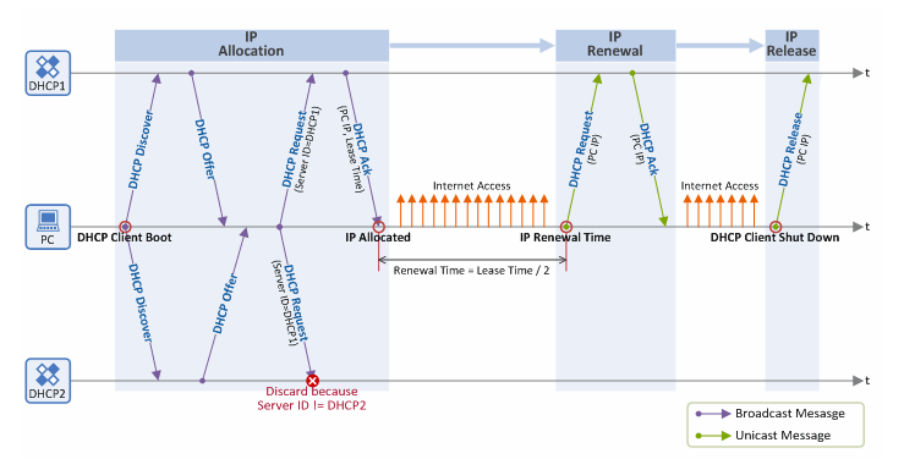

# Dhcp Relay Agent

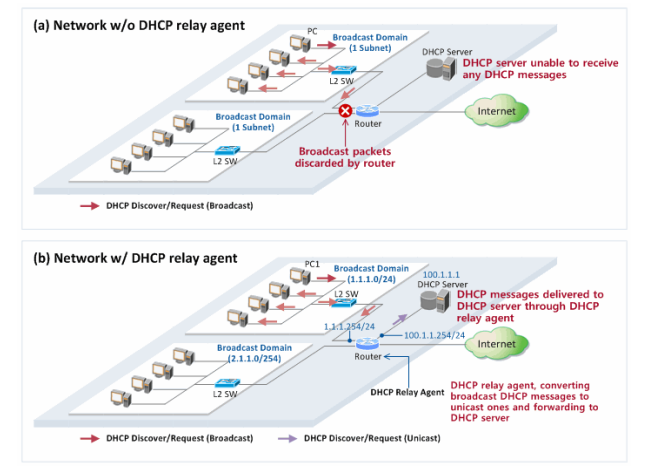

# Dhcp Relay Agent

| Configuration: DHCP Server IP=100.1.1.1                      | DHCP Server IP=100.1.1.1                                       |                       |
|--------------------------------------------------------------|----------------------------------------------------------------|-----------------------|
| РС МАС=m1                                                    | DHCP Server MAC=m5                                             |                       |
| Downlink MAC=m2                                              | Uplink MAC=m3                                                  |                       |
| L2 Network                                                   | Downlink IP=1.1.1.254                                          | Uplink IP=100.1.1.254 |
| РС                                                           | Relay                                                          | DHCP                  |
| (Relay Agent IP)                                             |                                                                |                       |
| 1a  DHCP Discover  (Broadcast)                               | 1b  DHCP Discover  (Unicast)                                   |                       |
| Ethernet Header {DA=FF:FF:FF:FF:FF, SA=m1},                  | Ethernet Header {DA=m5, SA=m3},                                |                       |
| IP Header {SIP=0.0.0, DIP=255.255.255},                      | IP Header {SIP=100.1.1.254, DIP=100.1.1.1},                    |                       |
| DHCP Payload {Broadcast Flag=0 or 1, Relay Agent IP=0.0.0.0, | DHCP Payload {Broadcast Flag=0 or 1, Relay Agent IP=1.1.1.254, |                       |
| Client MAC=m1}                                               | Client MAC=m1}                                                 |                       |
| 2b  DHCP Offer  (Unicast or Broadcast)                       | 2a  DHCP Offer  (Unicast)                                      |                       |
| Ethernet Header {DA=m3, SA=m5},                              |                                                                |                       |
| Ethernet Header {DA=m1 or FF:FF:FF:FF:FF:FF, SA=m2},         |                                                                |                       |
| IP Header {SIP=1.1.1.254, DIP=1.1.10 or 255.255.255.255},    | IP Header {SIP=100.1.1.1, DIP=1.1.1.254},                      |                       |
| DHCP Payload {Broadcast Flag=0 or 1, Your IP=1.1.1.10,       | DHCP Payload {Broadcast Flag=0 or 1, Your IP=1.1.1.10,         |                       |
| Relay Agent IP=1.1.1.254, Client MAC=m1,                     | Relay Agent IP=1.1.1.254, Client MAC=m1,                       |                       |
| DHCP Server Identifier(54)=100.1.1.1, Options}               | DHCP Server Identifier(54)=100.1.1.1, Options}                 |                       |
| За  DHCP Request  (Broadcast)                                | 3b  DHCP Request  (Unicast)                                    |                       |
| Ethernet Header {DA=FF:FF:FF:FF:FF, SA=m1},                  | Ethernet Header {DA=m5, SA=m3},                                |                       |
| IP Header {SIP=0.0.0.0, DIP=255.255.255},                    | IP Header {SIP=100.1.1.254, DIP=100.1.1.1},                    |                       |
| DHCP Payload {Broadcast Flag=0 or 1, Relay Agent IP=0.0.0.0, | DHCP Payload {Broadcast Flag=0 or 1, Relay Agent IP=1.1.1.254, |                       |
| Client MAC=m1, DHCP Server Identifier(54)=100.1.1.1}         | Client MAC=m1, DHCP Server Identifier(54)=100.1.1.1}           |                       |
| 4b  DHCP Ack  (Unicast or Broadcast)                         | 4a  DHCP Ack  (Unicast)                                        |                       |
| Ethernet Header {DA=m1 or FF:FF:FF:FF:FF:FF, SA=m2},         | Ethernet Header {DA=m3, SA=m5},                                |                       |
| IP Header {SIP=1.1.1.254, DIP=1.1.10 or 255.255.255.255},    | IP Header {SIP=100.1.1.1, DIP=1.1.1.254},                      |                       |
| DHCP Payload {Broadcast Flag=0 or 1, Your IP=1.1.1.10,       | DHCP Payload {Broadcast Flag=0 or 1, Your IP=1.1.1.10,         |                       |
| Relay Agent IP=1.1.1.254, Client MAC=m1,                     | Relay Agent IP=1.1.1.254, Client MAC=m1,                       |                       |
| DHCP Server Identifier(54)=100.1.1.1, Options}               | DHCP Server Identifier(54)=100.1.1.1, Options}                 |                       |
| \ IP address=1.1.10 allocation completed                     |                                                                |                       |
| Internet Access                                              |                                                                |                       |
| SIP=1.1.1.10                                                 |                                                                |                       |

