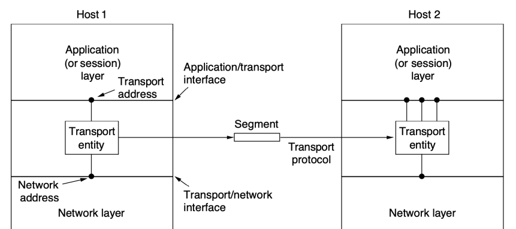
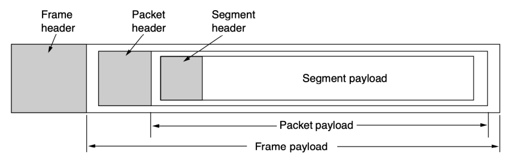
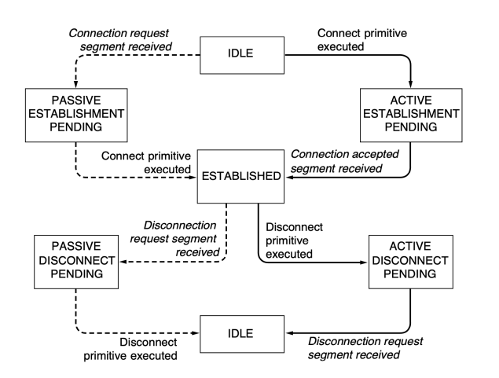
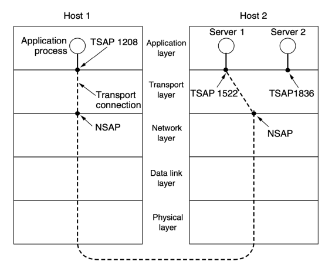
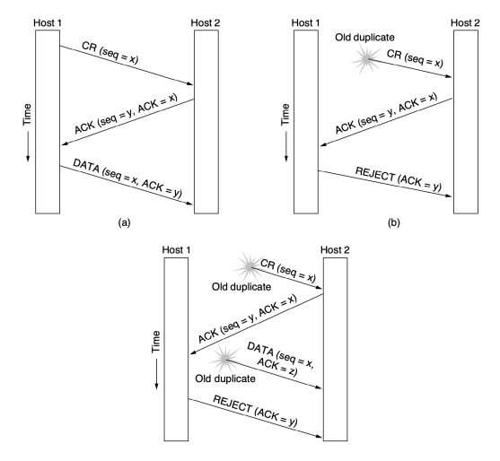
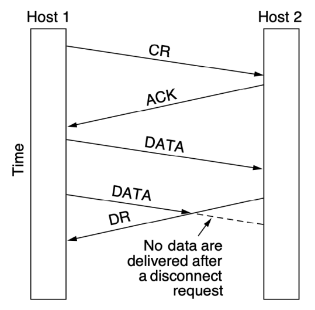
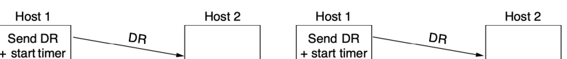
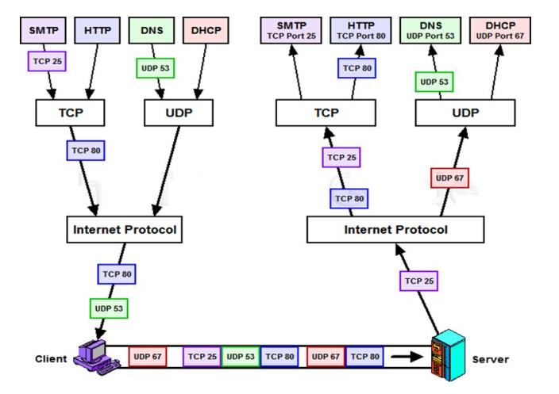

ТРАНСПОРТНИЙ 
РІВЕНЬ

# Транспортний Рівень

- *Мережевий рівень* забезпечує наскрізну доставку пакетів з використанням дейтаграм і віртуальних каналів
- *Транспортний рівень* на основі мережевого відповідає за передачу даних **від процесу** на машині-джерелі **до процесу** на машині-адресаті, надаючи необхідний рівень надійності незалежно від фізичних характеристик мереж
- Транспортний рівень забезпечує надійну доставку даних в мережі будь якого масштабу

# Транспортний Сервіс Мережевий, Транспортний І Прикладний Рівні

# Базові Операції Транспортного Сервісу

- Сервіси транспортного рівня:
oСервіси зі встановленням з'єднання oСервіси без встановлення з'єднання
- Базові операції простого транспортного сервісу:

| Операція                                | Відправлений сегмент   | Значення                                 |
|-----------------------------------------|------------------------|------------------------------------------|
| Блокувати сервер, поки якийсь процес не |                        |                                          |
| LISTEN                                  | (немає)                | спробує з'єднатись                       |
| CONNECT                                 | CONNECTION REQUEST     | Активно спробувати встановити з'єднання  |
| SEND                                    | DATA                   | Надіслати інформацію                     |
| RECEIVE                                 | (немає)                | Блокувати сервер, поки не надійдуть дані |
| DISCONNECT                              | DISCONNECTION REQUEST  | Перервати з'єднання                      |

# Сегменти, Пакети І Кадри

# Діаграма Станів Простої Схеми Управління З'Єднаннями

# Сокети Берклі

- Вперше були застосовані в 1983 році в ОС 
Berkeley UNIX 4.2BSD
- Використовуються в протоколі ТСР
- Популярні для інтернет-програмування в більшості ОС

# Базові Операції Сокетів Тср

| Операція   | Значення                                                                             |
|------------|--------------------------------------------------------------------------------------|
| SOCKET     | Створити новий сокет (гніздо зв'язку)                                                |
| BIND       | Зв'язати локальну адресу з сокетом Оголосити про бажання прийняти з'єднання; вказати |
| LISTEN     | розмір черги                                                                         |
| ACCEPT     | Пасивно встановити вхідне з'єднання                                                  |
| CONNECT    | Активно намагатись встановити з'єднання                                              |
| SEND       | Надіслати дані через з'єднання                                                       |
| RECEIVE    | Отримати дані через з'єднання                                                        |
| CLOSE      | Розірвати з'єднання                                                                  |

Елементи транспортних протоколів

# Транспортні Протоколи

- Транспортні сервіси реалізуються **транспортним** 
протоколом
- На транспортному рівні необхідно явно зазначати **адресу** отримувача
- Необхідне початкове **встановлення з'єднання**
- Пакети можуть приходити із затримкою, в зміненій послідовності і з дублікатами → протоколи повинні забезпечувати **правильну** передачу даних

# Адресація

- Транспортні адреси адресують **прикладні** 
процеси
- Кінцеві точки в Інтернеті - **порти**
- В загальному - **TSAP** (Transport Service Access Point)
- Кінцеві точки мережевого рівня - **NSAP** (Network Service Access Point)

# Транспортні З'Єднання

# Серверні Порти

- Звідки клієнти знають порти серверів?

- **Наперед відомі порти** (IANA: RFC 6335; 
/etc/services тощо)
- **Процес portmapper**. Повідомляє номери портів клієнтам. Кожна нова служба повинна реєструватись в службі portmapper.

- **Порти клієнтів** зазвичай виділяються динамічно

# Встановлення З'Єднання

- **Проблема дублікатів, що надходять із** 
затримкою. Вони можуть бути розпізнані як спроба встановити нове з'єднання
- **Одноразові транспортні адреси.** Нове з'єднання 
- нова адреса. Проблеми зі встановленням з'єднання.

- **Унікальні ідентифікатори з'єднання.** Потребує збереження історії з'єднань кожним учасником → обмеження часу життя пакетів.

Метод птрійного рукостискання

# Завершення З'Єднання

- Існує два стилі розірвання з'єднання: 
асиметричний і *симетричний*
- **Асиметричне** - зв'язок переривається при ініціації будь-якою стороною
- **Симетричне** - два окремих однонапрямлених з'єднання, потрібне окреме завершення кожного з них Асиметричне звершення з'єднання Може призвести до втрати даних

# Симетричне Завершення З'Єднання

| Host 1        | Host 2        | Host 1        | Host 2   |
|---------------|---------------|---------------|----------|
| Send DR       | DR            | Send DR       | DR       |
| + start timer | + start timer |               |          |
| Send DR       | Send DR       |               |          |
| + start timer |               |               |          |
| О             | DR            | + start timer |          |
| Release       | .             |               |          |
| Release       | .             |               |          |
| cnnection     |               |               |          |
| cnnection     | .             |               |          |
| .             |               |               |          |
| О             |               |               |          |
| .             |               |               |          |
| Send ACK      | АСК           | О             |          |
| АСК           |               |               |          |
| Release       | Send ACK      | -             |          |
| О             |               |               |          |
| cnnection     | (Timeout)     |               |          |
| release       |               |               |          |
| cnnection     |               |               |          |
| (а)           | (b)           |               |          |

# Симетричне Завершення З'Єднання (2)

| Host 1        | Host 2        | Host 1       | Host 2      |
|---------------|---------------|--------------|-------------|
| Send DR       | DR            | Send DR      | DR          |
| + start timer | + start timer |              |             |
| Send DR &     | Send DR &     |              |             |
| О             | start timer   | .            | start timer |
| -             |               |              |             |
| .             | .             |              |             |
| Timeout)      | .             | -            |             |
| DR            |               |              |             |
| snd DR        | Timeout)      | .            |             |
| Send DR &     | .             |              |             |
| + start timer | snd DR        |              |             |
| start timer   | .             |              |             |
| О             | + start timer | -            |             |
| .             |               |              |             |
| Release       | .             | -            |             |
| .             |               |              |             |
| cnnection     | -             |              |             |
| .             | .             |              |             |
| .             |               |              |             |
| .             | О             |              |             |
| Send ACK      | АСК           | (N Timeouts) | (Timeout)   |
| Release       | release       | release      |             |
| cnnection     | cnnection     | cnnection    |             |
| (C)           | (d)           |              |             |

# Напіввідкриті З'Єднання

- Причини: (1) втрата першого і усіх подальших запитів на розірвання з'єднання або (2) взагалі неможливо передавати пакети в мережі (аварія)
- Правило закриття з'єднань в яких протягом певного часу не надходить жодного сегменту (можливі keep-alive сегменти)

# Контроль Помилок І Управління Потоком

- Протокол **ковзного вікна**
- Розмір вікна динамічно змінюється відповідно до пропускної здатності мережі
- Ковзне вікно дає можливість одночасно реалізувати і управління потоком і контроль перевантажень

# Мультиплексування

