ТРАНСПОРТНІ 
ПРОТОКОЛИ 
ІНТЕРНЕТУ

# Транспортні Протоколи Інтернет

- UDP (User Datagram Protocol):
- без встановлення з'єднання
- без підтверджень
- адресація прикладних програм - швидкий
- TCP (Transmission Control Protocol):
- встановлення з'єднання - забезпечення надійності мережі (підтвердження, повторна передача)
- управління потоком і контроль перевантажень Протокол UDP

# Протокол Udp

- Описаний в RFC 768
- Інтерфейс для протоколу ІР з функцією мультиплексації та демультиплексації + контроль помилок (опціонально)
- Основне використання: «запитання-відповідь»

| UDP Datagram Header Format   |                          |    |    |    |    |    |
|------------------------------|--------------------------|----|----|----|----|----|
| Bit #                        | 0                        | 15 | 16 | 23 | 24 | 31 |
| Source Port                  |                          |    |    |    |    |    |
| 0                            | Destination Port         |    |    |    |    |    |
| 32                           | Header and Data Checksum |    |    |    |    |    |
| Length                       |                          |    |    |    |    |    |

# Поля Заголовку Udp

- **Номери портів** адресують прикладні процеси
- **Довжина** пакету разом з заголовком UDP (min 8 байтів, max 65 515 байтів)
- **Контрольна сума** обчислюється для заголовку UDP, даних і псевдозаголовку ІР

# Протокол Tcp Протокол Tcp: Історія

- TCP розроблений для забезпечення надійного наскрізного потоку байтів по ненадійній об'єднаній мережі
- Описаний в RFC 793 (1981 рік)
- Численні доповнення (список - в RFC 4614): 
розширення для високої продуктивності RFC 1323, селективні підтвердження RFC 2018, контроль перевантажень RFC 2581, удосконалені таймери повторної передачі RFC 2988 тощо

# Модель Сервісу Tcp: Сокети

- **Сокет** = ІР-адреса вузла + 16-бітовий номер порту
- Процес вузла ідентифікується **портом**
- Вузол ідентифікується **ІР-адресою**
- Процес в мережі ідентифікується **сокетом** - Кожен сокет може приймати участь в кількох з'єднаннях
- З'єднання ідентифікується парою сокетів

# Порти Tcp

- Порти до 1024 зарезервовані стандартними сервісами - **відомі порти** (well-known ports)
- Відомі порти затверджуються Internet Assigned Numbers Authority, IANA (www.iana.org)

| Порт   | Протокол   | Використання                           |
|--------|------------|----------------------------------------|
| 20, 21 | FTP        | Передача файлів                        |
| 22     | SSH        | Дистанційний вхід в систему            |
| 25     | SMTP       | Електронна пошта                       |
| 80     | HTTP       | WWW                                    |
| 110    | POP3       | Віддалений доступ до електронної пошти |
| 143    | IMAP       | Віддалений доступ до електронної пошти |
| 443    | HTTPS      | Захищений WWW (HTTP через SSL/TLS)     |

# Модель Сервісу Tcp: З'Єднання

- Усі ТСР-з'єднання є **повнодуплексними** і двоточковими (групова і широкомовна передача в ТСР відсутні)
- ТСР-з'єднання - **потік байтів**; границі між повідомленнями не зберігаються

# Протокол Tcp

- Вузли, що встановили ТСР-з'єднання обмінюються даними у вигляді **сегментів**
- Обмеження на розмір ТСР-сегмента:
oНе більший за 65 515 байтів максимального розміру вмісту ІР-пакету oНе більший за розмір MTU каналу
- Основний протокол - **протокол ковзного вікна** з динамічним розміром вікна

# Протокол Ковзного Вікна

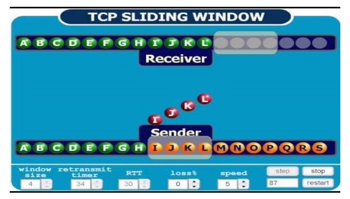

# Протокол Ковзного Вікна: Повернення На N

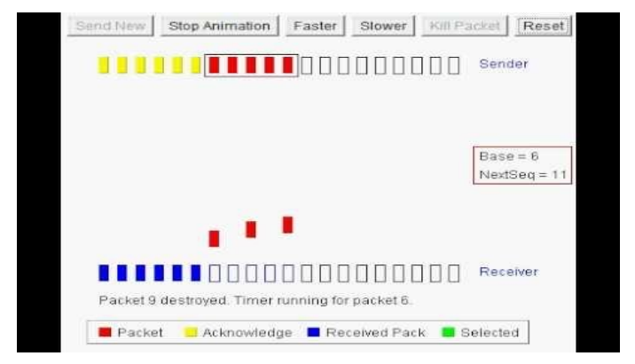

# Протокол Ковзного Вікна: Вибіркові Підтвердження

Send New | Stop Animation Reset

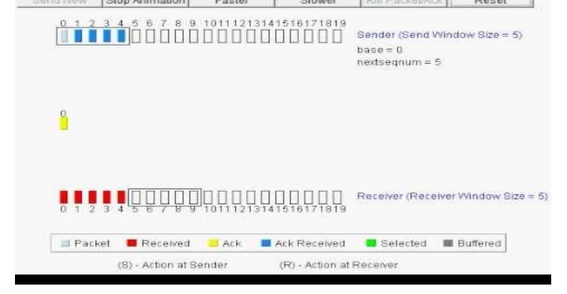

| Faster   | Slower   | RHERACKet/Acid   |
|----------|----------|------------------|

# Протокол Ковзного Вікна: Повільний Старт

Congestion Avoidance Congestion Window > Threshold Congestion Window = Congestion Window + 1

Congestion Window = 10 MSS

# Заголовок Тср

| TCP Segment Header Format   |                          |                |       |             |    |    |
|-----------------------------|--------------------------|----------------|-------|-------------|----|----|
| Bit #                       | 24                       |                |       |             |    |    |
| 0                           | 7                        | 8              | 15.   | 16          | 2  | 31 |
| Source Port                 | Destination Port         |                |       |             |    |    |
| 0                           |                          |                |       |             |    |    |
| 32                          | Sequence Number          |                |       |             |    |    |
| 64                          | Acknowledgment Number    |                |       |             |    |    |
| 96                          | Data Offset              | Res            | Flags | Window Size |    |    |
| 128                         | Header and Data Checksum | Urgent Pointer |       |             |    |    |
| 160...                      | Options                  |                |       |             |    |    |

| Bit #       | 16                       | 2   |  24    |    |
|-------------|--------------------------|-----|--------|----|
| 0           | 7                        | 8   | 15     | 31 |
| Source Port | Destination Port         |     |        |    |
| 0           | Header and Data Checksum |     |        |    |
| 32          | Length                   |     |        |    |

UDP Datagram Header Format

# Поля Заголовку Tcp

- **Acknowledgement Number** - номер наступного очікуваного байта. Підтвердження накопичувальне (cumulative acknowledgement)
- **Data Offset** - довжина заголовку ТСР в 32-бітових словах
- **Window Size** - розмір вікна (скільки байтів може відіслати відправник після підтвердженого байта)

# Заголовок Tcp: Флаги

- CWR i ECE - повідомлення про перевантаження в мережі, якщо використовується ECN (Explicit Congestion Notification), RFC 3168
- URG - термінові дані
- ACK - флаг підтвердження
- **PSH** - вказівка передати дані додатку без буферизації
- RST - скидання з'єднання через якусь проблему - SYN - флаг встановлення з'єднання - **FIN** - флаг розірвання з'єднання: відправник більше не має даних для передачі

# Встановлення Тср-З'Єднання

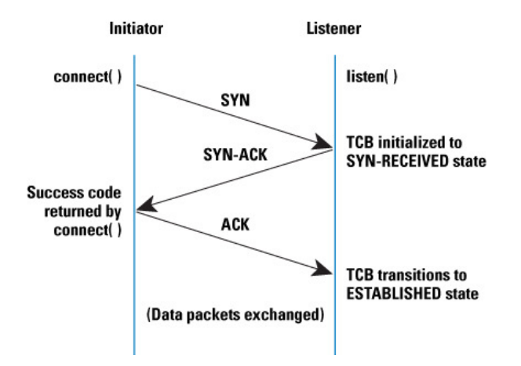

# Завершення Тср-З'Єднання

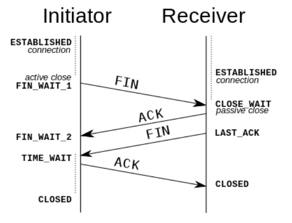

# Стани Протоколу Tcp

| Стан        | Опис                                                          |
|-------------|---------------------------------------------------------------|
| CLOSED      | Закрито. З'єднання не є активним і не є в стані встановлення  |
| LISTEN      | Очікування. Сервер очікує вхідного запиту                     |
| SYN RCVD    | Отримано запит з'єднання. Очікування підтвердження            |
| SYN SENT    | Надіслано запит з'єднання. Додаток почав відкривати з'єднання |
| ESTABLISHED | Встановлено. Нормальний стан передачі даних                   |
| FIN WAIT 1  | Додаток повідомив, що більше не має даних для передачі        |
| FIN WAIT 2  | Інша сторона погодилась розірвати з'єднання                   |
| TIMED WAIT  | Очікування, поки в мережі не зникнуть всі пакети              |
| CLOSING     | Обидві сторони намагались одночасно закрити з'єднання         |
| CLOSE WAIT  | Інша сторона ініціювала роз'єднання                           |
| LAST ACK    | Очікування, поки в мережі не зникнуть всі пакети              |

# Діаграма Станів Протоколу Тср

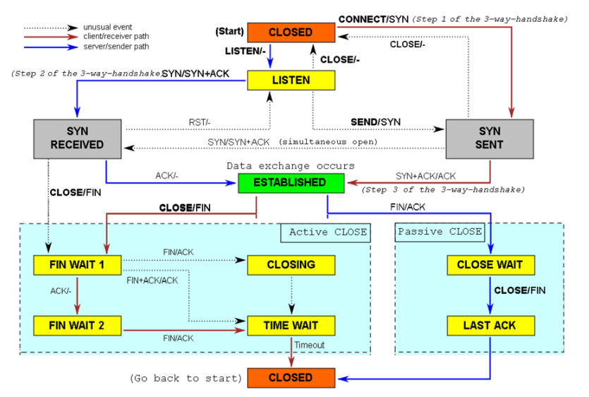

# Управління Вікном В Тср

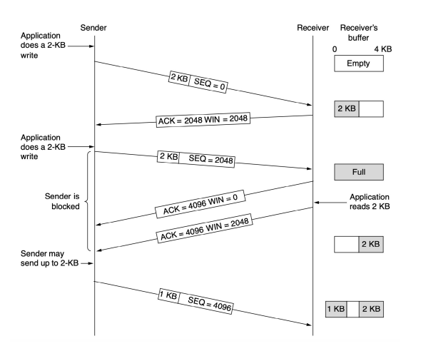

Контроль перевантаженн я в ТСР
.

AIMD (Additive Increase Multiplicative Decrease) - протокол адитивно збільшує пропускну здатність, а після отримання сигналу про перевантаження, мультиплікативно її зменшує

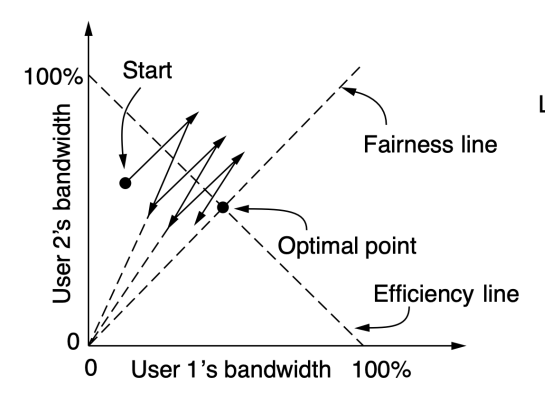

Legend:
✔ = Additive increase
(up at 45°)
́ = Multiplicative decrease
(line points to origin)

# Вікно Перевантаження І Вікно Управління Потоком

- **Вікно перевантаження** (congestion window) 
визначає кількість байтів кожного відправника в кожен момент часу в мережі
- **Швидкість відправлення** - розмір вікна, ділений на час подвійного оберту. Розмір вікна задається відповідно до правила AIMD
- **Індикатор перевантаження** - втрата пакетів - **Вікно управління потоком** - кількість байтів в буфері отримувача
- **Ефективне вікно відправника** - менше з двох вікон

# Повільний Старт

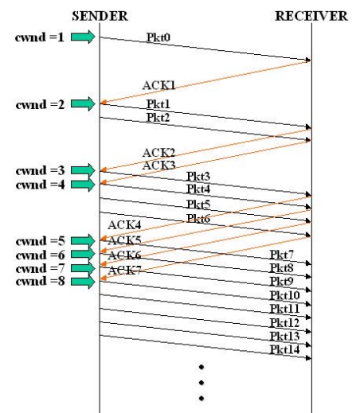

# Дублікати Підтверджень І Швидкий Повтор

- Швидкий спосіб повідомити відправника про втрату пакетів - **дублікати підтверджень** (duplicate acknowledgements): при отриманні кожного нового пакету надсилається підтвердження на останній перед втраченим
- **Швидкий повтор** (fast retransmission): три дублікати підтверджень = втрата пакету → повторна передача не чекаючи таймера. Починається з повільного старту

# Дублікати Підтверджень І Швидкий Повтор

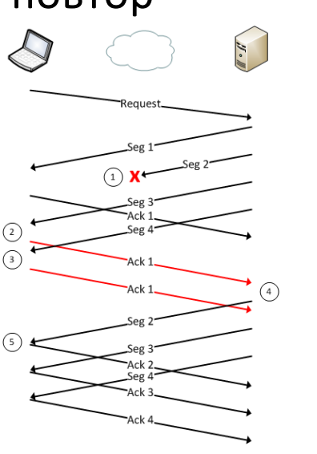

# Вибіркові Підтвердження Sack

- **SACK** (Selective ACKnowledgements) містить до трьох діапазонів успішно отриманих байтів
- Опція, описана в RFC 2883, контроль управління 

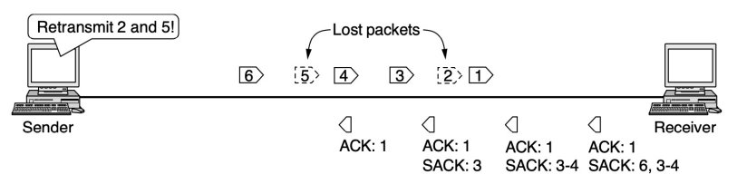

ТСР з використанням SACK описано в RFC 3517

# Вибіркові Підтвердження Sack

TCP without SACK
-100-199 200-299

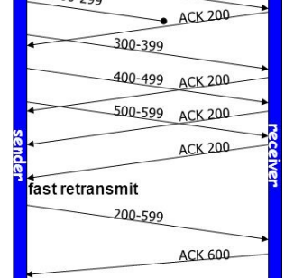

TCP with SACK

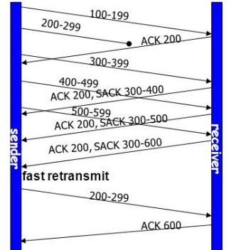

