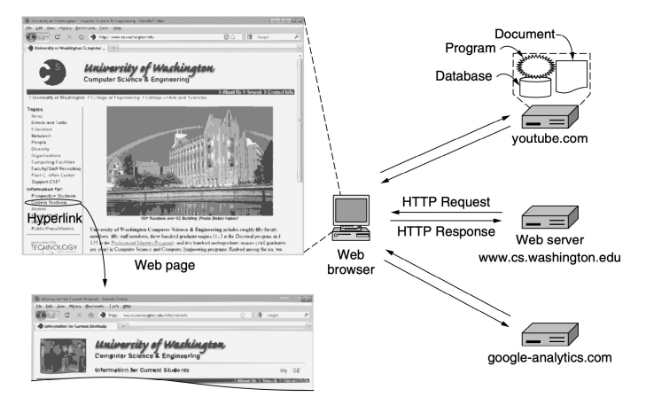
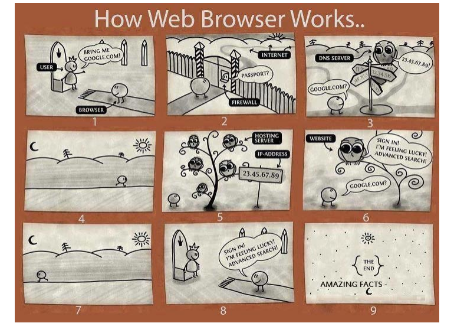
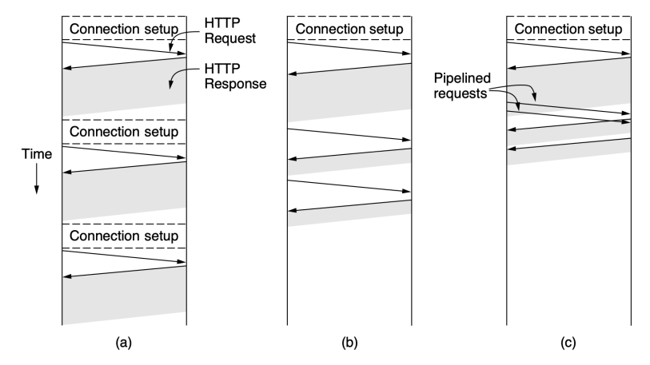
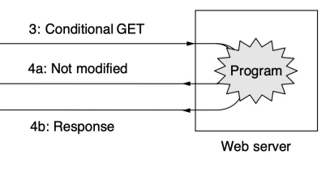
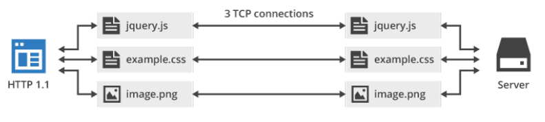
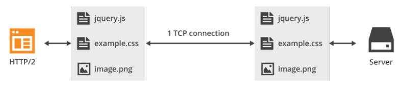
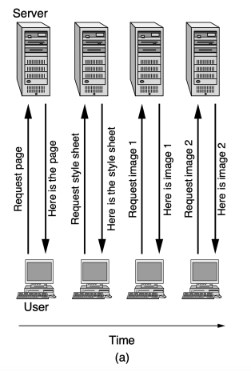
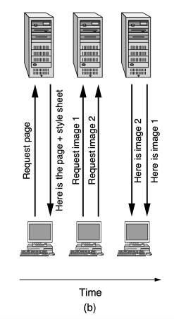

WWW і ПРОТОКОЛ HTTP

# Архітектура Www

- Множина **сторінок** (Web pages)
- Кожна зі сторінок може містити **посилання** (links)
- Концепція сторінок, пов'язаних посиланнями –
гіпертекст (hypertext)
- Протокол запиту-відповіді для відображення сторінок - **HTTP** (HyperText Transfer Protocol)

# Архітектура Www

# Url, Uri Та Urn

- Кожна сторінка має URL (Uniform Resource Locator)
- URL = протокол + DNS-ім'я машини + шлях до сторінки (файл або програма)
http://pz.lp.edu.ua/Courses-Map Протокол (*http*), DNS-ім'я машини (*pz.lp.edu.ua*), 
шлях (Courses-Map)

# Url, Uri Та Urn

- Узагальнення URL - URI (Uniform Resource Identifiers)
- URI, що описує локалізацію ресурсу - URL
- Якщо URI не описує конкретну локалізацію ресурсу, а тільки його назву - URN (Uniform Resource Names)
- Правила запису URI визначені в RFC 3986, інші схеми використання URI визначаються IANA

# Як Працює Браузер

# Http - Протокол Передачі Гіпертексту

- **HTTP** (HyperText Transfer Protocol), RFC 2616
- HTTP - простий протокол типу запит-відповідь
- Транспорт: TCP, серверний порт: 80 (443 HTTPS)
- Вміст відповіді визначається типом MIME

# Http

## - Http - Stateless Протокол:

oНе вимагає, щоб сервер зберігав інформацію або статус кожного користувача протягом декількох запитів oДеякі додатки можуть зберігати сеанси на стороні сервера використовуючи HTTP cookie або приховані елементи HTML на веб-формі

# З'Єднання Http

- **Постійні з'єднання** (persistent connection):
oвстановлення ТСР-з'єднання oвідправлення запиту oотримання відповіді oпередача і прийом додаткових запитів і відповідей
- **Конвеєрні запити** (pipelined requests): наступний запит надсилається ще до отримання відповіді на попередній

# З'Єднання Нттр

(а) Множинні з'єднання і послідовні запити
(b) Постійне з'єднання і послідовні запити
(с) Постійне з'єднання і конвеєрні запити

# Методи Http - Http: ‹Метод› ‹Uri› Http/‹Версія›

| Метод   | Опис                                                      |
|---------|-----------------------------------------------------------|
| GET     | Запит читання ресурсу                                     |
| HEAD    | Запит читання заголовку (без тіла) ресурсу (веб-сторінки) |
| POST    | Надсилання даних (об'єкта) на ресурс (веб-сторінку)       |
| PUT     | Запит збереження веб-сторінки                             |
| DELETE  | Видалення веб-сторінки                                    |
| TRACE   | Тест зворотного зв'язку по шляху до ресурсу               |
| PATCH   | Застосування часткових модифікацій в ресурсі              |
| CONNECT | Встановлює тунель до сервера                              |
| OPTIONS | Опис варіантів зв'язку до ресурсу (веб-сторінки)          |

# Методи Http

| Запит має тіло   | Відповідь має тіло   | Безпечний   | Ідемпотентний   | Кешований   |     |
|------------------|----------------------|-------------|-----------------|-------------|-----|
| GET              | НІ                   | ТАК         | TAK             | TAK         | TAK |
| HEAD             | НІ                   | НІ          | TAK             | TAK         | TAK |
| POST             | TAK                  | TAK         | НІ              | НІ          | TAK |
| PUT              | TAK                  | TAK         | НІ              | TAK         | НІ  |
| DELETE           | НІ                   | TAK         | НІ              | TAK         | НІ  |
| CONNECT          | TAK                  | TAK         | НІ              | НІ          | НІ  |
| OPTIONS          | ОПЦІОНАЛЬНО          | TAK         | TAK             | TAK         | НІ  |
| TRACE            | НІ                   | TAK         | TAK             | TAK         | НІ  |
| PATCH            | TAK                  | TAK         | НІ              | НІ          | TAK |

# Відповіді Сервера Http

| Група   | Значення        | Приклади                                                             |
|---------|-----------------|----------------------------------------------------------------------|
| 1xx     | Інформація      | 100 = сервер погодився обробити запити 200 = запит успішно оброблено |
| 2xx     | Успіх           | 204 = вміст відсутній 301 = сторінку переміщено                      |
| 3xx     | Перенаправлення | 304 = кешована сторінка все ще доступна 403 = помилка доступу        |
| 4xx     | Помилка клієнта | 404 = сторінку не знайдено 500 = внутрішня помилка сервера           |
| 5xx     | Помилка сервера | 503 = спробуй пізніше                                                |

# Відповіді Сервера Нттр

| Method                     | Method                       |
|----------------------------|------------------------------|
| 20 ОК                      | 21 Created                   |
| 2 Accepted                 | 23 Not authorized            |
| 204 No content             | 25 Reset content             |
| 26 Partial content         |                              |
| 30 Multiple choice         | 31 Moved permanently         |
| 302 Found                  | 3 See other                  |
| 304 Not modified           | 36 (unused)                  |
| 307 Temporary redirect     |                              |
| 40 Bad request             | 41 Unauthorized              |
| 402 Payment required       | 403 Forbidden                |
| 404 Not found              | 45 Method not allowed        |
| 46 Not acceptable          | 407 Proxy auth required      |
| 408 Timeout                | 49 Conflict                  |
| 410 Gone                   | 411 Length required          |
| 412 Preconditions failed   | 413 Request entity too large |
| 414 Requested URI too long | 415 Unsupported media        |
| 416 Bad request range      | 47 Expectation failed        |
| 500 Server error           | 51 Not implemented           |
| 502 Bad gateway            | 503 Service unavailable      |
| 504 Gateway timeout        | 55 Bad HTTP version          |

# Заголовки Повідомлень

- За рядком запиту можуть міститись інші рядки з додатковою інформацією (параметрами) - заголовки запитів (request headers)
- Аналогічно, відповіді можуть містити **заголовки** 
відповідей (response headers)

# Деякі Заголовки Повідомлень Протоколу Http

| Заголовок         | Тип       | Вміст                                                 |
|-------------------|-----------|-------------------------------------------------------|
| User-Agent        | запит     | Інформація про браузер і його платформу               |
| Accept            | запит     | Типи сторінок, що підтримуються клієнтом              |
| Accept-Charset    | запит     | Підтримувані клієнтом набори символів                 |
| Accept-Encoding   | запит     | Підтримувані клієнтом типи кодування                  |
| Accept-Language   | запит     | Мови підтримувані клієнтом                            |
| If-Modified-Since | запит     | Час і дата останнього оновлення (умовний GET)         |
| If-None-Match     | запит     | Теги останнього оновлення (умовний GET)               |
| Host              | запит     | Ім'я сервера                                          |
| Authorization     | запит     | Перелік персональних ідентифікаторів клієнта          |
| Referer           | запит     | URL, з якого було відправлено попередній запит        |
| Cookie            | запит     | Відправлення раніше прийнятого cookie-файлу на сервер |
| Set-Cookie        | відповідь | cookie-файл для збереження на клієнті                 |
| Server            | відповідь | Інформація про сервер                                 |
| Content-Encoding  | відповідь | Тип кодування вмісту (наприклад, gzip)                |

# Деякі Заголовки Повідомлень Протоколу Http

| Заголовок        | Тип               | Вміст                                                                                   |
|------------------|-------------------|-----------------------------------------------------------------------------------------|
| Content-Language | відповідь         | Мова сторінки                                                                           |
| Content-Length   | відповідь         | Розмір сторінки в байтах                                                                |
| Content-Type     | відповідь         | Тип MIME вмісту сторінки                                                                |
| Content-Range    | відповідь         | Ідентифікує частину вмісту сторінки                                                     |
| Last-Modified    | відповідь         | Дата і час внесення останніх змін в сторінку                                            |
| Expires          | відповідь         | Термін «чинності» сторінки                                                              |
| Location         | відповідь         | Команда на пересилання запиту на іншу адресу Сервер готовий приймати запити на сторінки |
| Accept-Ranges    | відповідь         | вказаного розміру (завантаження фрагментами)                                            |
| Date             | запит і відповідь | Дата і час відправлення повідомлення                                                    |
| Range            | запит і відповідь | Ідентифікує частину сторінки                                                            |
| Cache-Control    | запит і відповідь | Вказівки на те, як обробляти кеш                                                        |
| Upgrade          | запит і відповідь | Протокол, на яких хоче перемкнутись відправник                                          |

# Http: Get Request & Response

REQUEST GET /wiki/HTTP HTTP/1.1 Host: uk.wikipedia.org User-Agent: firefix/5.0 (Linux; 5.0.8; en-US; rv:1.8.1.7) Gecko/20070914 Firefox/2.0.0.7 Connection: close <empty string> RESPONSE HTTP/1.0 200 OK Server: Apache Content-Language: uk Content-Type: text/html; charset=utf-8 Content-Length: 1234 (далі йде текст запитаної сторінки) Дані відділені від HTTP-заголовків CRLF CRLF (двома переводами рядка)

# Http: Redirect

## Request

GET /about.html HTTP/1.1 Host: example.org User-Agent: MyBrowser/5.0

## Response

HTTP/1.x 301 Moved Permanently Location: http://example.com/about.html\#contacts Date: Thu, 19 Feb 2009 11:08:01 GMT Server: Apache/2.2.4 Content-Type: text/html; charset=windows-1251 Content-Length: 110 (пустий рядок)
<html>
 <body> <a href="http://example.com/about.html\#contacts">Click here</a> </body>
</html>

# Http: File Download

Файл http://example.org/BestFilm.avi, 2 Gb REQUEST GET /BestFilm.avi HTTP/1.0 Host: example.org Accept: */* User-Agent: Mozilla/4.0 (compatible; MSIE 5.0; Windows 98) Referer: http://example.org/ -> вказує, що файл запитаний з головної сторінки Без цього сервер може повернути 403 - Access Forbidden RESPONSE HTTP/1.1 **200 OK** Date: Thu, 19 Feb 2009 12:27:04 GMT Server: Apache/2.2.3 Last-Modified: Wed, 18 Jun 2003 16:05:58 GMT ETag: "56d-9989200-1132c580" Content-Type: video/x-msvideo Content-Length: 160993792 Accept-Ranges: bytes -> можна запитувати фрагменти Connection: close (порожній рядок) (двійковий вміст файлу)

# Http: Continue Download After 84 Mb

REQUEST GET /BestFilm.avi HTTP/1.0 Host: example.org Accept: */* User-Agent: Mozilla/4.0 (compatible; MSIE 5.0; Windows 98)
Range: bytes=88080384- -> видати вміст від 84 Мбайту і далі Referer: http://example.org/ RESPONSE HTTP/1.1 **206 Partial Content** Date: Thu, 19 Feb 2009 12:27:08 GMT Server: Apache/2.2.3 Last-Modified: Wed, 18 Jun 2003 16:05:58 GMT ETag: "56d-9989200-1132c580" Accept-Ranges: bytes Content-Range: bytes 88080384-160993791/160993792 -> діапазон байтів Content-Length: 72913408 -> розмір фрагмента Connection: close Content-Type: video/x-msvideo (порожній рядок) (двійкове представлення файлу)

# Http: Partial Get

- HTTP дозволяє отримати одразу не весь вміст ресурсу, а лише його заданий фрагмент: **часткові** запити GET
- Використовуються зазвичай для докачки файлів і швидкого скачування в декількох потоках
- Для отримання клієнт надсилає запит із заголовком **Range** із байтовими діапазонами
- Якщо сервер часткові запити
- **не опрацьовує** - повертає 200 і повний вміст файлу
- **опрацьовує** - повертає 206 = Partial Content, і містить заголовок Content-Range

# Http: Partial Get

- Фрагменти можуть бути **передані 2 способами**:
1) У відповіді поміщається заголовок ContentRange з вказанням байтових **діапазонів**. 

Згідно них фрагменти послідовно поміщаються в основне тіло. **Content-Length** відповідає сумарному об'єму всього тіла 2) Сервер вказує медіа-тип **multipart/byteranges**
для основного вмісту і передає фрагменти вказавши відповідний **Content-Range** для кожного елемента

# Http: 

 Conditional Get

- У відповідь на умовний GET, тіло ресурсу передається тільки, якщо він змінювався після дати, зазначеної в заголовку "**IfModified-Since**"
- Використання методу **умовний GET**
спрямовано на розвантаження мережі
- Метод GET змінюється на «умовний GET», 

якщо повідомлення запиту містить у собі поле заголовка "**If-Modified-Since**"

# Http: Conditional Get

- Алгоритм визначення :
oЯкщо код статусу відповіді на запит буде відрізнятися від «**200 OK**», або дата, зазначена в полі заголовка «**If-Modified-Since**» некоректна, відповідь буде ідентична відповіді на звичайний запит GET
oЯкщо після зазначеної дати ресурс змінювався, відповідь буде також ідентична відповіді на звичайний запит GET
oЯкщо ресурс не змінювався після зазначеної дати, сервер поверне код «304 Not Modified»

# Http/2

- Двійковий, а не текстовий
- Двійкові протоколи більш ефективні для аналізу, більш компактні, і менш схильні до помилок
- Повністю мультиплексований, замість черг і блоків
- В HTTP / 1.x є проблема, коли ефективно одночасно може бути виданий лише 1 запит
- В HTTP / 1.1 - конвеєрна передача
- Мультиплексування дозволяє використовувати декілька запитів і відповідей одночасно

# Http/2

- Можна використовувати одне з'єднання для паралелізму
- В HTTP/1 браузер відкриває від 4 до 8 з'єднань на джерело
- Оскільки більшість сайтів має декілька джерел, відкривається біля 30 з'єднань
- Користувацькі заголовки стискаються для зменшення навантаження
- Дозволяє серверу записувати відповіді в клієнтські кеші

# Htp/2 Multiplexing

Multiplexing

# Порівняння Http/1.1 Та Http/2

