БЕЗПЕКА ВЕБ-
ДОДАТКІВ

# Що Таке Безпека Веб-Додатків?

- Безпека веб-додатків - це практика захисту вебсайтів, програм і API від атак.

- Цілі - забезпечити безперебійну роботу вебдодатків і захистити бізнес від кібервандалізму, крадіжки даних, неетичної конкуренції та інших негативних наслідків.

# Ризики Безпеки Вебдодатків

Веб-додатки можуть зіткнутися з різними типами атак залежно від цілей зловмисника, характеру роботи цільової організації та конкретних прогалин у безпеці програми.

# Ризики Безпеки Веб-Додатків

- Zero-day vulnerabilities
- Cross-site scripting (XSS) - SQL injection (SQLi) - Denial-of-service (DoS) and distributed denial-of-service (DDoS) attacks
- Memory corruption
- Buffer overflow - Cross-site request forgery (CSRF)
- Credential stuffing
- Page scraping
- API abuse
- Shadow APIs
- Third-party code abuse
- Attack surface misconfigurations

# Вразливості Нульового Дня

Вразливості, про які розробники програми не знають, тому їх не можна виправити Понад 20 000 уразливостей нульового дня щороку Атаки спрямовані на швидке використання цих вразливостей і часто намагаються уникнути захисту, встановленого постачальниками засобів безпеки Cross-site scripting

# Cross-Site 

 Scripting

- XSS - це вразливість, яка дозволяє 

зловмиснику вставляти сценарії на стороні клієнта на веб-сторінку, щоб отримати прямий доступ до важливої інформації, видати себе за користувача або обманом змусити користувача розкрити важливу інформацію

# Cross-Site Scripting

- XSS - зловмисник додає код на легальний вебсайт, який виконується, коли жертва завантажує веб-сайт
- Цей шкідливий код можна вставити кількома способами
- Найчастіше його додають у **кінець URL-адреси** або публікують безпосередньо **на сторінці**, яка відображає вміст, створений користувачами
- Міжсайтовий сценарій - це атака з ін'єкцією коду на стороні клієнта

# Що Таке Клієнтський Код?

- JavaScript, який виконується на комп'ютері користувача після того, як браузер завантажує веб- сторінку
- Клієнтський код дуже корисний для інтерактивних веб-сторінок: інтерактивний вміст працює швидше та надійніше
- Клієнтський код використовується на більшості сучасних веб-сайтів
- Міжсайтовий скриптинг став **однією з найбільш** 
часто повідомлених вразливостей кібербезпеки, а XSS атаки вразили такі сайти, як YouTube, Facebook і Twitter

# Приклад

- Веб-сайти, які мають неперевірені форуми або коментарі
- Зловмисник публікує коментар, що складається з виконуваного коду, укладеного в теги 

- Коли будь-який інший користувач завантажить цей веб-сайт, зловмисний код між тегами сценарію буде виконано їхнім веб-браузером, і вони стануть жертвою атаки

# Використання Xss Зловмисником

- JavaScript має доступ до деяких конфіденційних даних, які можна використовувати для крадіжки особистих даних та інших зловмисних цілей
- Наприклад, JavaScript має доступ до файлів cookie, і зловмисник може використовувати XSS-атаку, щоб викрасти файли cookie користувача та видати себе за нього онлайн
- JavaScript також може створювати HTTP-запити, які можна використовувати для надсилання даних (наприклад, викрадених файлів cookie) назад до зловмисника
- Крім того, клієнтський JavaScript також може допомогти зловмиснику отримати доступ до API, які містять геолокаційні координати, дані веб-камери та іншу конфіденційну інформацію.

# Типова Xss Атака

1. Жертва завантажує веб-сторінку, а шкідливий код копіює файли cookie користувача 2. Потім код надсилає HTTP-запит на веб-сервер зловмисника з викраденими файлами cookie в тілі запиту 3. Потім зловмисник може використовувати ці файли cookie, щоб видати себе за користувача на цьому веб-сайті з метою атаки соціальної інженерії або навіть отримати доступ до номерів банківських рахунків чи інших конфіденційних даних

# Типи Xss

Reflected cross-site scripting

 Persistent cross-site scripting

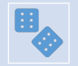

# Reflected Cross-Site Scripting

- Найпоширеніша атака
- Шкідливий код додається в кінець URL-адреси легального веб-сайту
- Коли жертва завантажує це посилання, браузер виконає код, вставлений у URL-адресу
- Зловмисник зазвичай використовує певну форму соціальної інженерії, щоб обманом змусити жертву натиснути посилання
- Наприклад, користувач може отримати легітимний електронний лист, який нібито надійшов від його банку:
http://legitamite-bank.com/index.php?user=

# Persistent Cross-Site Scripting

- Це трапляється на сайтах, які дозволяють користувачам публікувати вміст, який бачать інші користувачі, наприклад, на форумах сайтах соціальних мереж
- Якщо сайт не перевіряє належним чином вміст, створений користувачами, зловмисник може вставити код, який браузери інших користувачів виконуватимуть під час завантаження сторінки:
"Hi! My name is Dave, I enjoy long walks on the beach and "

# Як Запобігти Міжсайтовому Сценарію?

- Немає єдиної стратегії запобігання XSS
- **Уникайте HTML у вхідних даних**. Одним із дуже ефективних способів уникнути *постійних* XSS атак є заборона користувачам публікувати HTML у даних форми.

- **Перевіряйте введені дані**. Правила, які не дозволяють користувачеві публікувати дані у формі, що не відповідають певним критеріям.

- **Очищення даних**. Схоже на перевірку, але відбувається після того, як дані опубліковано на веб-сервері, але ще до того, як вони відображаються іншому користувачеві.

- **Заходи безпеки щодо файлів cookie**. Наприклад cookie можна прив'язати до певних IP-адрес або створити правила для повного блокування доступу JavaScript до файлів cookie.

- WAF. WAF також можна налаштувати для застосування правил, які запобігатимуть *відображеному* XSS.

# Sql Injection Що Таке Sql-Ін'Єкція?

- SQL-ін'єкція - це техніка ін'єкції коду, яка використовується для зміни або отримання даних із баз даних SQL
- Вставляючи спеціалізовані оператори SQL у поле введення, зловмисник може виконувати команди, які дозволяють отримувати дані з бази даних, знищувати конфіденційні дані або виконувати інші маніпулятивні дії.

- Неавторизований користувач може підробити особу більш привілейованого користувача, підробити існуючі дані, змінити транзакції, а також отримати та/або знищити всі дані сервера.

- SQL-ін'єкція зазвичай відбувається через Інтернет шляхом надсилання шкідливих запитів SQL до кінцевої точки API, наданої веб-сайтом або службою.

- У найгіршому випадку впровадження SQL може дозволити зловмиснику отримати кореневий доступ до машини, надаючи йому повний контроль.

# Як Працює Sql-Ін'Єкція?

- Поле запиту SQL, яке зарезервовано для певного типу даних, наприклад числа
- Замість цього передається неочікувана інформація, наприклад команда
- Під час виконання команда виходить за межі намічених обмежень, уможливлюючи потенційно негідну поведінку
- Поле запиту зазвичай заповнюється даними, введеними у форму на веб-сторінці

# Звичайний Sql-Запит

- Рядок studentId передається в оператор SQL - Мета полягає в тому, щоб переглянути список студентів для студента, який відповідає введеному studentId studentId = getRequestString("studentId");
lookupStudent = "SELECT * FROM students WHERE studentId = " + studentId
- Якщо студент вводить номер студента 117 у форму веб-сторінки, результуючий SQL-запит матиме такий вигляд:
SELECT * FROM students WHERE studentId = 117;
- Ця команда поверне запис для конкретного студента з studentId

# Запит Sql-Ін'Єкції

- Зловмисник вводить команду SQL або умовну логіку в поле введення, він вводить ідентифікаційний номер студента:
SELECT * FROM students WHERE studentId = 117 OR 1=1;
- Як і слід було очікувати, твердження завжди вірне для *кожного* студента в стовпці, і в результаті база даних поверне **всі дані з таблиці** студентів.

- Існують інструменти, які дозволяють зловмиснику автоматично здійснювати пошук на веб-сайті в пошуках форм, а потім намагатися ввести різні SQL-запити
- SQL-ін'єкції легко реалізувати, і, що цікаво, також досить легко запобігти за умови *належної практики розробки*
•Cтислі терміни, недосвідчені розробники та застарілий код часто призводять до низької якості коду та практик безпеки

SQi

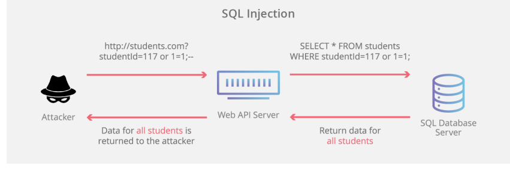

# Як Запобігти Атаці Sql Injection?

- В якості найкращої практики слід використовувати кілька стратегій
- Використання підготовлених інструкцій (з параметризованими **запитами)** - цей метод очищення вхідних даних передбачає спочатку визначити весь код SQL, а потім передавати лише певні параметри в запит SQL. Це дозволяє базі даних розрізняти дані, які вводяться, і код, який потрібно виконати, незалежно від типу даних, наданих у полі введення.

- Екранування вводу **користувача** - Екранування символу це спосіб сказати базі даних не розбирати його як команду чи умову, а натомість розглядати його як літеральний вхід.

- **Використання збережених процедур**. Якщо належним чином обмежити дозволи облікового запису БД, навіть код, вразливий до SQL-ін'єкцій, не матиме дозволів, необхідних для маніпулювання непов'язаними таблицями. Збережені процедури також можуть перевіряти тип вхідних параметрів. У випадках, коли статичних запитів недостатньо, зазвичай слід уникати збережених процедур.

- **Застосувати найменші привілеї**. Як правило, у всіх випадках, коли веб-сайту потрібно використовувати динамічний SQL, важливо обмежити дозволи найменшим обсягом, необхідним для виконання відповідного запиту.

Denial-of-service 
(DoS) attack

# Що Таке Атака На Відмову В Обслуговуванні?

- Атака типу «відмова в обслуговуванні» (DoS) - це тип кібератаки, під час якої зловмисник прагне зробити комп'ютер або інший пристрій недоступним для користувачів
- DoS-атаки зазвичай функціонують, перевантажуючи цільову машину запитами
- Розподілена атака типу «відмова в обслуговуванні» (DDoS) - це тип DoS-атаки, яка надходить із багатьох розподілених джерел, наприклад DDoS-атака ботнету

# Як Працює Dos-Атака?

## - Атаки Переповнення Буфера

- Тип атаки, під час якого переповнення буфера пам'яті може спричинити використання комп'ютером усього доступного місця на жорсткому диску, пам'яті чи часу ЦП.

## - Атака Насиченням (Flood)

- Насичуючи цільовий сервер величезною кількістю пакетів, зловмисник може перенаситити потужність сервера, що призведе до відмови в обслуговуванні. Щоб більшість DoS-атак були успішними, зловмисник повинен мати більшу доступну пропускну здатність, ніж ціль.

# Деякі Історично Важливі Dosатаки

- **Smurf attack** - зловмисник використовує широкомовну адресу вразливої мережі, надсилаючи підроблені (spoofed) пакети (зазвичай ICMP), що призводить до затоплення цільової IP-адреси.

- **Ping flood** - ця проста атака на відмову в обслуговуванні заснована на переповненні цілі пакетами ICMP (ping). Цю атаку також можна використовувати як DDoS-атаку.

- **Ping of Death** - часто пов'язаний з ping-flood, передбачає надсилання неправильно сформованого пакета на цільову машину, що призводить до шкідливої поведінки, наприклад збою системи.

# Ip Spoofing

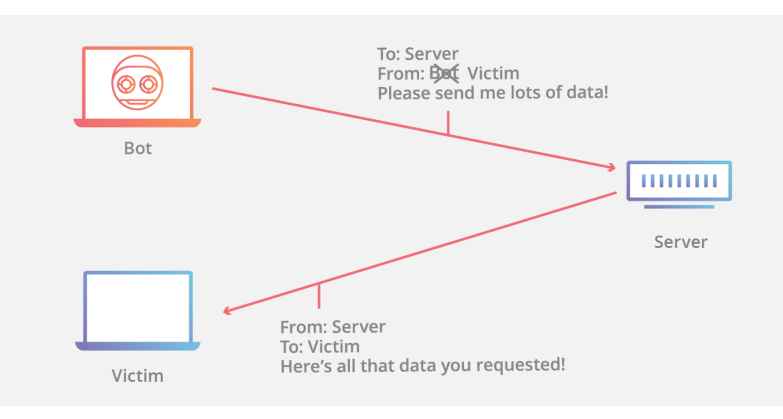

# Яка Різниця Між Ddos-Атакою Та Dos-Атакою?

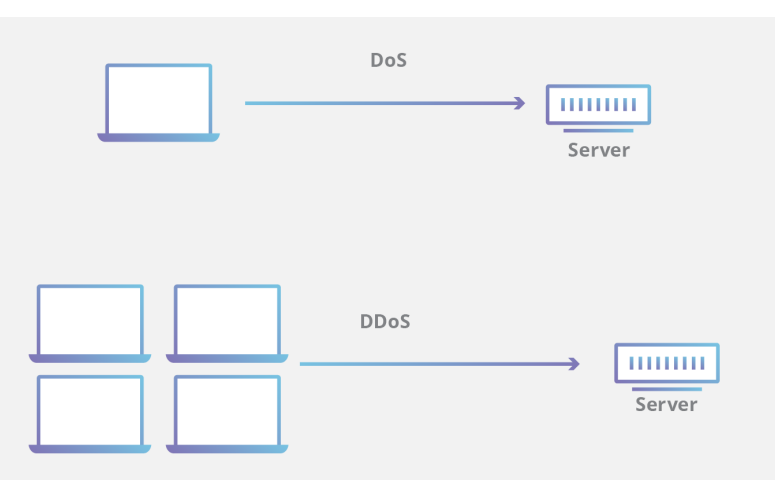

# Деякі Поширені Типи Ddos-Атак

- Хоча майже всі DDoS-атаки включають перевантаження цільового пристрою або мережі трафіком, атаки можна розділити на три категорії 1) Атаки прикладного рівня 2) Атаки на протокол 3) Об'ємні атаки
- Зловмисник може використовувати один або кілька різних векторів атаки або циклічні вектори атаки у відповідь на контрзаходи

# Атаки Прикладного Рівня

- Ці атаки мають на **меті** вичерпати ресурси цілі, щоб створити відмову в обслуговуванні
- Атаки націлені на рівень, де веб-сторінки генеруються на сервері та доставляються у відповідь на запити HTTP
- Виконання одного HTTP-запиту на стороні клієнта є дешевим, але відповідь цільового сервера може бути дорогою, оскільки сервер часто завантажує кілька файлів і виконує запити до бази даних, щоб створити веб-сторінку
- Від атак рівня 7 важко захиститися, оскільки буває важко відрізнити зловмисний трафік від легального

# Http Flood

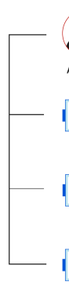

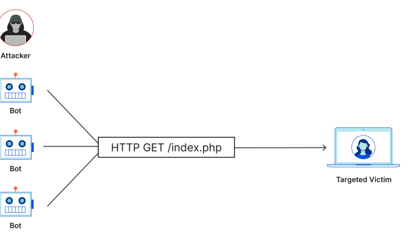

# Атаки На Протокол

- Атаки на протокол, також відомі як атаки на виснаження стану, спричиняють порушення роботи служби через надмірне споживання ресурсів сервера та/або ресурсів мережевого обладнання, як-от брандмауери та балансувальники навантаження
- Атаки на протокол використовують слабкі місця на рівнях 3 і 4 стека протоколів

# Syn Flood

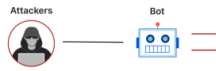

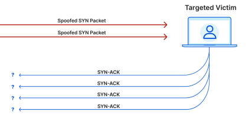

# Об'Ємні Атаки

- Ця категорія атак намагається створити перевантаження, споживаючи всю доступну пропускну здатність між ціллю та Інтернетом
- Великі обсяги даних надсилаються до цілі за допомогою форми посилення або іншого засобу створення масивного трафіку, наприклад запитів із ботнету

# Dns Amplification

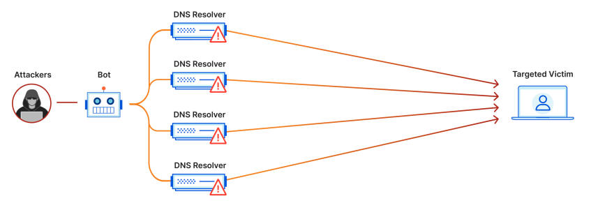

# Як Пом'Якшити Ddos-Атаки?

- Ключовою проблемою для пом'якшення DDoSатаки є розрізнення між трафіком атаки та звичайним трафіком.

- Багатовекторна DDoS-атака використовує кілька шляхів атаки.

- Що складніша атака, то більша ймовірність того, що трафік атаки буде важко відокремити від звичайного трафіку.

- Багаторівневе рішення дасть найбільшу користь.

# Як Пом'Якшити Ddos-Атаки: Blackhole Routing

- Одним із рішень, доступним практично всім мережевим адміністраторам, є створення маршруту чорної діри та спрямування трафіку на цей маршрут.

- Якщо інтернет-ресурс зазнає DDoS-атаки, постачальник послуг Інтернету (ISP) може направити весь трафік сайту в чорну діру.

- Це не ідеальне рішення, оскільки воно фактично дає зловмиснику бажану мету: робить мережу недоступною.

# Як Пом'Якшити Ddos-Атаки: Rate Limiting

- Обмеження кількості запитів, які сервер прийматиме протягом певного періоду часу.

- Хоча обмеження швидкості є корисним для уповільнення web scrapers від крадіжки вмісту та для пом'якшення спроб входу грубою силою, його одного, швидше за все, буде недостатньо для ефективної обробки складної DDoS-атаки.

- Тим не менш, обмеження швидкості є корисним компонентом ефективної стратегії пом'якшення DDoS.

# Як Пом'Якшити Ddos-Атаки: Web Application Firewall

- WAF - це інструмент, який може допомогти пом'якшити DDoS-атаку рівня 7.

- Встановлюючи WAF між Інтернетом і вихідним сервером, WAF може діяти як зворотний проксі, захищаючи цільовий сервер від певних типів шкідливого трафіку.

- Однією з ключових цінностей ефективного WAF є здатність швидко впроваджувати власні правила у відповідь на атаку.

# Як Пом'Якшити Ddos-Атаки: Anycast Network Diffusion

- Цей підхід пом'якшення використовує мережу Anycast для розсіювання трафіку атаки по мережі розподілених серверів до точки, коли трафік поглинається мережею.

- Надійність мережі Anycast для пом'якшення DDoS-атаки залежить від розміру атаки, розміру та ефективності мережі.

- Наприклад, Cloudflare має мережу 280 Тбіт/с, що на порядок більше, ніж найбільша зареєстрована DDoS-атака.

# Low And Slow Attack

- Тип DoS- або DDoS-атаки, яка покладається на невеликий потік дуже повільного трафіку, націленого на ресурси програми або сервера
- Вимагають дуже мало пропускної здатності, і їх важко пом'якшити, оскільки вони створюють трафік, який дуже важко відрізнити від звичайного трафіку
- Можуть залишатися непоміченими протягом тривалого періоду часу, при цьому відмовляючи або сповільнюючи обслуговування реальних користувачів
- Два найпопулярніших інструменти для запуску низької та повільної атаки - Slowloris і R.U.D.Y.

# Як Працює Низька Та Повільна Атака?

- Дані передаються до сервера дуже повільно, але достатньо швидко, щоб запобігти тайм-ауту
- Зловмисники можуть використовувати заголовки HTTP, запити HTTP POST або TCP:
- Slowloris підключається до сервера, а потім повільно надсилає часткові заголовки HTTP. Це змушує сервер тримати з'єднання відкритим, щоб він міг отримати решту заголовків, зв'язуючи потік.

- R.U.D.Y. (R-U-DEAD-YET?) генерує запити HTTP POST для заповнення полів форми. Він повідомляє серверам, скільки даних очікувати, але потім надсилає ці дані дуже повільно. Сервер зберігає з'єднання відкритим, оскільки він очікує більше даних.

- Sockstress використовує вразливість у тристоронньому рукостисканні TCP/IP, створюючи невизначені з'єднання.

# Як Виявити Low And Slow Attack?

- Методи виявлення швидкості, які використовуються для ідентифікації та зупинки традиційних DDoS-атак, не виявлять низьку та повільну атаку, оскільки вони виглядають *як звичайний трафік*
- Найкращим способом їх виявлення є ретельний моніторинг використання ресурсів сервера в поєднанні з *аналізом поведінки* користувачів
- Якщо сервери працюють повільно або виходять з ладу, і є підозра на низьку та повільну атаку, однією з ознак такої атаки є те, що звичайні процеси користувача займають набагато більше часу

# Як Зупинити Низьку Та Повільну Атаку?

- Один із способів пом'якшити низьку та повільну атаку - це підвищити доступність вашого сервера
- Проблема цього підходу полягає в тому, що зловмисник може спробувати масштабувати свою атаку
- Іншим рішенням є захист на основі зворотного проксі-сервера, який пом'якшить низькі та повільні атаки до того, як вони досягнуть вихідного сервера

# Reverse Proxy

- Зворотний проксі - це сервер, який знаходиться перед веб-серверами та пересилає запити клієнта на ці веб-сервери
- Зворотні проксі-сервери зазвичай впроваджуються для підвищення безпеки, продуктивності та надійності

# Forward Proxy

Forward Proxy Flow

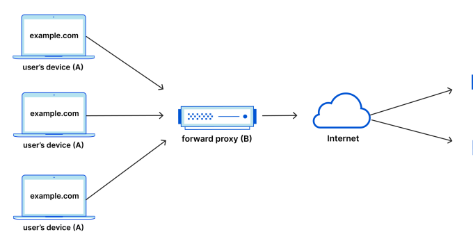

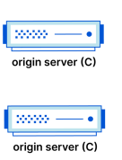

# Для Чого Використовують Проксі-Сервери

- To avoid state or institutional browsing restrictions
- To block access to certain content
- To protect their identity online

# Reverse Proxy

Reverse Proxy Flow

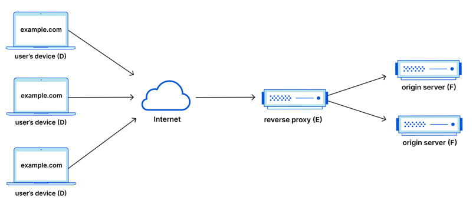

# Переваги Зворотного Проксі

- Load balancing
- Protection from attacks
- Global server load balancing (GSLB)
- Caching - SSL encryption

# Пошкодження Пам'Яті

Вміст пам'яті ненавмисно змінено, що призводить до потенційної неочікуваної поведінки програмного забезпечення Зловмисники намагатимуться використати пошкодження пам'яті за допомогою експлойтів, таких як впровадження коду або атаки переповнення буфера Переповнення буфера Що таке 

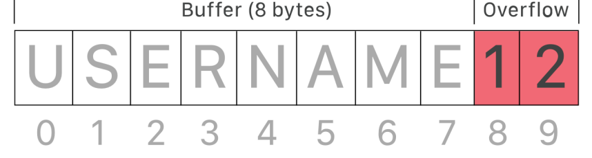 переповнення буфера?

- Переповнення буфера - це аномалія, яка виникає, коли ПЗ, яке записує дані в буфер, переповнює його ємність, що призводить до перезапису сусідніх ділянок пам'яті

# Використання Переповнення Буфера

- Зловмисники можуть використати переповнення буфера для пошкодження ПЗ
- Незважаючи на те, що атаки з переповненням буфера добре зрозумілі, вони все ще є серйозною проблемою безпеки
- У 2014 році загроза, відома як «heartbleed», 
піддала атаці сотні мільйонів користувачів через уразливість переповнення буфера в програмному забезпеченні SSL

# Як Зловмисники Використовують Переповнення Буфера?

- Якщо структура пам'яті програми чітко визначена, зловмисник може навмисно перезаписати області, які містять виконуваний код.

- Потім зловмисник може замінити цей код власним виконуваним кодом.

- Наприклад, якщо перезаписана частина пам'яті містить вказівник, код зловмисника може замінити цей код іншим вказівником, який вказує на код зловмисника.

# Хто Вразливий До Атак Переповнення Буфера?

- Деякі мови кодування більш чутливі до переповнення буфера, ніж інші.

- C і C++ - це дві популярні мови з високою вразливістю, оскільки вони не містять вбудованих засобів захисту від доступу або перезапису даних у своїй пам'яті.

- Java, PERL і C\#, мають вбудовані функції, які допомагають зменшити ймовірність переповнення буфера, але не можуть запобігти цьому повністю.

# Як Захиститися Від Атак Переповнення Буфера?

- Сучасні ОС мають засоби захисту під час виконання, які допомагають пом'якшити атаки переповнення буфера:
- Рандомізація **адресного простору**. Довільно змінює розташування ключових областей даних процесу в адресному просторі. Атаки переповнення буфера зазвичай покладаються на знання точного розташування важливого виконуваного коду, рандомізація адресних просторів робить це майже неможливим.

- **Запобігання виконанню даних** - позначає певні області пам'яті як виконувані, запобігаючи запуску коду, знайденого в невиконуваній області.

- Розробники ПЗ також можуть вживати запобіжних заходів проти вразливості переповнення буфера.

- Незважаючи на запобіжні заходи, виявляються все нові вразливості переповнення буфера.

# Типи Атак Переповнення Буфера

- **Stack overflow attack** - найпоширеніший тип 

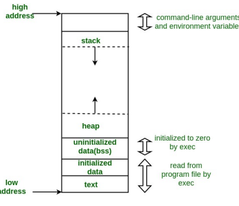

атаки на переповнення буфера, яка передбачає переповнення буфера в стеку викликів.

- **Heap overflow attack** - тип атаки спрямований на дані у відкритому пулі пам'яті, відомому як купа.

- **Integer overflow attack**. Арифметична операція призводить до отримання цілого числа, яке є занадто великим для цілого типу; це може призвести до переповнення буфера.

- **Unicode overflow**. Переповнення Unicode створює переповнення буфера, вставляючи символи Unicode у вхідні дані, які очікують символів ASCII.

Cross-site request forgery (CSRF)

# Що Таке Міжсайтова Підробка Запитів (Csrf)?

- Підробка міжсайтового запиту полягає в тому, що жертву обманом змушують зробити запит, який використовує її автентифікацію або авторизацію.

- Використовуючи привілеї облікового запису користувача, зловмисник може надіслати запит під виглядом користувача.

- Після того, як обліковий запис користувача було зламано, зловмисник може викрасти, знищити або змінити важливу інформацію.

# Як Це Працює?

- Ця атака спрямована на 

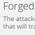

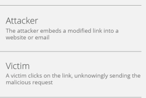

запити, що змінюють стан, які призводять до зміни даних з одного значення на інше.

- Наприклад, цільовий запит може здійснити покупку або змінити значення в обліковому записі.

- Це «сліпа атака», яка не 

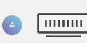

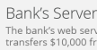

повертає дані зловмиснику, що робить її поганим вибором для крадіжки даних.

# Характеристики Атак Csrf

- Атаки CSRF відрізняються за методологією, але зазвичай мають такі характеристики:
- Вони використовують веб-сайти, які покладаються на особистість користувача
- Вони обманом змушують браузер користувача надсилати HTTP-запити на цільовий сайт
- Вони включають використання запитів HTTP, які мають побічні ефекти та не мають належного захисту CSRF

# Вразливість Http До Атак Csrf

- Як правило, запити GET не змінюють стан, що робить їх неефективними для CSRF.

- HTTP POST використовується для зміни стану, що призводить до підвищення потреби в захисті.

- Заходи безпеки: same origin policy (SOP) і cross origin resource sharing (CORS).

- SOP дозволяє лише запити з одного джерела, а CORS 
дозволяє надходження лише певних типів запитів з іншого джерела.

- Інші методи HTTP, такі як PUT і DELETE, можна запускати лише за допомогою SOP і CORS, пом'якшуючи багато міжсайтових атак.

# Як Можна Пом'Якшити Csrf?

- Найпоширеніша методологія пом'якшення атак CSRF 
передбачає використання токенів Anti-CSRF.

## - Synchronizer Token Pattern:

- Коли користувач відвідує веб-сторінку, веб-сайт вставляє випадковий маркер у форму. Коли користувач надсилає форму, повертається випадковий маркер, і сервер може перевірити, чи збігаються два токени.

## - Cookie-To-Header Token:

- Інший метод передбачає видачу файлу cookie, який містить випадковий маркер. JavaScript, що працює на стороні клієнта, зчитує значення токена в файлі cookie та копіює його в HTTP-заголовок, який надсилатиметься з кожним запитом.

# Credential Stuffing

Зловмисники можуть використовувати ботів для швидкого введення великої кількості вкрадених комбінацій імені користувача та пароля на портал входу веб-додатку. Якщо введення облікових даних надає зловмиснику доступ до облікового запису справжнього користувача, він може викрасти дані користувача або зробити шахрайські покупки від імені користувача.

# Що Таке Введення Облікових Даних?

- Надсилання облікових 

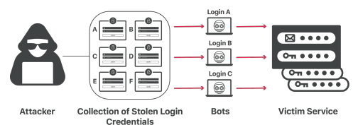

даних - це кібератака, під час якої скомпрометовані на одному сервісі облікові дані, використовуються для спроби входу в інший непов'язаний сервіс.

- Надсилання облікових даних широко поширене завдяки величезним спискам зламаних облікових даних, якими торгують і продають на чорному ринку.

# Що Робить Додавання Облікових Даних Ефективним?

- Статистично, атаки з використанням облікових даних мають дуже низький рівень успіху, приблизно 0,1%.

- Величезний обсяг колекцій облікових даних, якими торгують зловмисники, робить введення облікових даних того вартим, незважаючи на низький рівень успіху.

- Удосконалення технологій ботів також робить введення облікових даних життєздатною атакою.

- Функції безпеки, вбудовані у форми входу в веб-додатки, часто включають навмисні затримки та заборону IP-адрес користувачів, які неодноразово невдало намагалися ввійти.

- Сучасне ПЗ для додавання облікових даних обходить ці засоби захисту, використовуючи ботів для одночасної спроби кількох входів, які, здається, надходять із різних типів пристроїв і з різних IP-адрес.

# Що Робить Додавання Облікових Даних Ефективним?

- Часто єдиним свідченням того, що компанія-жертва є жертвою атаки, є збільшення загальної кількості спроб входу.

- Навіть тоді постраждалій компанії буде важко зупинити ці спроби, не вплинувши на можливість законних користувачів входити в службу.

- Основна причина ефективності атак із введенням облікових даних полягає в тому, що люди повторно використовують паролі. Дослідження показують, що більшість користувачів, за деякими оцінками 85%, повторно використовують ті самі облікові дані для входу в декілька служб.

# Page Scraping

Зловмисники можуть використовувати ботів для масової крадіжки вмісту веб-сторінок. Вони можуть використовувати цей вміст, щоб отримати цінову перевагу над конкурентом, імітувати власника сторінки в зловмисних цілях або з інших причин.

# Що Таке Копіювання Вмісту?

- Збирання вмісту означає, що бот завантажує велику частину або весь вміст веб-сайту, незалежно від бажання власника веб-сайту.

- Боти для збирання вмісту часто використовуються для перепрофілювання вмісту в зловмисних цілях, наприклад для копіювання вмісту для пошукової оптимізації на веб-сайтах, якими володіє зловмисник, порушення авторських прав і викрадення трафіку.

- Збирання вмісту може включати заповнення та надсилання форм для доступу до додаткового закритого вмісту, і як побічний продукт це призводить до небажаних даних у базі даних компанії.

- Крім того, виконання HTTP-запитів від ботів забирає ресурси сервера.

# Як Боти Збирають Вміст?

- Бот-збирач веб-сайтів зазвичай надсилає серію HTTP-запитів GET, а потім копіює та зберігає всю інформацію, яку веб-сервер надсилає у відповідь, проходячи через ієрархію веб-сайту, доки не скопіює весь вміст.

- Більш складні боти-збирачі можуть використовувати JavaScript, щоб, наприклад, заповнювати кожну форму на веб-сайті та завантажувати будь-який закритий вміст.

# На Який Вміст Націлені Боти Для Сканування Вмісту?

- Будь-що, опубліковане в Інтернеті, - текст, зображення, HTML-код, CSS-код тощо.

- Зловмисники можуть використовувати зібрані дані для різних цілей.

- Текст можна повторно використати на іншому веб-сайті, щоб викрасти рейтинг першого веб-сайту в пошуковій системі або ввести в оману користувачів.

- Зловмисник може використати код HTML і CSS веб-сайту, щоб скопіювати вигляд законного веб-сайту або бренд іншої компанії.

- Створення фішингових веб-сайтів, які обманом змушують користувачів ввести особисту інформацію, виглядаючи як справжня версія іншого веб-сайту.

# Які Ще Існують Види Вебзбирання?

## - Збирання Контактів

- Сканування веб-сайтів на предмет контактної інформації, такої як номери телефонів і адрес електронної пошти, а потім завантаження цієї інформації.

- Боти для збирання електронної пошти - це тип бота- збирача, який спеціально націлений на адреси електронної пошти, як правило, з метою пошуку нових цілей для спаму.

## - Збирання Цін

- Одна компанія завантажує всю інформацію про ціни з веб-сайту компанії-конкурента, щоб вони могли відповідним чином скоригувати власні ціни.

# Як Компанії Можуть Запобігти Веб-Збиранню?

- Рішення для керування ботами можуть визначати моделі поведінки ботів і пом'якшувати дії ботів, часто за допомогою *машинного навчання*.

- Обмеження швидкості також може допомогти запобігти копіюванню вмісту: реальний користувач навряд чи запитає вміст кількох сотень сторінок за кілька секунд або хвилин, а будь-який «користувач», який робить запити так швидко, швидше за все, бот.

- CAPTCHA також може допомогти відрізнити реальних користувачів від ботів.

# Credential Stuffing

Зловмисники можуть використовувати ботів для швидкого введення великої кількості вкрадених комбінацій імені користувача та пароля на портал входу веб-додатку. Якщо введення облікових даних надає зловмиснику доступ до облікового запису справжнього користувача, він може викрасти дані користувача або зробити шахрайські покупки від імені користувача.

# Api Abuse

Як і будь-який тип ПЗ, АРІ можуть мати вразливості, які дозволяють зловмисникам надсилати зловмисний код в одну з програм або перехоплювати конфіденційні дані під час їх переміщення з однієї програми в іншу. Це все більш поширений тип атаки, оскільки використання API зростає.

# Owasp

- Open Web Application Security Project (OWASP) - некомерційна організація, метою якої є сприяння безпеці веб-додатків.

- OWASP пропонує багато безкоштовних ресурсів усім, хто хоче створити безпечну веб-програму.

- Одним із найбільш популярних ресурсів є OWASP 
Top 10, у якому перелічено 10 найбільших проблем безпеки веб-додатків.

- OWASP також підтримує окремий подібний список для API, які є найважливішим будівельним блоком для більшості веб-програм. Цей список є Топ-10 безпеки OWASP API.

# Owasp Api Security Top 10

1. **Broken Object Level Authorization**: маніпулювання ідентифікаторами об'єктів у запиті для отримання несанкціонованого доступу до конфіденційних даних. Зловмисники отримують доступ до об'єктів (даних), до яких вони не повинні мати доступу, просто змінюючи ідентифікатори.

2. **Broken User Authentication**: якщо автентифікацію реалізовано неправильно, зловмисники можуть видавати себе за користувачів API, надаючи їм доступ до конфіденційних даних.

3. **Excessive Data Exposure**: багато API помиляються, відкриваючи дані, і розраховують на те, що користувач API правильно фільтруватиме дані. Це може дозволити неавторизованим особам переглядати дані.

# Owasp Api Security Top 10

4. **Lack of Resources & Rate Limiting**: за умовчанням багато API не обмежують кількість або розмір запитів, які вони можуть отримати в певний час. Це робить їх відкритими для атак типу «відмова в обслуговуванні» (DoS).

5. **Broken Function Level Authorization**: цей ризик пов'язаний з авторизацією. Користувачам API може бути дозволено робити занадто багато, що призведе до розкриття даних.

6. **Mass Assignment**: API автоматично застосовує дані користувача до кількох властивостей. Зловмисник може використати цю вразливість, щоб, наприклад, змінити себе на адміністратора під час оновлення деяких інших нешкідливих властивостей свого профілю користувача.

# Owasp Api Security Top 10

7. **Security Misconfiguration**: помилки у налаштуванні API, 
зокрема неправильно налаштовані HTTP-заголовки, непотрібні методи HTTP та те, що OWASP називає «дослівними повідомленнями про помилки, що містять конфіденційну інформацію».

8. **Injection**: під час ін'єкційної атаки зловмисник надсилає спеціалізовані команди API, які обманом спонукають його відкрити дані або виконати якусь іншу несподівану дію.

9. **Improper Assets Management**: не відстежуються як поточні робочі API, так і застарілі, що призводить до тіньових API. 10. **Insufficient Logging & Monitoring**: зазвичай потрібно понад 200 днів, щоб виявити порушення. Детальна реєстрація і моніторинг подій можуть дозволити розробникам API виявляти та зупиняти порушення набагато раніше.

# Shadow Api

Команди розробників швидко працюють над досягненням бізнес-цілей, часто створюючи та публікуючи API, не інформуючи команди безпеки. Ці невідомі API можуть розкривати конфіденційні дані компанії, працюючи в «тіні», оскільки групи безпеки, яким доручено захистити API, не знають про їх існування.

# Що Таке Тіньовий Api?

- «Тіньовий» API відноситься до будь-якого API, яким не керує та не захищає організація, що його використовує.

- Часто тіньові API вводяться розробниками та іншими користувачами в організації під час процесу розробки програми або для виконання інших бізнес- функцій.

- Тіньові API не обов'язково використовуються зі зловмисною метою. Однак через те, що вони не знаходяться під контролем ІТ-служб і груп безпеки організації, їх неможливо захистити від нових вразливостей і атак.

# Чому Тіньові Api Небезпечні?

- **Викриття даних**: тіньові API можуть мати доступ до конфіденційних даних. Якщо ці API зламано або атаковано, це може призвести до розкриття або викрадення даних.

- **Бічний рух**: тіньові API можуть надавати зловмисникам точки входу для доступу до конфіденційних систем і облікових записів. Після проникнення в середовище організації вони можуть викрасти конфіденційну інформацію або використати цей доступ для подальших атак.

- **Невиправлені вразливості**: організації не можуть виправляти нові вразливості в API, які вони ще не відстежують і не керують ними.

- **Невідповідність**: багато організацій підпадають під дію законів про конфіденційність даних (наприклад, GDPR або CCPA). Тіньові API можуть дозволити розробникам або іншим користувачам обробляти дані способами, які не відповідають цим правилам.

# Тіньові Api Та Зомбі Api

- Тіньовий API - це некерований API, який активно використовується.

- Зомбі-API - це API, який застарів або від якого відмовилися.

- На відміну від тіньових API, зомбі-API можуть бути вже ідентифіковані та керовані організацією, але вони не використовуються активно.

- Як тіньові API, так і API-зомбі представляють серйозний ризик для організацій, які з ними взаємодіють, оскільки вони зазвичай залишаються незахищеними та можуть бути скомпрометовані або використані для здійснення атак.

# Third-Party Code Abuse

Багато сучасних веб-додатків використовують різноманітні інструменти сторонніх розробників. Якщо зловмисники виявлять вразливість в одному з цих інструментів, вони можуть скомпрометувати інструмент і викрасти дані, які він обробляє.

# Зловживання Кодом Третьої Сторони

- Якщо зловмисники виявлять вразливість в одному з сторонніх інструментів, вони можуть скомпрометувати інструмент і викрасти дані, які він обробляє, перешкодити його функціонуванню або використати його для впровадження шкідливого коду в іншу частину програми.

- Атаки Magecart, які знімають дані кредитної картки з платіжних процесорів, є прикладом цього типу атак.

- Ці атаки також вважаються атаками на ланцюг поставок браузера (supply chain attack).

# Що Таке Атака На Ланцюг Поставок?

- Атака на ланцюг поставок використовує сторонні інструменти або служби - разом іменовані 
«ланцюгом поставок» - для проникнення в систему або мережу цілі.

- Ці атаки іноді називають «атаками на ланцюг поставок» або «атаками третіх сторін».

- Під час атаки на ланцюг постачання зловмисник може націлитися на третю сторону та додати шкідливий код до його програмного забезпечення, яке потім надсилається в оновленні системи клієнтам цього постачальника.

- По суті, так була здійснена атака SolarWinds на 18 000 клієнтів у 2020 році.

# Як Здійснюється Атака На Ланцюг Поставок?

- Перш ніж здійснити атаку на ланцюг поставок, зловмисникам потрібно отримати доступ до сторонньої системи, програми або інструменту, який вони планують використати («upstream» атака).

- Це можна зробити за допомогою вкрадених облікових даних, використання невідомої вразливості програмного забезпечення тощо.

- Після того як доступ до цієї сторонньої залежності буде захищено, «downstream» атаку - атаку, яка досягає кінцевої цілі - можна здійснити різними способами, наприклад через оновлення ПЗ.

# Поширені Типи Атак На Ланцюги Поставок

- **Атаки браузера** запускають шкідливий код у браузерах кінцевих користувачів. Зловмисники можуть атакувати бібліотеки JavaScript або розширення браузера, які автоматично виконують код на пристроях користувачів. Крім того, вони також можуть викрасти конфіденційну інформацію користувача, яка зберігається в браузері.

- **Програмні атаки** маскують зловмисне ПЗ в оновленнях програмного забезпечення. Як і під час атаки SolarWinds, системи користувачів можуть завантажувати ці оновлення автоматично.

# Поширені Типи Атак На Ланцюги Поставок

- **Атаки з відкритим вихідним кодом** використовують уразливості у відкритому коді. Пакети з відкритим кодом можуть дозволити зловмисникам підробити відомі вразливості або приховати зловмисне ПЗ.

- **Атаки на JavaScript** використовують наявні вразливості в коді JavaScript або вбудовують шкідливі сценарії у веб-сторінки, які автоматично виконуються, коли їх завантажує користувач.

- **Атаки Magecart** використовують зловмисний код JavaScript для отримання даних кредитної картки з форм оплати на веб-сайті, якими часто керують треті сторони. Це також відоме як «formjacking».

# Поширені Типи Атак На Ланцюги Поставок

- **Атаки водопою** (watering hole attacks) ідентифікують веб-сайти, якими зазвичай користується велика кількість користувачів. Зловмисники можуть використовувати низку тактик, щоб виявити вразливі місця в безпеці на сайті, а потім використати ці вразливості, щоб доставити зловмисне ПЗ 
користувачам, які нічого не підозрюють.

- **Cryptojacking** дозволяє зловмисникам викрасти обчислювальні ресурси, необхідні для майнінгу криптовалюти. Вони можуть зробити це кількома способами: шляхом ін'єкції шкідливого коду чи реклами на веб-сайт, вбудовування сценаріїв криптомайнінгу в сховища коду з відкритим вихідним кодом або використання фішингу.

# Як Захиститися Від Атак На Ланцюг Поставок?

- **Виконайте оцінку ризику третьої сторони**: це може включати тестування стороннього програмного забезпечення перед розгортанням, вимогу до постачальників дотримуватися певних політик безпеки, впровадження політик безпеки вмісту (Content Security Policies, CSP), щоб контролювати, які ресурси може запускати веб-переглядач, або використання Subresource Integrity (SRI), щоб перевірити JavaScript на наявність підозрілого вмісту.

- **Запровадження Zero Trust**: Zero Trust гарантує, що кожен користувач - від співробітників до підрядників і постачальників - підлягає безперервній перевірці та моніторингу в мережі організації. Перевірка ідентифікаційних даних і привілеїв користувача та пристрою допомагає гарантувати, що зловмисники не зможуть проникнути в організацію, просто викравши облікові дані легітимного користувача.

# Як Захиститися Від Атак На Ланцюг Поставок?

- **Використовуйте засоби запобігання зловмисному ПЗ**: 
інструменти запобігання зловмисному програмному забезпеченню, наприклад антивірусне програмне забезпечення, автоматично сканують пристрої на наявність шкідливого коду, щоб запобігти його виконанню.

- **Застосуйте ізоляцію веб-переглядача**. Sandbox ізолює код веб-сторінки перед його виконанням на пристроях кінцевих користувачів, тому будь-яке зловмисне ПЗ виявляється та пом'якшується до того, як воно досягне цільового призначення.

- **Виявлення тіньових ІТ**: «Тіньові ІТ» стосуються програм і послуг, які працівники використовують без схвалення ІТ- відділу своєї організації. Ці несанкціоновані інструменти можуть містити вразливості, які ІТ не можуть виправити, оскільки вони не знають про їх використання.

# Як Захиститися Від Атак На Ланцюг Поставок?

- **Увімкніть виправлення та виявлення вразливостей**: 
організації, які використовують інструменти сторонніх розробників, несуть відповідальність за те, щоб ці інструменти не мали вразливостей у безпеці. Хоча ідентифікувати та виправити кожну вразливість може бути неможливо, організації все одно повинні докладати належних зусиль, щоб знайти та розкрити відомі вразливості в програмному забезпеченні та інших ресурсах третіх сторін.

- Запобігайте експлойтам **нульового дня**: часто атаки на ланцюги поставок використовують експлойти нульового дня, які ще не виправлено. Хоча не існує надійного методу для передбачення загроз нульового дня, інструменти ізоляції браузера та брандмауери можуть допомогти ізолювати та заблокувати зловмисний код перед його виконанням.

# Неправильна Конфігурація Поверхні Атаки

Поверхнею атаки організації є весь її ІТ-слід, який може бути вразливим до кібератак: сервери, пристрої, SaaS і хмарні активи, доступні з Інтернету. Ця поверхня атаки може залишатися вразливою до атаки через те, що певні елементи не помічені або неправильно налаштовані.

# Важливі Стратегії Безпеки Вебдодатків

Безпека вебдодатків - це широка дисципліна, яка постійно змінюється. Найкращі практики дисципліни змінюються, коли з'являються нові атаки та вразливості

# Стратегії Безпеки Веб-Додатків

- Пом'якшення DDoS **атак**: служби пом'якшення DDoS 
розташовуються між сервером і загальнодоступним Інтернетом, використовуючи спеціальну фільтрацію та надзвичайно високу пропускну здатність, щоб запобігти стрибкам зловмисного трафіку від перевантаження сервера.

- **Web Application Firewall**: фільтрує трафік, який може використовувати вразливі місця веб-програм. WAF важливі, оскільки нові вразливості з'являються надто швидко й непомітно, щоб майже всі організації могли їх виявити самостійно.

# Стратегії Безпеки Веб-Додатків

- **Шлюзи API**: допомагають ідентифікувати «тіньові API» і блокують трафік, який може бути спрямований на вразливості API.

- **DNSSEC**: протокол, який гарантує, що DNS-трафік веб-програми безпечно направляється на правильні сервери, щоб користувачів не перехопив зловмисник.

- **Керування сертифікатами шифрування**: третя сторона керує ключовими елементами процесу шифрування SSL/TLS, як-от генерування закритих ключів, оновлення і відкликання сертифікатів. Це усуває ризик того, що ці елементи залишаться непоміченими.

# Стратегії Безпеки Веб-Додатків

- **Керування ботами**: використовує машинне навчання та інші спеціалізовані методи, щоб відрізнити автоматизований трафік від людей-користувачів і запобігти доступу перших до веб-програми.

- **Безпека на стороні клієнта**: перевіряє наявність нових залежностей стороннього JavaScript і змін коду сторонніх розробників, допомагаючи організаціям швидше виявляти зловмисну активність.

- **Керування поверхнею атаки**: ефективні інструменти керування поверхнею атаки мають забезпечувати єдине місце для картографування вашої поверхні атаки, визначення потенційних ризиків безпеці та пом'якшення ризиків кількома клацаннями.

Яких найкращих методів безпеки програм слід очікувати організаціям від своїх постачальників?

Веб-розробники можуть проектувати та створювати додатки таким чином, щоб запобігти зловмисникам доступ до особистих даних, шахрайський доступ до облікових записів користувачів та виконання інших зловмисних дій. Список OWASP Top 10 містить найпоширеніші ризики безпеки програм, про які розробники повинні знати.

# Практики Запобігання Ризикам Безпеки Додатків

- **Перевірка введених даних**: блокування проходження неправильно відформатованих даних через робочі процеси програми допомагає запобігти проникненню зловмисного коду в програму через ін'єкційну атаку.

- **Використання сучасного шифрування**: 
збереження даних користувача в зашифрованому вигляді разом із використанням HTTPS для шифрування передачі вхідного та вихідного трафіку допомагає запобігти крадіжці даних зловмисниками.

# Практики Запобігання Ризикам Безпеки Додатків

- **Надійна автентифікація та авторизація**: 
створення та застосування засобів контролю для надійних паролів, використання багатофакторної автентифікації, включаючи апаратні ключі, контроль доступу та інші методи ускладнюють зловмисникам шахрайський доступ до облікових записів користувачів і переміщення в межах вашої програми.

# Практики Запобігання Ризикам Безпеки Додатків

- **Відстеження API**. Існують інструменти для виявлення «тіньових API», які можуть стати поверхнею для атаки, але безпека API стає легшою, коли API ніколи не ігнорується.

- **Документування змін коду**: це допомагає службам безпеки та командам розробників швидше виправляти нові вразливості.

